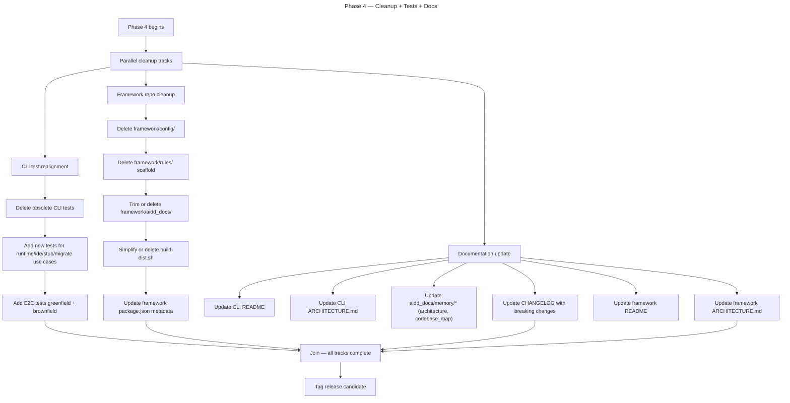

# Instruction: Framework Cleanup + Tests + Docs Alignment

## Feature

- **Summary**: Remove obsolete framework directories (`framework/config/`, `framework/rules/` empty scaffold, `framework/aidd_docs/` framework internal docs). Simplify or delete `framework/scripts/build-dist.sh` (framework now = Git repo with marketplace.json + plugins/). Realign tests across CLI (delete obsolete, add new for new flows). Update README, ARCHITECTURE.md, CHANGELOG. Final pass for incremental release.
- **Stack**: `Node.js >=24, TypeScript ESM, vitest, biome, lefthook`
- **Branch name**: `chore/framework-cleanup-docs`
- **Parent Plan**: `2026_05_01-cli-marketplace-architecture-master.md`
- **Sequence**: `5 of 5`
- Confidence: 9/10
- Time to implement: 4–6h

## Existing files

- @../framework/config/
- @../framework/rules/
- @../framework/aidd_docs/
- @../framework/scripts/build-dist.sh
- @../framework/.claude-plugin/marketplace.json
- @../framework/package.json
- @../framework/ARCHITECTURE.md
- @../framework/README.md
- @README.md
- @CHANGELOG.md
- @aidd_docs/memory/architecture.md
- @aidd_docs/memory/codebase_map.md
- @tests/

### Files to delete (corrected after verification)

- ../framework/config/ (entire directory)
- ../framework/rules/ (entire directory — empty scaffold, repo-only)
- ../framework/aidd_docs/ (memory/, tasks/, CATALOG.md, CONTRIBUTING.md — keep only README.md)
- ../framework/scripts/build-dist.sh (delete — framework now pure Git repo, no build needed)
- tests/application/use-cases/shared/catalog-use-case.integration.test.ts (CORRECTED PATH)
- tests/application/use-cases/resolve-framework-use-case.integration.test.ts
- tests/infrastructure/adapters/framework-resolver-adapter.integration.test.ts (15.7K — verified exists)
- tests/infrastructure/adapters/framework-loader-adapter.integration.test.ts (8.5K — verified exists)
- (no `install-memory-bank-use-case` test exists — was claim error)
- (no `tests/infrastructure/tar/` exists — tar logic in src/, not tests/)

### New files to create

- tests/application/use-cases/install/install-runtime-config-use-case.integration.test.ts
- tests/application/use-cases/install/install-ide-config-use-case.integration.test.ts
- tests/application/use-cases/install/install-memory-stub-use-case.integration.test.ts
- tests/application/use-cases/migrate-use-case.integration.test.ts
- tests/infrastructure/adapters/marketplace-resolver-adapter.integration.test.ts
- tests/e2e/marketplace-greenfield.e2e.test.ts
- tests/e2e/marketplace-brownfield-migrate.e2e.test.ts

## User Journey

## Implementation phases

### Phase 1 — CLI test realignment

> Drop obsolete tests, add new ones, full e2e coverage.

1. Delete obsolete tests listed above (framework resolver, loader, tarball, memory bank, catalog)
2. Add new integration tests for runtime/ide/memory-stub/migrate use cases
3. Add E2E test `tests/e2e/marketplace-greenfield.e2e.test.ts`:
   - Use **mock HTTP server** (vitest mocks) simulating real marketplace.json + plugin git endpoints (locked decision #4)
   - `aidd setup --tool claude,vscode` (full bootstrap) → assert manifest + .claude/settings.json + CLAUDE.md stub + .vscode/* written
   - `aidd plugin install aidd-context --tool claude` → assert plugin files written, manifest tracks
4. Add E2E test `tests/e2e/marketplace-brownfield-migrate.e2e.test.ts`:
   - Pre-seed old project state (manifest with docs/scripts sections, bundled plugins)
   - `aidd migrate --dry-run` → assert plan shown, no changes
   - `aidd migrate` → assert backup created, manifest cleaned, plugins re-registered via mock marketplace
5. Add E2E test for idempotency: re-run each command twice, verify no errors and no diff on second run
5. Run full test suite: `pnpm test` + `pnpm test:e2e` — green

### Phase 2 — Framework repo cleanup + plugin content refactor (placeholder removal)

> Remove obsolete framework directories AND refactor plugin content to remove placeholders entirely (locked decision #11).

#### 2a — Plugin content refactor (24 files affected, fully tool-agnostic + self-contained)

> Per locked decision #11 + Option A: plugin content has NO tool-path knowledge AND no cross-plugin refs. Intra-plugin = relative. Cross-plugin shared content = inlined. Project rules refs = removed.

1. **Find all `{{TOOLS}}` references**: `grep -rn "{{TOOLS}}" framework/plugins/` — confirmed 24 files
2. **Intra-plugin refs (within same plugin)** → relative:
   - `@{{TOOLS}}/plugins/aidd-dev/skills/01-plan/assets/plan-template.md` (within aidd-dev) → `@./skills/01-plan/assets/plan-template.md`
   - `@{{TOOLS}}/plugins/aidd-context/skills/03-context-generate/...` (within aidd-context) → relative path
3. **Cross-plugin refs (true cross-plugin) → INLINE shared content (Option A)**:
   - `aidd-dev/skills/02-assert/actions/03-assert-frontend.md` refs `aidd-pm/skills/03-prd/assets/task-template.md` → COPY `task-template.md` into `aidd-dev/skills/02-assert/assets/`, ref `@./assets/task-template.md`
   - `aidd-dev/skills/07-debug/actions/02-debug.md` refs:
     - `aidd-context/skills/06-mermaid/references/mermaid-conventions.md` → COPY into `aidd-dev/skills/07-debug/references/`, ref relative
     - `aidd-pm/skills/03-prd/assets/task-template.md` → COPY into `aidd-dev/skills/07-debug/assets/`, ref relative
   - `aidd-dev/skills/01-plan/actions/02-components-behavior.md` refs `aidd-context/skills/06-mermaid/references/mermaid-conventions.md` → COPY into `aidd-dev/skills/01-plan/references/`, ref relative
4. **Project rules refs `@{{TOOLS}}/rules/`** → REMOVED entirely (8 occurrences):
   - Skill text becomes generic: "Apply project conventions" or similar
   - AI tool loads project rules via its own mechanism
   - Files affected: `aidd-dev/skills/{00-sdlc/actions/01-implement,03-audit/actions/01-audit,04-review/actions/01-review-code,05-test/actions/01-test}.md` and similar
5. **Replace `{{DOCS}}/` references** in plugins → literal `aidd_docs/` (project convention)
6. **Document inlining maintenance contract** in framework README:
   - Source-of-truth plugins for shared content (e.g., aidd-pm owns `task-template.md`)
   - Release process must propagate updates to all copies
   - Drift detection script (optional follow-up)
7. **Manual tests**:
   - Install `aidd-dev` via Claude Code's native `/plugin install` from local marketplace — verify all `@`-references resolve, no broken cross-plugin refs
   - Install `aidd-dev` ALONE (no aidd-pm) — verify it works (no missing deps)
   - Repeat for Cursor + Copilot native install paths

#### 2b — Framework repo directory cleanup

6. Delete `framework/config/` (content already in `cli/src/assets/configs/` from Phase 0)
7. Delete `framework/rules/` (empty scaffold, never user-content)
8. Trim `framework/aidd_docs/` to keep only `framework/README.md` references; delete framework internal memory notes
9. Delete `framework/scripts/build-dist.sh` (framework = pure Git repo, no build needed)
10. Update `framework/package.json`:
    - Remove `@ai-driven-dev/cli` dep (verified at line 13: `"4.0.0-beta.1"`)
    - Drop `lefthook` + `commitlint` if not used elsewhere
    - Update description, scripts
11. Verify `framework/.claude-plugin/marketplace.json` content matches expected schema for new marketplace resolver

### Phase 3 — Documentation update

> Reflect new architecture across all docs.

1. Update CLI `README.md`:
   - New install flow: `setup` → `install ai/ide` → `plugin install`
   - Migration section pointing to `aidd migrate`
   - Asset bundling note
2. Update CLI `ARCHITECTURE.md` (if exists at CLI root) — currently in aidd_docs
3. Update `aidd_docs/memory/architecture.md`:
   - Drop framework loader / resolver references
   - Add MarketplaceResolver, asset loader
4. Update `aidd_docs/memory/codebase_map.md` — new structure (assets/, removed framework files)
5. Update CLI `CHANGELOG.md` — breaking changes section: install data source swap (CLI assets vs framework loader), framework no longer downloaded by CLI, migration command added, FrameworkResolver/Loader removed
6. Update framework `README.md`:
   - Framework is now a marketplace (marketplace.json + plugins/)
   - No more tarball flow
7. Update framework `ARCHITECTURE.md`:
   - Reflect marketplace-only model
   - Remove old distribution sections

### Phase 4 — Release prep

> Lock release candidate after all phases complete.

1. Bump CLI version to `4.1.0-beta.1` (or appropriate semver per conventional commits)
2. Verify `pnpm build` outputs clean dist
3. Verify `pnpm typecheck`, `pnpm lint`, `pnpm test`, `pnpm knip` all green
4. Manual smoke test on fresh project + brownfield project
5. Tag release candidate, publish to beta channel

## Validation flow

1. Run `pnpm build` from CLI — succeeds, dist size acceptable
2. Run `pnpm test` — all tests green, including new e2e
3. Run `pnpm knip` — no unused exports/files
4. Run `pnpm typecheck` — clean
5. Verify `framework/` repo state: only `marketplace.json`, `plugins/`, `README.md`, `ARCHITECTURE.md`, `LICENSE`, `package.json`, `.git`
6. Manual: clone fresh project, run full greenfield journey, verify outcome
7. Manual: open existing project (pre-refactor), run `aidd migrate`, verify successful transition

## Confidence assessment

✅ Phases sequential within (deletion → tests → docs), but each independently safe
✅ Test infrastructure (vitest, biome, lefthook) unchanged
✅ Knip catches dead code automatically
❌ Framework consumers (other repos using framework as dep) may break — coordinate communication
❌ Documentation may miss edge cases; rely on manual smoke test
