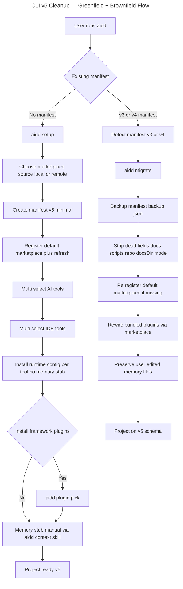

# Instruction: CLI v5 Final Cleanup (Master)

## Feature

- **Summary**: Strip residual legacy from CLI post marketplace-only refactor. Remove orphan commands (`cache`, `config`), kill memory-stub ownership (plugin owns), drop legacy install branch and `ResolveFrameworkUseCase`, rework manifest v5 in place (drop dead fields), restructure command surface to noun-first (`ai/ide/plugin install`), chain global ops, extend sync to plugins, rebuild `framework/scripts/build-dist.sh` for tarball generation, simplify test pyramid (unit-heavy, light integration, E2E only on main journeys).
- **Stack**: `Node.js >=24, TypeScript ESM, commander, @inquirer/prompts, tsup, vitest, biome, lefthook`
- **Parent branch**: `feat/plugin-architecture`
- **Branch name**: `feat/cli-v5-cleanup` (merged back to `feat/plugin-architecture`)
- **Parent Plan**: `2026_05_01-cli-marketplace-architecture-master.md` (residual cleanup)
- **Sequence**: `master`
- **Confidence**: 9/10 (post-brainstorm verification, all decisions locked)
- **Time to implement**: 5–7 days (12 phases, 1 commit per phase)

## Existing files (post Phase 0 inventory)

### CLI

- @src/application/commands/cache.ts — DELETE
- @src/application/commands/config.ts — DELETE
- @src/application/commands/install.ts — REWORK (remove legacy branch)
- @src/application/commands/uninstall.ts — REWORK (split AI/IDE)
- @src/application/commands/setup.ts — REWORK (drop legacy flags)
- @src/application/commands/update.ts — REWORK (chain ai/ide/plugin)
- @src/application/commands/sync.ts — REWORK (extend with plugins)
- @src/application/commands/restore.ts — REWORK (drop pluginFetcher dep)
- @src/application/commands/status.ts — REWORK (chain scopes)
- @src/application/commands/doctor.ts — REWORK (chain scopes)
- @src/application/commands/clean.ts — KEEP
- @src/application/commands/migrate.ts — REWORK (drop dead fields)
- @src/application/commands/menu.ts — REWORK (relabel + reorder)
- @src/application/commands/plugin.ts — EXTEND (status/sync/restore/doctor sub-cmds)
- @src/application/commands/marketplace.ts — EXTEND (cache sub-cmd)
- @src/application/commands/auth.ts — KEEP
- @src/application/commands/self-update.ts — KEEP
- @src/application/use-cases/install/install-use-case.ts — DELETE
- @src/application/use-cases/install/install-plugins-use-case.ts — DELETE
- @src/application/use-cases/install/install-runtime-config-use-case.ts — KEEP (rework signature)
- @src/application/use-cases/install/install-ide-config-use-case.ts — KEEP (rework signature)
- @src/application/use-cases/resolve-framework-use-case.ts — DELETE
- @src/application/use-cases/setup-use-case.ts — REWRITE
- @src/application/use-cases/migrate-use-case.ts — REWORK (drop dead fields)
- @src/application/use-cases/shared/catalog-use-case.ts — DELETE
- @src/application/use-cases/install-framework-plugins-use-case.ts — DELETE
- @src/application/use-cases/sync/sync-use-case.ts — REWORK (plugin propagation)
- @src/application/use-cases/restore/restore-use-case.ts — REWORK (drop pluginFetcher)
- @src/application/use-cases/restore/restore-plugin-use-case.ts — REWORK (cache-first)
- @src/application/use-cases/adopt/ — DELETE entire dir (legacy adoption flow)
- @src/domain/models/manifest.ts — REWRITE v5 schema
- @src/domain/models/plugin.ts — KEEP
- @src/infrastructure/cache/framework-cache.ts — DELETE
- @src/infrastructure/adapters/framework-resolver-adapter.ts — DELETE
- @src/infrastructure/adapters/framework-loader-adapter.ts — DELETE (verify dead)
- @src/assets/memory-stubs/ — DELETE entire dir
- @src/cli.ts — REWORK (unregister deleted commands)

### Framework

- @../framework/scripts/build-dist.sh — RECREATE (deleted in `27bcee6`)
- @../framework/.github/workflows/ci.yml — UPDATE (consume rebuilt dist tarballs)

## New files to create

- src/application/commands/ai.ts (noun-first AI tool subcommands)
- src/application/commands/ide.ts (noun-first IDE tool subcommands)
- src/application/use-cases/setup/setup-marketplace-source-use-case.ts (sub-uc)
- src/application/use-cases/setup/setup-tools-use-case.ts (sub-uc)
- src/application/use-cases/setup/setup-plugins-prompt-use-case.ts (sub-uc)
- src/application/use-cases/sync/sync-plugins-use-case.ts (sub-uc)
- src/application/use-cases/global/update-all-use-case.ts (chain orchestrator)
- src/application/use-cases/global/status-all-use-case.ts (chain orchestrator)
- src/application/use-cases/global/sync-all-use-case.ts (chain orchestrator)
- src/application/use-cases/global/restore-all-use-case.ts (chain orchestrator)
- src/application/use-cases/global/doctor-all-use-case.ts (chain orchestrator)
- src/application/use-cases/marketplace/marketplace-cache-list-use-case.ts
- src/application/use-cases/marketplace/marketplace-cache-clear-use-case.ts
- src/domain/models/manifest-v5.ts (new schema model)
- src/domain/models/marketplace-source-mode.ts (value object: `local | remote`)
- src/domain/models/setup-flow.ts (aggregate root for setup orchestration)

## User Journey



## Implementation phases

Each phase = 1 commit on `feat/cli-v5-cleanup`. Phases ordered by dependency. Each phase has its own `part-N.md` with checklists.

| # | Phase | Blocks | File |
|---|---|---|---|
| 0 | Inventory + verification grep | — | `2026_05_06-cli-v5-cleanup-part-0.md` |
| 1 | Manifest v5 schema rewrite | 0 | `2026_05_06-cli-v5-cleanup-part-1.md` |
| 2 | Vertical suppressions (cache, config, memory stubs, catalog, legacy install branch, ResolveFramework, adopt) | 1 | `2026_05_06-cli-v5-cleanup-part-2.md` |
| 3 | Setup orchestrator refactor (interactive + scriptable) | 2 | `2026_05_06-cli-v5-cleanup-part-3.md` |
| 4 | Migrate command alignment (drop dead fields, transparent backup) | 1, 2 | `2026_05_06-cli-v5-cleanup-part-4.md` |
| 5 | Surface noun-first split (`ai`, `ide`, `plugin` subcommand groups) | 2 | `2026_05_06-cli-v5-cleanup-part-5.md` |
| 6 | Globaux chainés (`update`, `status`, `sync`, `restore`, `doctor`) | 5 | `2026_05_06-cli-v5-cleanup-part-6.md` |
| 7 | Marketplace cache subcommand | 2 | `2026_05_06-cli-v5-cleanup-part-7.md` |
| 8 | Sync plugins inter-tool propagation | 5 | `2026_05_06-cli-v5-cleanup-part-8.md` |
| 9 | Menu interactif aligned (relabel + reorder) | 5, 6 | `2026_05_06-cli-v5-cleanup-part-9.md` |
| 10 | Framework `build-dist.sh` reconstruction | 3 | `2026_05_06-cli-v5-cleanup-part-10.md` |
| 11 | Tests rewrite (unit-heavy pyramid) + docs alignment | 1–10 | `2026_05_06-cli-v5-cleanup-part-11.md` |

Phase 12 (marketplace format adapters: Copilot/Cursor/Codex/OpenCode) deferred to separate master plan after this cleanup ships.

## Validation flow

End-of-cleanup acceptance — execute in order against a clean checkout:

1. **Greenfield interactive** : in empty dir, `aidd setup` → prompts source/AI/IDE/plugins → manifest v5 written, default marketplace registered, runtime configs installed, NO memory stub on disk.
2. **Greenfield scriptable** : `aidd setup --source remote --all --no-plugins --yes` → completes without prompts, exit 0.
3. **Brownfield migrate** : v3 manifest fixture → `aidd migrate` → manifest v5 (no `docs/scripts/repo/docsDir/mode/topPlugins`), backup file present, user-edited memory files untouched.
4. **Noun-first surface** : `aidd ai install claude` works, `aidd plugin install <name>` works, `aidd install <category> <tool>` no longer exists.
5. **Globaux chainés** : `aidd update` chains AI + IDE + plugin update + marketplace refresh in one invocation.
6. **Sync plugins** : `aidd ai sync --source claude --target cursor` propagates configs AND installed plugins, re-translated for cursor.
7. **Marketplace cache** : `aidd marketplace cache list` shows fetched marketplaces; `clear` purges.
8. **Build-dist** : `bash framework/scripts/build-dist.sh` produces `framework/dist/<tool>-{local,remote}/` ready-to-tar.
9. **CI tarball pipeline** : `framework/.github/workflows/ci.yml` consumes `dist/<tool>-<mode>/` and attaches per-tool tarballs to release.
10. **Test pyramid** : `pnpm test` runs in <60s, unit:integration:e2e ratio ≥10:3:1, E2E covers only main journeys (greenfield setup, brownfield migrate, plugin install, sync, update).

## Architecture rules (enforced per phase)

These rules apply to every line of code written. Violations fail review.

### Domain richness (non-anemic)

- `src/domain/models/` entities own behavior, not just data
- Value objects: `readonly` fields, no setters, `.equals()`, validate in constructor
- Aggregate roots: enforce invariants across child entities (e.g. `Manifest` is aggregate root for tool entries + plugins)
- Data classes (DTOs) live in adapter layer or `*Data` interfaces inside model files (deserialization)
- Domain pure: zero `import` from `application/` or `infrastructure/`, zero `node:fs`, no `process.env`, no logging

### Use case discipline

- One public `execute()` method per use-case class
- Methods ≤20 lines (extract private named helpers)
- Sub-use-cases live in `src/application/use-cases/<scope>/` and are called by orchestrator use-cases only (never by commands)
- Commands are thin wrappers: parse flags → create deps → call ONE use-case → display
- Global commands (`aidd update`, `aidd status`, `aidd sync`, `aidd restore`, `aidd doctor`) call ONE orchestrator use-case which chains sub-use-cases

### Test pyramid (inverted)

- **Unit tests** (`*.unit.test.ts`): every domain model, every value object, every pure function. Goal: maximum coverage, runs in milliseconds. Use cases tested via direct construction with in-memory ports.
- **Integration tests** (`*.integration.test.ts`): adapter ↔ I/O boundary (FS, HTTP, git). Minimal, only when adapter has translation logic.
- **E2E tests** (`*.e2e.test.ts`): main user journeys only. Maximum 6 E2E tests covering: greenfield setup, brownfield migrate, plugin install from marketplace, ai sync inter-tool, aidd update global, aidd clean.

## Confidence assessment

✅ **High confidence (9/10)**:
- Architecture rules already enforced via `.claude/rules/` (hexagonal, manifest, layer responsibilities, value objects)
- Phasing verified against existing master plan (`2026_05_01`)
- All locked decisions resolved in brainstorm
- Manifest migration chain v1→v5 already operational
- Per-tool emitter pattern (`domain/tools/ai/`) already supports plugin re-translation for sync
- `build-dist.sh` historical content recovered from git (`27bcee6`)

❌ **Risks (drops 1 point)**:
- Adopt use-case dir (`adopt/`) deletion blast radius unverified — Phase 0 must inventory dependents
- Sync plugins inter-tool requires verifying that all per-tool emitters can re-emit a `NormalizedPlugin` symmetrically — not all paths exercised today

## Locked decisions

| # | Topic | Lock |
|---|---|---|
| 1 | Manifest version | **v5 reworked in place**. Prod=v3, betas=v4/v5. v5 not yet stable → drop dead fields without bumping to v6. Migration chain v3→v4→v5 retained. |
| 2 | `mode` field | **DROP**. Marketplace `source.type` (git/local/url/npm) covers distribution mode. |
| 3 | Memory stub ownership | **Plugin only**. CLI never writes `CLAUDE.md` / `AGENTS.md` / `copilot-instructions.md`. User runs `aidd-context.project-init` skill manually post-setup. |
| 4 | Cache surface | **Marketplace cache** exposed via `aidd marketplace cache list\|clear`. Old `FrameworkCache` (`.aidd/cache/`) deleted entirely. |
| 5 | Config command | **DELETE**. Manifest fields `repo` and `docsDir` removed. |
| 6 | Setup non-interactive minimum | **No abort**. `aidd setup --source remote --yes` (no tools) creates minimal manifest + registers default marketplace. Required by `build-dist.sh` reconstruction. |
| 7 | Surface convention | **Noun-first** for domain commands (`ai install`, `ide install`, `plugin install`). Globals stay flat (`status`, `doctor`, `sync`, `update`, `restore`, `clean`). No `--scope` flag — global commands chain all unitaries. |
| 8 | `ai sync` semantic | **Configs + plugins**. Source tool's runtime config AND installed plugins propagate, plugins re-translated by target tool's emitter. |
| 9 | Migrate command | **Keep indefinitely**. Transparent (no opt-in/no warning). Backup `.aidd/manifest.backup.json` before mutation. |
| 10 | Branching | **Single branch `feat/cli-v5-cleanup`** based on `feat/plugin-architecture`, merged back at end. One commit per phase. No intermediate PRs. |
| 11 | Test pyramid | **Inverted (unit-heavy)**. Goal: <60s full test run. Max 6 E2E tests on main journeys. Integration only at adapter boundaries. |
| 12 | Format adapters | **Deferred**. Copilot VSCode / Cursor / Codex / OpenCode native marketplace ingestion = next master plan post-cleanup ship. |

## Sequencing

```text
Phase 0 (inventory) ──► Phase 1 (manifest) ──► Phase 2 (suppressions) ──► Phase 3 (setup) ──► Phase 4 (migrate)
                                                          │
                                                          ├──► Phase 5 (noun-first) ──► Phase 6 (globaux) ──► Phase 9 (menu)
                                                          │                              │
                                                          │                              └──► Phase 8 (sync plugins)
                                                          │
                                                          └──► Phase 7 (mp cache)

Phase 3 ──► Phase 10 (build-dist) parallelizable
Phase 11 (tests + docs) gates merge
```

Each phase produces a single commit with conventional commit format:

```
<type>(<scope>): <subject>

<body explaining intent + rationale>

Refs: aidd_docs/tasks/2026_05/2026_05_06-cli-v5-cleanup-part-N.md
```

Final merge: `git checkout feat/plugin-architecture && git merge --no-ff feat/cli-v5-cleanup`.

## Verified facts

| Claim | Truth | Source |
|---|---|---|
| `framework/scripts/build-dist.sh` exists | FALSE | Deleted commit `27bcee6` |
| `MANIFEST_VERSION` constant value | `5` | `src/domain/models/manifest.ts:16` |
| Prod npm latest stable | `4.0.0` | `npm view @ai-driven-dev/cli version` |
| Manifest v5 ever published stable | FALSE | All v5 schema versions in beta only |
| `FrameworkCache` adapter usage | Only `aidd cache` command | `rtk grep "FrameworkCache" src/` |
| Memory stub assets present | TRUE | `src/assets/memory-stubs/{AGENTS,CLAUDE,copilot-instructions}.md` |
| Noun-first commands today | `plugin`, `marketplace`, `auth`, `config` | `grep "\.command\(" commands/` |
| Verb-first commands today | `install`, `uninstall`, `update`, `restore`, `sync`, `status`, `doctor`, `clean`, `setup`, `migrate`, `self-update` | idem |
| `ResolveFrameworkUseCase` callers | `install.ts` legacy branch only post Phase 1 | per master plan `2026_05_01` Phase 1c |
| `adopt/` directory dependents | Unverified | Phase 0 inventory required |
| Plugin re-translation symmetric | Untested across all tool emitters | Phase 8 must verify |
