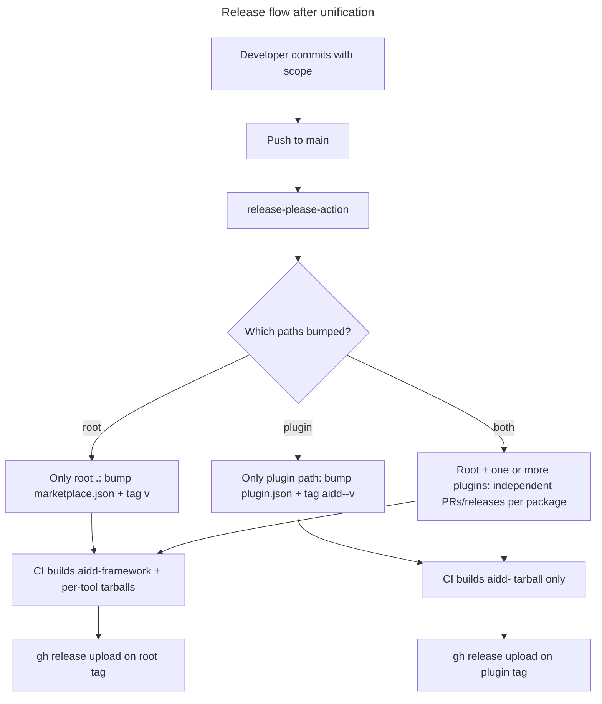

# Instruction: Unify release-please versioning across plugins and root

## Feature

- **Summary**: Make every plugin in `plugins/*` an independent release-please package, keep `marketplace.json` as the root catalog, fix the broken `version.txt` reference in CI, accept `marketplace` as a commitlint scope, and document the bump-per-scope rules.
- **Stack**: `release-please-action@v4`, `commitlint@v6` (config-conventional), GitHub Actions, `jq`, `gh` CLI, `bash` for tarball steps.
- **Branch name**: `chore/issue-81-unify-release-please-versioning`
- **Parent Plan**: none
- **Sequence**: standalone
- Confidence: 9/10
- Time to implement: 1.5–2 h (config + CI + docs)

## M / C / D (Must / Could / Don't)

### Must

- Add `plugins/aidd-orchestrator` and `plugins/aidd-refine` as full packages in `release-please-config.json` (same shape as `aidd-context`/`aidd-dev`/`aidd-vcs`, bumping each plugin's own `plugin.json`).
- Sync `.release-please-manifest.json`: root `.` 3.9.1 → 4.0.0; add `plugins/aidd-orchestrator: 1.0.0` and `plugins/aidd-refine: 1.0.0`.
- Add `marketplace` to `scope-enum` in `commitlint.config.cjs` (keep all existing scopes).
- Remove `version.txt` from the source tarball step in `.github/workflows/ci.yml` (file does not exist → current tar step is silently broken).
- Switch `build-and-attach` to per-package conditional logic using release-please-action v4 outputs (`paths_released`, plus per-path `<path>--release_created`, `<path>--tag_name`, `<path>--version`):
  - When root `.` is released → build & attach `aidd-framework-v<X.Y.Z>.tar.gz` + all per-tool bundles (existing behavior).
  - When a plugin path is released → build & attach `aidd-<plugin>-v<X.Y.Z>.tar.gz` only.
- Document the new commit-scope discipline in `CONTRIBUTING.md` (add `aidd-orchestrator`, `aidd-refine`, `marketplace`, explain what each scope bumps).

### Could

- Add a one-line note to `CONTRIBUTING.md` recommending stable tag names (e.g. `aidd-refine-v1.1.0`) when describing release-please tags per package.
- Refactor the build matrix in `ci.yml` into reusable shell steps if duplication becomes painful (defer if a single conditional branch keeps the diff readable).

### Don't

- Don't touch `scripts/build-dist.sh`.
- Don't retro-tag historical plugin components (no `git tag aidd-refine-v1.0.0` from past commits).
- Don't change `aidd-pm`'s `release-as: 1.0.0-rc.1` directive.
- Don't hand-edit `marketplace.json` `$.version` — release-please owns it via `extra-files`.
- Don't pre-create `CHANGELOG.md` files in `plugins/aidd-orchestrator/` or `plugins/aidd-refine/` — release-please creates them on first plugin release.
- Don't fix stale `version.txt` references inside `dist/` (build artifacts; only the source `ci.yml` is load-bearing for AC #6).
- Don't open or modify the existing release-please PR #77; it must be closed before this work merges (see Risk register).

## Architecture projection

### Files to modify

- `release-please-config.json` - register `plugins/aidd-orchestrator` and `plugins/aidd-refine` packages.
- `.release-please-manifest.json` - bump `.` to 4.0.0; add the two new plugin entries.
- `commitlint.config.cjs` - add `marketplace` to `scope-enum`.
- `.github/workflows/ci.yml` - drop `version.txt` from source tarball; add per-package conditional build/attach using release-please outputs.
- `CONTRIBUTING.md` - update "Commit scope discipline" table with `aidd-orchestrator`, `aidd-refine`, `marketplace`; clarify what each scope bumps.

### Files to create

- (none)

### Files to delete

- (none — `version.txt` is already absent from disk; only the CI reference is removed.)

## Applicable rules

| Tool   | Name                | Path                                                                                  | Why it applies                                                            |
| ------ | ------------------- | ------------------------------------------------------------------------------------- | ------------------------------------------------------------------------- |
| claude | command-structure   | `/Users/baptistelafourcade/Projects/freelance/aidd/.claude/rules/01-standards/1-command-structure.md` | Touches CI/config files in a workspace governed by command/file conventions; preserves naming and frontmatter discipline. |
| claude | ide-mapping         | `/Users/baptistelafourcade/Projects/freelance/aidd/.claude/rules/04-tooling/ide-mapping.md` | Confirms file location/naming conventions for any companion edits in `.claude/`. |
| claude | mermaid             | `/Users/baptistelafourcade/Projects/freelance/aidd/.claude/rules/01-standards/1-mermaid.md` | Diagram conventions for the user-journey block in this plan.              |

> No project-level rules under `framework/.claude/rules/`; inherited rules from the parent workspace apply to source-of-truth conventions.

## User Journey

## Risk register

| Risk | Impact | Mitigation |
| ---- | ------ | ---------- |
| Open release-please PR #77 (`chore: release main`) collides with manifest changes | Manifest edit (`.` → 4.0.0, new plugin entries) may either rewrite PR #77 on next push or leave it stranded with stale numbers. | Close PR #77 before merging this PR; let release-please reopen a fresh PR after merge. |
| `chore(framework)` (per AC #2) does not bump version under default release-please rules; only `feat`/`fix`/`feat!` do | AC #2 verification commit may produce no PR, looking like a regression. | Recorded as `decisions_made #1`: implementer should test AC #2 with `feat(framework): test bump` (and analogously `feat(aidd-refine): test bump` for AC #1, which the ticket already specifies as `feat`). |
| Plugin tarball contents not specified by the ticket | Implementer guesses; downstream consumers receive an inconsistent artifact. | Recorded as `decisions_made #2`: ship `tar czf aidd-<plugin>-v<X.Y.Z>.tar.gz -C plugins/<plugin> --exclude='.aidd/cache' .`. |
| release-please-action v4 per-package output names are easy to mistype | `if:` conditions silently evaluate to false; no tarball attached. | Use exact path-key syntax: `steps.release.outputs['plugins/aidd-refine--release_created']`; mirror the path key as defined in `release-please-config.json`. |
| `marketplace.json` and manifest currently disagree (`4.0.0` vs `3.9.1`) | After alignment to 4.0.0, the next root commit jumps from 4.0.0 (not 3.9.1). | Expected behavior; documented here so the next release isn't a surprise. |
| Build matrix grows complex when root+plugin release simultaneously | Race conditions or duplicate uploads. | Use `paths_released` to drive a single matrix; treat root and each plugin as independent matrix items with independent `if:` guards. |

## Implementation phases

### Phase 1: CI hygiene — drop dangling version.txt reference

> Stop referencing a file that does not exist; isolate this fix in its own commit so the bug fix is bisectable and revertable.

#### Tasks

1. Remove the `version.txt` line from the source tarball step in `.github/workflows/ci.yml` (currently `ci.yml:89`).
2. Verify no other source location references `version.txt` (excluding `dist/` build artifacts, which regenerate).

#### Acceptance criteria

- [ ] `grep -q 'version.txt' .github/workflows/ci.yml` returns non-zero (no match).
- [ ] No other tracked source file (outside `dist/`) references `version.txt` for build/release purposes.

#### Expected commit boundary

- `ci(framework): drop dangling version.txt reference from source tarball step`

### Phase 2: Register aidd-orchestrator and aidd-refine as release-please packages

> Make release-please aware of every plugin so each one bumps independently.

#### Tasks

1. In `release-please-config.json`, add `plugins/aidd-orchestrator` and `plugins/aidd-refine` entries mirroring `plugins/aidd-context` / `plugins/aidd-dev` / `plugins/aidd-vcs` (`package-name`, `extra-files` pointing to `.claude-plugin/plugin.json` `$.version`).
2. In `.release-please-manifest.json`, set `.` to `4.0.0` and add `plugins/aidd-orchestrator: 1.0.0` and `plugins/aidd-refine: 1.0.0`.
3. Sanity-check that `aidd-pm`'s `release-as: 1.0.0-rc.1` directive is untouched.

#### Acceptance criteria

- [ ] `jq '.packages | keys' release-please-config.json` lists root `.` and all six plugin paths (`aidd-context`, `aidd-dev`, `aidd-vcs`, `aidd-pm`, `aidd-orchestrator`, `aidd-refine`).
- [ ] `jq '.["."]' .release-please-manifest.json` equals `"4.0.0"`.
- [ ] `jq '.["plugins/aidd-orchestrator"], .["plugins/aidd-refine"]' .release-please-manifest.json` both equal `"1.0.0"`.
- [ ] `jq '.packages["plugins/aidd-pm"]["release-as"]' release-please-config.json` still equals `"1.0.0-rc.1"`.

#### Expected commit boundary

- `chore(framework): register aidd-orchestrator and aidd-refine in release-please`

### Phase 3: Add `marketplace` scope to commitlint

> Allow `chore(marketplace): ...` commits without disabling existing scopes.

#### Tasks

1. Append `"marketplace"` to the `scope-enum` list in `commitlint.config.cjs`. Keep `aidd-orchestrator` and `aidd-refine` (already present).

#### Acceptance criteria

- [ ] `grep -q '"marketplace"' commitlint.config.cjs` succeeds.
- [ ] All previously allowed scopes (`aidd-context`, `aidd-dev`, `aidd-vcs`, `aidd-pm`, `aidd-refine`, `aidd-orchestrator`, `framework`) remain in the list.
- [ ] A dry-run with `echo "feat(marketplace): test" | npx commitlint` exits 0 (manual local check; not gated in CI for this phase).

#### Expected commit boundary

- `build(framework): allow marketplace scope in commitlint`

### Phase 4: Wire per-package conditional build/attach in CI

> Build & attach the right tarball(s) for whichever package(s) release-please cut.

#### Tasks

1. Update the `release-please` job outputs to expose per-package `release_created`, `tag_name`, `version` for `.`, `plugins/aidd-context`, `plugins/aidd-dev`, `plugins/aidd-vcs`, `plugins/aidd-pm`, `plugins/aidd-orchestrator`, `plugins/aidd-refine`. Use the literal path-key syntax `steps.release.outputs['<path>--release_created']`.
2. Restructure the `build-and-attach` job into two independent paths:
   - **Root path** (`if: needs.release-please.outputs['.--release_created'] == 'true'`): retain `npm install -g @ai-driven-dev/cli@beta`, `bash scripts/build-dist.sh`, build `aidd-framework-v<X.Y.Z>.tar.gz` (without `version.txt`), build all per-tool tarballs, attach them all.
   - **Plugin path** (one matrix entry per plugin or one job per plugin, each guarded by `if: needs.release-please.outputs['plugins/<plugin>--release_created'] == 'true'`): build `aidd-<plugin>-v<X.Y.Z>.tar.gz` via `tar czf "/tmp/aidd-<plugin>-v<X.Y.Z>.tar.gz" -C plugins/<plugin> --exclude='.aidd/cache' .` and `gh release upload "<plugin>-v<X.Y.Z>" "/tmp/aidd-<plugin>-v<X.Y.Z>.tar.gz" --clobber`.
3. Validate YAML locally (e.g. `yq . .github/workflows/ci.yml` or any JSON-schema validator) before commit.

#### Acceptance criteria

- [ ] `release-please` job exposes per-path outputs for the root and each of the six plugin packages.
- [ ] `build-and-attach` (or its replacement structure) gates the root tarball on `.--release_created` and each plugin tarball on its own `--release_created` output.
- [ ] Plugin tarball naming matches `aidd-<plugin>-v<X.Y.Z>.tar.gz`; root tarball remains `aidd-framework-v<X.Y.Z>.tar.gz`.
- [ ] No reference to `version.txt` remains in `ci.yml`.
- [ ] Workflow YAML parses cleanly (no syntax errors).

#### Expected commit boundary

- `ci(framework): build per-package tarballs based on release-please outputs`

### Phase 5: Document scope-bump mapping in CONTRIBUTING.md

> Tell humans (and future-AI) what each scope does to which version.

#### Tasks

1. In `CONTRIBUTING.md` "Commit scope discipline" section, add rows for `aidd-orchestrator`, `aidd-refine`, `marketplace`. Replace the static "five allowed scopes" wording with the actual current count.
2. Add a short subsection (or paragraph) titled "Which scope bumps what" listing: `aidd-<plugin>` → bumps `plugins/<plugin>/.claude-plugin/plugin.json`, tags `aidd-<plugin>-v<X.Y.Z>`; `marketplace` or `framework` → bumps `marketplace.json`, tags `v<X.Y.Z>`.
3. Update the existing tarball description (currently mentions `agents/`, `commands/`, `version.txt`) to reflect the current contents (`plugins/`, `.claude-plugin/`, `aidd_docs/`).

#### Acceptance criteria

- [ ] `CONTRIBUTING.md` "Commit scope discipline" table includes `aidd-orchestrator`, `aidd-refine`, `marketplace` with accurate "Use for" text.
- [ ] The tarball-content description no longer mentions `version.txt`, `agents/`, `commands/`, `config/`, `rules/`, `skills/`, or `templates/` (legacy paths) and matches the new tarball steps.
- [ ] A "scope → tag/file bump" mapping is present and unambiguous.

#### Expected commit boundary

- `docs(framework): document scope-bump mapping after release-please unification`

## Amendments

<!-- AI-initiated changes during implementation. Each entry is prefixed with 🤖. -->

## Log

<!-- APPEND ONLY. One entry per step attempt. Never rewrite. -->

## Validation flow demonstration

1. **Static checks (covered by `success_condition`)**:
   - `jq` confirms `release-please-config.json` has both new plugin entries.
   - `jq` confirms `.release-please-manifest.json` has root `.` = 4.0.0 and both new plugin entries at 1.0.0.
   - `grep` confirms `commitlint.config.cjs` contains `"marketplace"`.
   - `grep` confirms `.github/workflows/ci.yml` no longer contains `version.txt`.
2. **Manual post-merge AC verification** (cannot be automated in this PR; perform after squash-merge to `main`):
   - **AC #1**: push commit `feat(aidd-refine): test bump` (in a follow-up PR or directly via release-please test branch). Confirm release-please opens a PR that bumps only `plugins/aidd-refine/.claude-plugin/plugin.json` and, on merge, tags `aidd-refine-v1.1.0`.
   - **AC #2**: push commit `feat(framework): test bump` (or `feat(marketplace): ...`). Confirm release-please opens a PR that bumps only `marketplace.json` and tags `v4.1.0`. (Note: `chore(...)` would not bump under default rules — see decisions table.)
   - **AC #3**: confirm the plugin release attaches only `aidd-<plugin>-v<X.Y.Z>.tar.gz`.
   - **AC #4**: confirm a root release attaches `aidd-framework-v<X.Y.Z>.tar.gz` plus all per-tool bundles (`aidd-claude-*`, `aidd-cursor-*`, `aidd-copilot-*`, `aidd-codex-*` and their `-remote-` variants).
3. **Pre-merge hygiene step**: close the existing open release-please PR (#77) before merging this PR so release-please starts a clean cycle with the new manifest baseline.
