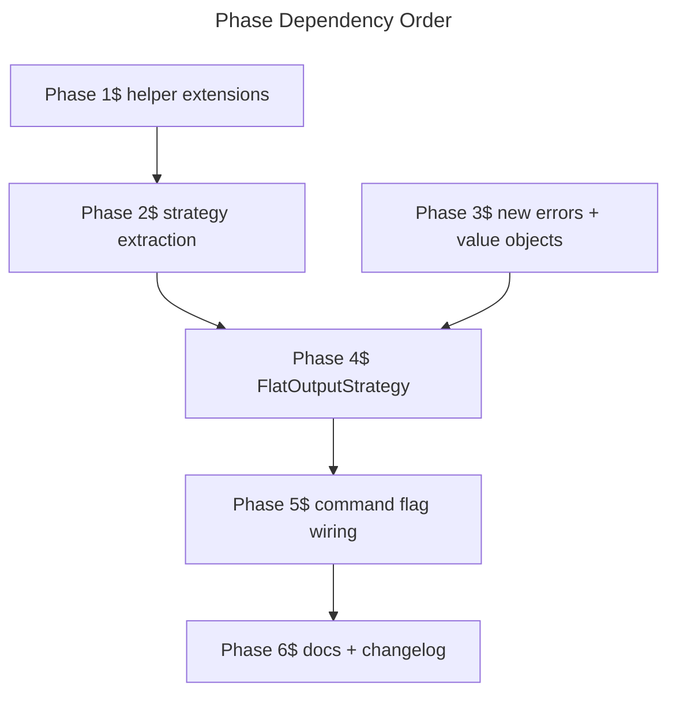

# Plan — `aidd framework build --target copilot --flat`

Executable plan for the frozen spec. Reuse-first. No production code in this file.

## 1. Reuse inventory (audit BEFORE any new code)

| Capability needed | Existing helper / construct | Location | Reuse decision | Rationale |
|---|---|---|---|---|
| `@./X` / `@../X` rewrite inside `.md` | `rewriteRelativeLinks` | `src/domain/formats/relative-link-rewrite.ts` | **extract pure** (add target-resolver) | `@./` / `@../` are pure base-relative — direct reuse. But `@${CLAUDE_PLUGIN_ROOT}/<rel>` resolves with `posix.relative(currentDir, targetPluginRel)` assuming Mode A layout. In flat mode the target lands at a **different path** (`.github/agents/<plugin>/<name>.agent.md`, `.github/skills/<plugin>/...`) and may have a suffix change (`.md` → `.agent.md`). Add an optional `resolveTargetPath(pluginRelPath) => string` parameter (default = identity preserves Mode A semantics). Spec line 112 reuse claim is half-true: keep the rewriter logic, swap the resolver. |
| Agent frontmatter allowlist | `stripAgentFrontmatter`, `COPILOT_AGENT_FRONTMATTER_KEYS` | `src/domain/formats/agent-frontmatter-strip.ts` | **direct** | Allowlist is identical (spec §AC #5 lists same six keys). |
| `${CLAUDE_PLUGIN_ROOT}/<rel>` rewrite inside JSON | `rewriteClaudeRootInJson` | `src/domain/formats/claude-root-path-rewrite.ts` | **extract pure** (add substitution fn) | Current implementation hardcodes substitution `./`. Flat mode needs context-aware substitution: hooks → `./.github/<section>/<plugin>/<rest>`; MCP → absolute `<absOut>/.github/<section>/<plugin>/<rest>`. Add a `substitute: (suffix: string) => string` parameter; default closure preserves Mode A behavior. |
| MCP merge into a top-level keyed object with collision detection | `mergeOpencodeMcp` / `unmergeOpencodeMcp` | `src/domain/formats/opencode-mcp-merge.ts` | **new file (NOT a mirror)** | Structural shape is **different**, not similar: `opencode-mcp-merge` strips previous plugin-owned entries via a `previousEntriesForThisPlugin: ReadonlyMap` sourced from the manifest. Flat mode has **no manifest** (spec §Out of scope), so there is no safe way to identify "previous" entries. Prefix-stripping (`<plugin>-*`) would delete user-owned keys that happen to share the prefix — **data loss**, violates AC #7. The correct contract for flat MCP merge is **purely additive**: read existing `servers`, attempt to add incoming keys, halt on any collision (unless `--force` overwrites that single key). No strip step at all. This is a different algorithm; "mirror" framing is wrong. Add `src/domain/formats/vscode-mcp-merge.ts` as a **simpler, dedicated** helper. See Decision M below. |
| Use-case orchestration scaffold (validate paths, read marketplace, iterate plugins, validate manifest, assert `{{TOOLS}}` placeholder, warn-skip out-of-scope sections, halt-at-first-failure) | `FrameworkBuildUseCase` | `src/application/use-cases/framework/framework-build-use-case.ts` | **extract strategy** (Phase 2 refactor) | The body mixes two responsibilities: orchestration (reusable) and Mode A output layout (`<outDir>/plugins/<name>/...`, manifest synthesis, `marketplace.json` emit, unconditional `deleteDirectory(outDir)`). Extract a `BuildOutputStrategy` port-style interface; existing logic becomes `MarketplaceOutputStrategy`; the flat-mode implementation is a sibling. Mode A must remain **byte-identical** after refactor (existing E2E assertion at `framework-build.e2e.test.ts:AC#2` proves it). |
| Path-safety guard (`source == out`, nested-paths) | `guardPaths` | same file, lines 80–85 | **extend** | Spec §Safety guard adds "`<out>` does not exist **or is not a directory**". Extend `guardPaths` to take an optional async **directory** check `(path) => Promise<boolean>` (not a mere existence probe — a regular file at `<out>` must also halt). Keep `InvalidBuildPathsError` for all three violations. |
| Tools placeholder halt | `assertNoToolsPlaceholder`, `TOOLS_PLACEHOLDER`, `FrameworkPlaceholderInPluginError` | same file + `src/domain/errors.ts` | **direct via strategy** | Used identically in flat mode (spec line 64 `@{{TOOLS}}/X → halt`). |
| JSON schema validation of `plugin.json` | `JsonSchemaValidator` + `assetProvider.loadPluginManifestSchema()` + `JsonSchemaValidationError` | use-case + ports + `src/domain/errors.ts` | **direct via strategy** | Spec §Behavior + §AC #10 explicitly demands `JsonSchemaValidationError` for invalid manifest. |
| Frontmatter parse/serialize | `parseFrontmatter`, `serializeFrontmatter` | `src/domain/formats/markdown.ts` | **direct** | Pure helpers, identical use. |
| Copilot canonical paths (`.github/agents`, `.github/skills`, `.vscode/mcp.json`) | `copilot.ts` `agentsHandler.buildFilePath` / `skillsHandler.buildFilePath` / MCP capability `outputPath` | `src/domain/tools/ai/copilot.ts` | **compose / extract constant** | Existing handlers do **not** insert `<plugin>/` namespacing (install-time is single-namespace). Do **not** modify them — would break install-time copilot. Instead, extract a small pure helper module `src/domain/formats/copilot-flat-paths.ts` that wraps the existing prefix constants and adds the `<plugin>/` infix and `.agent.md` suffix. Re-import the `.github/` and `.vscode/mcp.json` *constants* from `copilot.ts` rather than re-typing them (Decision N). |
| Halt-at-first-failure semantics | implicit in `for` loop with `await` throwing | use-case body | **direct via strategy** | Pattern preserved by strategy refactor; no special construct needed. |
| Errors: `InvalidBuildPathsError`, `JsonSchemaValidationError`, `FrameworkPlaceholderInPluginError`, `InvalidSourceMarketplaceError`, `NoFrameworkSourceError`, `FrameworkResolutionError` | `src/domain/errors.ts` | **direct** | All reused. Add **only** `FlatTargetExistsError` (new). |

**Reuse delta budget.** Only three new files of substance:
- `src/domain/formats/copilot-flat-paths.ts` (pure path helpers).
- `src/domain/formats/vscode-mcp-merge.ts` (mirror of opencode-mcp-merge, `servers`-keyed).
- `src/application/use-cases/framework/strategies/flat-output-strategy.ts` (flat output strategy implementation).
Plus extensions to `relative-link-rewrite.ts` and `claude-root-path-rewrite.ts` (optional parameters, defaults preserve Mode A).

## 2. Do-not-duplicate list (referenced, never re-implemented)

- `TOOLS_PLACEHOLDER` constant (`framework-build-use-case.ts:30`) and `assertNoToolsPlaceholder` method — go through the orchestrator, never re-pattern.
- Plugin iteration loop, `validateManifest`, `readSourceMarketplace`, `validateSourceMarketplace` — orchestrator only.
- `COPILOT_AGENT_FRONTMATTER_KEYS` — single source of truth for the allowlist.
- `parseFrontmatter` / `serializeFrontmatter` — never inline frontmatter parsing in the flat strategy.
- The `mergeOpencodeMcp` algorithmic split (parseExisting / stripPreviousEntries / applyIncoming) — the mirror file follows the same shape, but **logic is not copy-pasted**; both files import the same `Hasher` port and use the identical sub-step decomposition for review symmetry.
- `.github/` directory constant and `.vscode/mcp.json` MCP `outputPath` — re-imported from `copilot.ts`, not re-declared. If `copilot.ts` doesn't currently export them, extract module-level `const` first (zero-LOC behavior change) then import.
- Path-guard `InvalidBuildPathsError` semantics — same error, no new error class for the third violation.
- `warnOutOfScopeSections` behavior for `commands/` and `rules/` — applies symmetrically in flat mode (see Decision C).

## 3. Decisions

### Decision A — Plugin namespacing inside flat output

**Question:** spec says `.github/agents/<plugin>/<name>.agent.md`, `.github/skills/<plugin>/<name>/`. Apply identically to hooks? `.vscode/mcp.json` is a single shared file so namespacing happens via key prefix instead.

**Decision (C — Confirm with reviewer at exit):** mirror the spec exactly.
- Agents: `<out>/.github/agents/<plugin>/<name>.agent.md`.
- Skills: `<out>/.github/skills/<plugin>/<name>/...` (preserves tree).
- Hooks: `<out>/.github/hooks/<plugin>.hooks.json` (per-plugin file — collision-free without subdir).
- MCP: merged into `<out>/.vscode/mcp.json`, every key prefixed `<plugin>-<originalKey>` (see Decision B).

**Rationale:** spec is explicit on the first three; the hooks-as-file (not dir) keeps `.github/hooks/` flat (Copilot reads any `*.hooks.json` in that directory, no nested-dir support per spec line 57).

### Decision B — MCP key-collision prefix scheme

**Decision (M — Made):** key naming = `<plugin-name>-<original-key>` (kebab, single dash separator).

**Rationale:** spec line 58 says "Server keys prefixed with `<plugin>-`". Use the unmodified plugin name as the prefix. If a plugin's name contains a dash, ambiguity is acceptable — same convention as `opencode-mcp-merge` uses today (no re-encoding).

**Collision policy inside `.vscode/mcp.json`.** Spec is silent on this case. Apply symmetry with AC #9: when a target server key (after prefixing) already exists in `<out>/.vscode/mcp.json`, halt with `FlatTargetExistsError` unless `--force`. With `--force`, the value is overwritten. User-owned servers (other keys) are always preserved. Recorded as **Decision B-bis (M — Made)**.

### Decision C — Out-of-scope sections (`commands/`, `rules/`) in flat mode

**Decision (M — Made):** apply the same warn-skip as Mode A. Use existing `OUT_OF_SCOPE_PLUGIN_SECTIONS` constant and `warnOutOfScopeSections` method, lifted into the strategy interface as a `postPluginHook(pluginName, pluginSrc)` step the orchestrator calls regardless of strategy.

**Rationale:** spec is silent; symmetric behavior avoids two diverging policies. MVP1 of flat = MVP1 of marketplace.

### Decision D — Hooks file-split strategy

**Decision (M — Made):** one file per plugin: `<out>/.github/hooks/<plugin>.hooks.json`. Contents = `<plugin>/hooks/hooks.json` from source with `${CLAUDE_PLUGIN_ROOT}/<rest>` rewritten to a **workspace-relative path** computed by inspecting the suffix's first path segment:
- `agents/<X>` → `./.github/agents/<plugin>/<X-with-.agent.md-suffix>`
- `skills/<X>` → `./.github/skills/<plugin>/<X>`
- anything else (including `commands/<X>`, `rules/<X>`) → emit `./.github/<rest>` (defensive default; warn since these sections are out-of-scope).

**Rationale:** spec line 70 says relative is fine because `cwd = workspaceFolder`. The substitution function passed to `rewriteClaudeRootInJson` performs this dispatch; no path math leaks into the use-case.

### Decision E — MCP path resolution in `.vscode/mcp.json`

**Decision (M — Made):** rewrite `${CLAUDE_PLUGIN_ROOT}/<rest>` to **absolute** `<absOut>/.github/<section>/<plugin>/<rest>` (with the same `agents/` ↔ `.agent.md` rewriting if `<rest>` starts with `agents/`).

**Rationale:** spec line 71. Workspace MCP servers don't have an implicit `cwd`.

### Decision F — Default fallback for the marketplace path

**Decision (M — Made):** when `--flat` is absent, default Mode A behavior is unchanged. The command flag is opt-in. The strategy refactor (Phase 2) does not change the public command surface; only Phase 5 adds flags.

### Decision G — Naming of the new strategy

**Decision (M — Made):** `FlatOutputStrategy` (file: `flat-output-strategy.ts`); existing scaffold becomes `MarketplaceOutputStrategy` (file: `marketplace-output-strategy.ts`). Avoid the name `ModeBFlat*` which already belongs to `ModeBFlatMaterializationAdapter` (the **install-time** translator for OpenCode/Cursor) — unrelated, but reusing the name would mislead reviewers.

### Decision H — `--force` semantics

**Decision (M — Made):** `--force` only affects flat-mode write-collision detection. It does **not** turn on auto-wipe of `<out>` (spec §Behavior "No auto-wipe"). With `--force`, individual canonical-path collisions overwrite; user files at non-canonical paths remain untouched.

### Decision I — Idempotency guarantee (AC #2)

**Decision (M — Made):** plugin iteration follows `sourceMarketplace.plugins` order (already deterministic — same as Mode A). For MCP merge, iterate server keys in `Object.entries(incoming)` order, which preserves source `mcp.json` insertion order; existing `.vscode/mcp.json` `servers` key order is preserved by serializing back via `JSON.stringify(_, null, 2)` (V8 guarantees insertion order for string keys). No `Set`/`Map` iteration without explicit `sort()`. Mode A E2E AC#2 test stays green; flat mode gets its own E2E variant.

### Decision J — Where the `<out>` directory check lives

**Decision (M — Made):** extend `guardPaths` to accept an optional async **directory** probe `(path) => Promise<boolean>` (e.g., backed by `fs.stat(path).isDirectory()` in the adapter). Keep the use-case's `guardPaths` synchronous when probe is omitted (Mode A path); call it asynchronously for flat mode. Single function, two call shapes — no duplicate. The probe must reject regular files at `<out>` (spec line 89), not just non-existence.

### Decision K — Test pyramid placement

**Decision (M — Made):**
- **Unit tests** (no I/O) cover: extended `rewriteRelativeLinks` with target-resolver; extended `rewriteClaudeRootInJson` with substitution; `copilot-flat-paths.ts` builders; `vscode-mcp-merge.ts` merge + collisions; new `FlatTargetExistsError` message shape.
- **Integration tests** cover: `FrameworkBuildUseCase` with `FlatOutputStrategy` against in-memory adapter ports (`tests/application/use-cases/framework/`).
- **E2E** adds one persona to `tests/e2e/framework-build.e2e.test.ts`: "flat build into clean project produces correct tree, re-run with `--force` byte-identical, collision without `--force` halts." One file, one new `it()` per AC per the existing concurrent describe.

### Decision L — Bundle-size impact

**Decision (M — Made):** the three new domain files + strategy + flag wiring are pure code (no new deps). The `<500 KB` budget (`scripts/check-bundle-size.mjs`) has ~100 KB headroom on current main (recent CI). No risk in MVP1 absent new dependencies.

### Decision M — Dedicated `vscode-mcp-merge.ts` with a purely additive contract (NOT a mirror of opencode-mcp-merge)

**Decision (M — Made):** add a new, structurally simpler helper. Do not generalize `opencode-mcp-merge`, and do not mirror it. The two have **different contracts**:

- `opencode-mcp-merge.mergeOpencodeMcp` is **manifest-driven**: caller passes `previousEntriesForThisPlugin` and the helper strips them before applying incoming entries. Required for the install-time path because plugins are upgradable and entries must be cleaned on each install.
- `vscode-mcp-merge.mergeVscodeMcp` is **purely additive**: read existing `<out>/.vscode/mcp.json` `servers`, attempt to add incoming keys (already prefixed `<plugin>-`), halt on **any** collision unless `--force` overwrites that one key. No "strip previous" step. Flat mode has no manifest (spec §Out of scope), so identifying "previous" entries by prefix would risk deleting user-owned keys sharing the prefix — that violates AC #7.

**Contract.** `mergeVscodeMcp(existing: string | null, incoming: Record<string, unknown>, force: boolean): { mergedContent: string; collisions: ReadonlyArray<string> }`. The strategy throws `FlatTargetExistsError` when `collisions.length > 0 && !force`. Keys in `incoming` are **already prefixed** by the caller (`flatMcpKeyPrefix(plugin)` from `copilot-flat-paths.ts`); the helper does not know about plugin identity.

**Consequence for idempotency (AC #2).** Re-running a flat build with `--force` overwrites the same prefixed keys with the same values → byte-identical output. If a plugin removes a server in a later build, the stale prefixed key persists in `<out>/.vscode/mcp.json` (no cleanup). This is acceptable per spec §"fire-and-forget" / "no auto-update" — accumulation is the documented trade-off for not tracking a manifest. Recorded in Risk R11.

**Why not generalize.** Refactoring `opencode-mcp-merge.ts` to support a "no previous, additive-only" mode would mix two contracts in one function and ripple into `mode-b-flat-materialization-adapter.ts` and `plugin-remove-use-case.ts`. Out of scope here. A second helper with a tighter, smaller contract is cleaner.

### Decision N — Constants extraction from `copilot.ts`

**Decision (M — Made):** `DIRECTORY = ".github/"` (line 34) and the MCP `outputPath = ".vscode/mcp.json"` (line 296) currently live as local `const` / inline string in `copilot.ts`. Extract them to a small `src/domain/tools/ai/copilot-paths.ts` module (or top-of-file `export`) so the flat strategy can import without duplicating literals. Pure refactor; no behavioral change; existing copilot install tests stay green.

## 4. Phases (each = one conventional commit, leaves Mode A E2E green)

### Phase 1 — Extend pure formats (helpers) [pure refactor]

**Objective.** Make `relative-link-rewrite.ts` and `claude-root-path-rewrite.ts` extensible without changing default behavior.

**Files modified.**
- `src/domain/formats/relative-link-rewrite.ts` — add optional `resolveTargetPath?: (pluginRelPath: string) => string` field on `RewriteRelativeLinksOptions`; default to identity. Use inside `rewriteClaudeRootRef`.
- `src/domain/formats/claude-root-path-rewrite.ts` — change `rewriteClaudeRootInJson(parsed, substitute?)` signature; `substitute(suffix)` defaults to `(s) => "./" + s`. Existing callers unchanged.

**Files added.** none.

**Tests added.**
- `tests/domain/formats/relative-link-rewrite.unit.test.ts` — new cases: default behavior unchanged; with a custom resolver, link path reflects the resolved target.
- `tests/domain/formats/claude-root-path-rewrite.unit.test.ts` — new cases: default `./<rest>`; with a custom substitution, output reflects the function.

**Test gate.** `npm test` green; existing Mode A E2E green; bundle size unchanged.

**Exit criterion.** Maps to spec AC #4 building block (rewrite target customization).

**Conventional commit.** `refactor(formats): make link and JSON path rewriters accept custom resolvers`.

### Phase 2 — Extract `BuildOutputStrategy` (pure refactor, Mode A only)

**Objective.** Decompose `FrameworkBuildUseCase.execute()` into orchestration + strategy. Mode A behavior byte-identical.

**Files added.**
- `src/application/use-cases/framework/strategies/build-output-strategy.ts` — interface with: `preBuild(outDir, sourceDir): Promise<void>`, `writeAgentFile(...)`, `writeSkillFile(...)`, `writeHooksDir(...)`, `writeMcpFile(...)`, `writePluginManifest(pluginName, pluginSrc): Promise<number>` (Mode A writes a synthesized `plugin.json`; flat mode returns `0`), `postBuild(builtPlugins, outDir): Promise<number>` (returns extra files written, e.g. `marketplace.json = 1`; flat mode returns `0`).
- `src/application/use-cases/framework/strategies/marketplace-output-strategy.ts` — extracts current Mode A code: `deleteDirectory(outDir)` in `preBuild`; **moves in `detectPluginPresenceFlags`, `synthesizePluginManifest`, `hasAgentFiles`, `listSkillNames` (all Mode-A-specific manifest shaping)**; agents/skills/hooks/mcp writes; `emitMarketplaceCopilot` in `postBuild`.

**Files modified.**
- `src/application/use-cases/framework/framework-build-use-case.ts` — keeps `execute()`, `guardPaths` (still synchronous, optional async directory probe parameter added but not used yet), `readSourceMarketplace`, `validateSourceMarketplace`, `validateManifest`, `assertNoToolsPlaceholder`, `warnOutOfScopeSections`. **Removes** `detectPluginPresenceFlags`, `synthesizePluginManifest`, `hasAgentFiles`, `listSkillNames`, `buildManifest`, `buildAgents`/`buildAgentFile`, `buildSkills`/`buildSkillFile`, `buildHooks`, `buildMcp`, `rewriteJsonFile`, `emitMarketplaceCopilot`, `buildCopilotPluginEntries`, `buildCopilotMarketplaceObject`, `resolveVersion`, `resolveDescription` (all into `MarketplaceOutputStrategy`). Delegates file writes through the injected strategy. Constructor adds a `BuildOutputStrategy` parameter; `createDeps` wires `MarketplaceOutputStrategy` as default.
- `src/infrastructure/deps.ts` — wire `MarketplaceOutputStrategy` into `frameworkBuildUseCase`.

**Tests added.** none new; existing tests must remain green. Verify:
- `tests/application/use-cases/framework/framework-build-use-case.integration.test.ts` — unchanged assertions still pass.
- `tests/e2e/framework-build.e2e.test.ts` AC #1 & AC #2 — byte-identical output proven by existing hash snapshot test (`run1 === run2`).

**Test gate.** Full test suite green. Bundle size check still under 500 KB. Method size ≤20 LOC enforced.

**Exit criterion.** Strategy boundary exists; Mode A continues to work unchanged. Spec AC #1–AC #11 unblocked.

**Conventional commit.** `refactor(framework-build): extract BuildOutputStrategy with MarketplaceOutputStrategy default`.

### Phase 3 — New value objects and errors

**Objective.** Add the discriminant types and errors the flat strategy needs, without wiring them yet.

**Files modified.**
- `src/domain/models/framework-build.ts` — extend `FrameworkBuildOptions` with `readonly mode: "marketplace" | "flat"` (default value resolved in command layer; constructor signature unchanged for callers passing the new field). Add `readonly force?: boolean` (only meaningful when `mode === "flat"`). Add module-level discriminant `FrameworkBuildMode = "marketplace" | "flat"` per `8-value-objects.md` rule. Add canonical flat path constants reused by tests and strategy:
  - `FLAT_GITHUB_AGENTS_PREFIX = ".github/agents/"`
  - `FLAT_GITHUB_SKILLS_PREFIX = ".github/skills/"`
  - `FLAT_GITHUB_HOOKS_PREFIX = ".github/hooks/"`
  - `FLAT_VSCODE_MCP_PATH = ".vscode/mcp.json"`
  - `FLAT_AGENT_OUTPUT_EXT = ".agent.md"` (referenced from `copilot.ts` `EXT_AGENT` if exported; otherwise duplicated here is acceptable since they have distinct ownership domains).
- `src/domain/errors.ts` — append `FlatTargetExistsError` with shape `(targetPath: string, pluginName: string)`; message must surface the absolute conflict path and `--force` hint.

**Files added.** none.

**Tests added.**
- `tests/application/errors.unit.test.ts` — new case for `FlatTargetExistsError` name + message format.

**Test gate.** Lint + types pass; all tests green.

**Exit criterion.** Errors and types ready; Phase 4 can wire without redefining.

**Conventional commit.** `feat(framework-build): introduce flat-mode model and FlatTargetExistsError`.

### Phase 4 — `FlatOutputStrategy` implementation

**Objective.** Implement the strategy + supporting pure helpers. No command wiring yet.

**Files added.**
- `src/domain/formats/copilot-flat-paths.ts` — pure helpers:
  - `flatAgentPath(plugin: string, agentBaseName: string): string` → `.github/agents/<plugin>/<base>.agent.md`
  - `flatSkillPath(plugin: string, skillRelPath: string): string` → `.github/skills/<plugin>/<rel>` (preserves tree).
  - `flatHooksFile(plugin: string): string` → `.github/hooks/<plugin>.hooks.json`
  - `flatMcpKeyPrefix(plugin: string): string` → `<plugin>-`
  - `resolveClaudeRootSuffixForFlat(suffix: string, plugin: string, mode: "relative" | "absolute", absOut?: string): string` — dispatcher used both for hooks (relative) and MCP (absolute); first-segment switch on `agents/` | `skills/` | other (warn).
  - Re-exports `.github/` / `.vscode/mcp.json` from `copilot-paths.ts` (Decision N).
- `src/domain/formats/vscode-mcp-merge.ts` — dedicated additive merge for `.vscode/mcp.json` (NOT a mirror of opencode-mcp-merge; see Decision M):
  - `mergeVscodeMcp(existing: string | null, incoming: Record<string, unknown>, force: boolean): { mergedContent: string; collisions: ReadonlyArray<string> }`.
  - Sub-helpers: `parseExisting` (returns full doc + servers map; empty when `existing === null`), `applyIncoming` (for each incoming key: collision iff `key in existingServers && !force`; collision pushed to list and key skipped; otherwise written/overwritten).
  - `incoming` keys are **pre-prefixed** by the caller — helper is agnostic to plugin identity.
  - Returns `collisions` array; caller throws `FlatTargetExistsError` when `collisions.length > 0 && !force`.
  - **No `stripPreviousForPlugin` step.** No manifest, no per-plugin tracking, no prefix-based deletion. Stale entries (from prior builds where a plugin contributed a server that has since been removed) persist — accepted per spec "fire-and-forget" (see Risk R11).
- `src/application/use-cases/framework/strategies/flat-output-strategy.ts` — implements `BuildOutputStrategy`:
  - `preBuild(out, src)` — extended path guard via async probe (Decision J); **no** `deleteDirectory`.
  - `writeAgentFile` — strip frontmatter, rewrite body with `resolveTargetPath` configured for flat layout, collision-check, write.
  - `writeSkillFile` — copy tree, rewrite `.md` with same resolver, collision-check, write.
  - `writeHooksDir` — read source `hooks/hooks.json`, transform via `rewriteClaudeRootInJson` with relative-substitution function, write to `<out>/.github/hooks/<plugin>.hooks.json`.
  - `writeMcpFile` — read source `.mcp.json`, transform via `rewriteClaudeRootInJson` with absolute-substitution function, then merge into `.vscode/mcp.json` via `mergeVscodeMcp` with per-plugin prefix; on collisions without `--force`, throw `FlatTargetExistsError`.
  - `postBuild` — returns `0` (no marketplace.json).
  - Holds `force: boolean` and `absOut: string` as constructor params (passed by the orchestrator via factory).

**Files modified.**
- `src/domain/tools/ai/copilot.ts` — extract `DIRECTORY` and the MCP `outputPath` literal into either an exported `const` in the same file or a new `src/domain/tools/ai/copilot-paths.ts` module (decision left to implementer; either satisfies "no literal duplication"). Behavior unchanged.
- `src/infrastructure/deps.ts` — add a factory `createFlatOutputStrategy({ out, force, fs, jsonValidator, assetProvider, logger, hasher })`. Not yet selected at runtime — selection happens in Phase 5.

**Tests added.**
- `tests/domain/formats/copilot-flat-paths.unit.test.ts` — every builder + the suffix resolver (agents/, skills/, other-warn).
- `tests/domain/formats/vscode-mcp-merge.unit.test.ts`:
  - empty existing → all incoming written.
  - existing with user-owned keys (no prefix match) → preserved untouched alongside incoming.
  - existing with a user key sharing the plugin prefix (e.g., user wrote `aidd-personal` and plugin is `aidd`) → **preserved**, treated identically to any other user key (no strip).
  - collision (incoming key already present) with `force === false` → key skipped, collision returned in list.
  - collision with `force === true` → overwrite, no collision returned.
  - second run with same input and `force === true` → byte-identical merged content (idempotency).
  - merged JSON serializes with `JSON.stringify(_, null, 2)`; insertion order preserved.
- `tests/application/use-cases/framework/flat-output-strategy.integration.test.ts` — orchestrate strategy directly with in-memory fs (`tests/helpers/ports/`):
  - happy path against `tests/fixtures/framework-real` produces the expected tree.
  - re-run with `--force` is byte-identical.
  - collision without `--force` throws `FlatTargetExistsError` and writes **nothing** (halt-at-first-failure).
  - `<out>` non-existent throws `InvalidBuildPathsError`.
  - source `plugin.json` invalid throws `JsonSchemaValidationError` (validation lives in orchestrator → still triggers).
  - hooks `${CLAUDE_PLUGIN_ROOT}/skills/<x>` resolves to `./.github/skills/<plugin>/<x>` (string assertion on emitted JSON).
  - MCP server `${CLAUDE_PLUGIN_ROOT}/agents/<x>.md` resolves to absolute `<absOut>/.github/agents/<plugin>/<x>.agent.md`.

**Test gate.** All unit + integration tests green. Bundle size still under 500 KB. Method size enforced (≤20 LOC).

**Exit criterion.** Spec AC #4, #5, #6, #7, #8, #9, #10 covered at the strategy level. AC #1, #2, #3 require Phase 5 wiring.

**Conventional commit.** `feat(framework-build): add FlatOutputStrategy for copilot flat target`.

### Phase 5 — Command wiring (`--flat` and `--force`)

**Objective.** Plumb the new flags through the command, select the strategy, surface a stats-only success message.

**Files modified.**
- `src/application/commands/framework.ts` — add `.option("--flat", "Materialize directly into project workspace, bypass marketplace")` and `.option("--force", "Overwrite existing files at canonical paths (flat mode only)")`. CLI guards (`output.error()` + `process.exit(1)`, no throws per `3-commander.md`):
  - `--force` requires `--flat`.
  - `--flat` requires `--target copilot` (already the only target in MVP1, but assert explicitly to future-proof).
  - existing `--target` check stays.
- Action handler: select `MarketplaceOutputStrategy` or `FlatOutputStrategy` from `createDeps`; pass `{ mode, force }` in `FrameworkBuildOptions`; on success emit `Flat-installed N plugins, M files written under <out>` per spec line 82 (flat) or existing message (marketplace).
- `src/infrastructure/deps.ts` — expose a strategy selector callable from the command; thin wrapper, no business logic.

**Files added.** none.

**Tests added.**
- `tests/e2e/framework-build.e2e.test.ts` — three new scenarios in the existing `describe.concurrent`:
  - **AC #1 (flat)**: `--flat --out <proj>` writes under `.github/agents/<plugin>/`, `.github/skills/<plugin>/`, `.github/hooks/<plugin>.hooks.json`, `.vscode/mcp.json`. No `.github/plugin/marketplace.json` written.
  - **AC #2 + AC #9 (flat)**: re-run with `--force` is byte-identical; re-run without `--force` halts with `FlatTargetExistsError` and exit code != 0.
  - **AC #4 (flat)**: a `@${CLAUDE_PLUGIN_ROOT}/skills/foo/SKILL.md` reference inside an agent file resolves to a relative markdown link matching the flat layout (regex on emitted file).
  - Out-of-scope guards: `--force` without `--flat` halts with stderr message; `--flat` without `--target copilot` halts.
- `tests/e2e/command-matrix-help.e2e.test.ts` — extend snapshot to include the new flags (or skip if forbidden by `5-test-pyramid.md` snapshot rule; in that case rely on `--help` exit code only).

**Test gate.** `npm test` green; `npm run check` green; bundle size still under 500 KB.

**Exit criterion.** Spec AC #1, #2, #3, #11 covered end-to-end.

**Conventional commit.** `feat(framework-build): add --flat and --force flags for copilot flat target`.

### Phase 6 — Documentation and changelog

**Objective.** Make the feature discoverable. No code change.

**Files modified.**
- `README.md` (cli package, if it exists for the `cli` module — verify before edit): add `--flat` to the framework build section.
- `CHANGELOG.md` (or release-please flow if applicable): record under unreleased / next minor.

**Files added.** none.

**Tests added.** none.

**Test gate.** Doc build (if any) green; lint green.

**Exit criterion.** Manual smoke: per spec AC #3, open a flat-built project in VS Code and confirm Copilot Chat picks up commands and agents. Documented as a manual checklist in the PR description; not automated.

**Conventional commit.** `docs(framework-build): document --flat copilot mode`.

## 5. Acceptance criteria mapping

| Spec AC | Covered by phase | Test layer |
|---|---|---|
| AC #1 — flat tree under `.github/...` + `.vscode/mcp.json` | Phase 4 + 5 | integration + E2E |
| AC #2 — idempotent under `--force` (byte-identical re-run) | Phase 4 + 5 | integration + E2E |
| AC #3 — VS Code Copilot picks up content without registration | Phase 5 + 6 | manual smoke (documented in PR) |
| AC #4 — `@./`, `@../`, `@${CLAUDE_PLUGIN_ROOT}/X` rewritten to flat-output relative paths | Phase 1 + 4 + 5 | unit + integration + E2E |
| AC #5 — `.agent.md` suffix + Copilot allowlist frontmatter | Phase 4 (via existing `stripAgentFrontmatter`) | integration |
| AC #6 — concrete paths in hooks (relative) and MCP (absolute) | Phase 4 | unit + integration |
| AC #7 — MCP merge into `servers`, per-plugin prefix, user entries preserved | Phase 4 | unit |
| AC #8 — per-plugin hooks file | Phase 4 | integration |
| AC #9 — `FlatTargetExistsError` without `--force` | Phase 3 + 4 + 5 | unit + integration + E2E |
| AC #10 — `JsonSchemaValidationError` on invalid manifest, `InvalidBuildPathsError` on safety guard | Phase 2 + 3 + 4 | integration (orchestrator-side validation still triggers) |
| AC #11 — path resolution (`copilot-flat-paths`) | Phase 4 | unit (`copilot-flat-paths.unit.test.ts`) |
| AC #11 — MCP merge (`vscode-mcp-merge`) additive contract | Phase 4 | unit (`vscode-mcp-merge.unit.test.ts`) |
| AC #11 — hooks split (per-plugin file) | Phase 4 | integration (`flat-output-strategy.integration.test.ts`) |
| AC #11 — collision detection on writes | Phase 4 + 5 | integration + E2E |
| AC #11 — full flat build driven against `framework-real` fixture | Phase 4 + 5 | integration + E2E |

## 6. Risks and mitigations

| Risk | Likelihood | Impact | Mitigation |
|---|---|---|---|
| **R1 — Mode A regression during strategy refactor (Phase 2).** Moving Mode A logic across files inadvertently changes byte output. | Medium | High (breaks released v4.4.0 contract) | Existing `framework-build.e2e.test.ts` AC #2 already snapshots a hash directory. Run it twice (before / after refactor) and diff the file content list. Commit Phase 2 only when E2E green. |
| **R2 — `${CLAUDE_PLUGIN_ROOT}/<rest>` resolution mismatch between hooks (relative) and MCP (absolute).** Sharing the helper but bifurcating substitution is the precise place a typo lands. | Medium | Medium | Cover the two paths with explicit unit cases on `claude-root-path-rewrite.ts` AND on `flat-output-strategy.integration.test.ts` (assert the JSON string content matches the expected prefix). |
| **R3 — Plugin name with `-` produces ambiguous MCP key prefixes (e.g., `my-plugin-server` vs plugin `my` and key `plugin-server`).** | Low | Low | Spec accepts this; record explicitly in Decision B. The prefix is informational only; uniqueness is enforced by full key including plugin name. No automated test mandated. |
| **R4 — `.vscode/mcp.json` collision when user already configured a server with the same key**, e.g., `<plugin>-foo` happens to coincide. | Low | Medium | Decision B-bis: halt with `FlatTargetExistsError` unless `--force`. Test in Phase 4 unit. Decision documented in plan. |
| **R5 — `<out>` is a checked-in project — accidental file overwrite when user runs build into the wrong directory.** | Medium | High (data loss) | Safety guards: (a) `<out>` must exist (Phase 3 model + Phase 4 strategy), (b) collision halt at every canonical path without `--force` (Phase 4), (c) success message lists files written so the user notices unexpected paths. |
| **R6 — Idempotency violation from non-deterministic JSON key ordering during MCP merge.** | Low | Medium | Phase 4 test asserts byte-identical re-run. Use `Object.entries` (insertion order) and `JSON.stringify(_, null, 2)`. No `Set` iteration without `sort()`. |
| **R7 — Spec ambiguity on what to do with `commands/` and `rules/` in flat mode.** | Low | Low | Decision C: same warn-skip as Mode A (no new policy). |
| **R8 — Bundle size creep above 500 KB.** | Low | Low | All additions are pure code, no deps. Phase 5 runs `scripts/check-bundle-size.mjs` as gate. |
| **R9 — Confusion with existing `ModeBFlatMaterializationAdapter` (install-time, unrelated).** | Low | Low | Decision G: name new code `FlatOutputStrategy`. Code review item, no automated check. |
| **R10 — `opencode-mcp-merge` and the new `vscode-mcp-merge` drift over time.** | Low | Low (MVP1) | Note in Phase 4 commit message. Future SDLC may consolidate. Contracts diverge today (manifest-driven vs additive); convergence requires aligning the install-time semantics first. Out of scope here. |
| **R11 — Stale MCP entries persist across flat builds when a plugin removes a server.** No manifest, no cleanup. | Low | Low | Documented as a deliberate trade-off of the additive contract (Decision M). User can manually edit `.vscode/mcp.json` or wipe the file before re-running. Not auto-mitigated — accumulation is part of "fire-and-forget" per spec §Out of scope. |

## 7. Definition of Done

- All five implementation phases (1–5) merged behind one PR with conventional commits.
- Bundle <500 KB (CI gate via `scripts/check-bundle-size.mjs`).
- Test pyramid populated per Decision K; unit + integration + E2E all green.
- Mode A E2E unchanged: `framework-build.e2e.test.ts` AC #1 + AC #2 pass byte-identically before and after the PR.
- All eleven spec ACs traceable in the AC mapping table.
- Manual smoke for AC #3 documented in PR description.
- No new error class beyond `FlatTargetExistsError`.
- No new dependency.

## 8. Out of scope (recorded, not deferred silently)

- `--flat` for `codex`, `cursor`, `opencode` (spec §Out of scope).
- `.aidd/manifest.json` tracking for flat-installed files (spec §Out of scope).
- Auto-update flow / drift detection (spec §Out of scope).
- Generalizing `opencode-mcp-merge` into a section-keyed merge (Decision M).
- Removing `<plugin>/` namespacing or supporting a flat-without-plugin-dir layout (spec is explicit).
