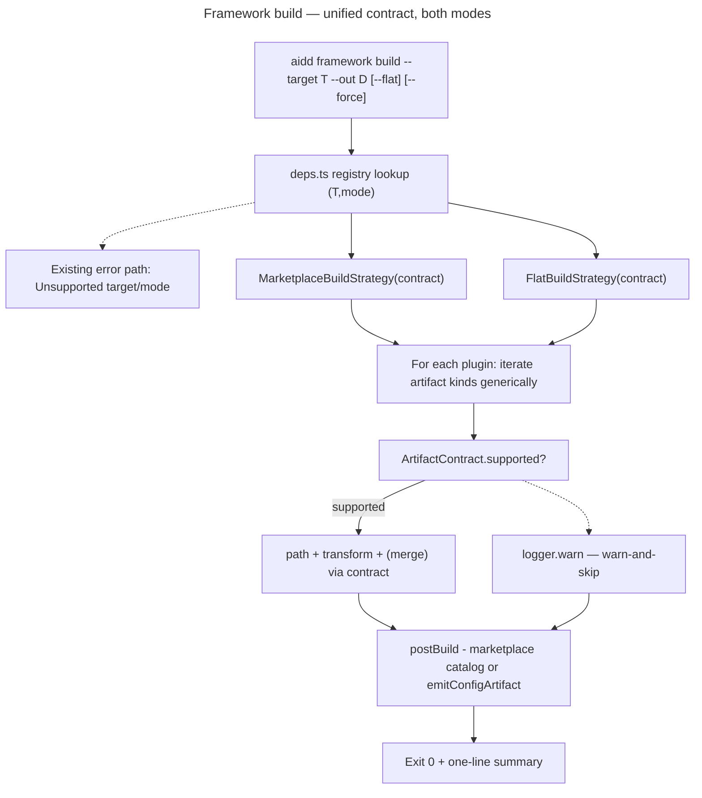

<!-- AI INSTRUCTIONS: ENGLISH ONLY. Append-only Log. Amendments prefixed 🤖. Do NOT write code from this file directly — execute phase by phase via the implementer, gating each phase on its own test gate. -->

# Instruction: Unified `ToolBuildContract` + flat parity (all 5 tools, both modes)

## Feature

- **Summary**: Replace the five per-tool/per-mode `*OutputStrategy` classes with a single per-tool `ToolBuildContract` (artifact-symmetric: skills/agents/mcp/hooks/rules/commands) driven by two thin mode orchestrators (`MarketplaceBuildStrategy`, `FlatBuildStrategy`). Retrofit current outputs byte-identical, then add flat mode for claude/cursor/codex/opencode. opencode flat is load-bearing (its only support path).
- **Stack**: `TypeScript 5 (ESM, NodeNext)`, `tsup`, `vitest`, `biome`, `ajv`, `commander`
- **Branch name**: `feat/framework-build-multi-target` (current; carries #279 marketplace work)
- **Parent Plan**: `none`
- **Sequence**: `standalone`
- Confidence: 9/10
- Time to implement: 2-3 focused sessions

## Architecture projection

### Files to modify

- `src/domain/models/framework-build.ts` - add `opencode` to `FrameworkBuildTarget` union; keep `FrameworkBuildMode`; reuse existing flat/output path constants.
- `src/domain/tools/ai/claude.ts` - attach a `buildContract: ToolBuildContract` to the tool def (or a sibling contract module wired here).
- `src/domain/tools/ai/cursor.ts` - attach contract (claude/cursor share a parameterized factory; cursor differs only in `manifestDir`/dir and `agents.transform` stripping `tools`/`color`).
- `src/domain/tools/ai/copilot.ts` - attach contract (`agents.ext=.agent.md`, `mcp.merge=mergeVscodeMcp`).
- `src/domain/tools/ai/codex.ts` - attach contract (`agents.transform=codexAgentMarkdownToToml`+`ext:.toml`, `skills.path` remap to `.agents/skills/`, `emitConfigArtifact=config.toml` skill-reg, `mcp.merge=mergeCodexConfigToml`).
- `src/domain/tools/ai/opencode.ts` - attach contract (`manifestDir/marketplaceRelative=null`, plural dirs, `mcp` merges into `opencode.json` via `mergeOpencodeMcp`+`transformMcpToOpencode`, `emitConfigArtifact=opencode.json`, `.jsonc` detection honored).
- `src/infrastructure/deps.ts` - replace `FRAMEWORK_BUILD_REGISTRY` rows with `(target,mode) → modeStrategy(toolContract)`; remove the 5 per-tool factory functions (`createCodexFrameworkBuildUseCase`, `createFlatFrameworkBuildUseCase`, and the inline claude/cursor/copilot factories); add the 4 new flat rows + opencode:flat; keep opencode:marketplace absent (→ undefined → existing error path).
- `src/application/commands/framework.ts` - delete the copilot-only flat guard (lines 49-52); add `opencode` to `SUPPORTED_TARGETS` (line 11) so `opencode --` non-flat routes to the registry and returns the existing "Unsupported target/mode combination" error (AC #7).
- `src/application/use-cases/framework/framework-build-use-case.ts` - default-strategy fallback (`?? new CopilotOutputStrategy`) must change to the new registry-supplied strategy (no per-tool default in the use-case).
- `src/domain/formats/copilot-flat-paths.ts` - generalize: extract tool-agnostic flat path primitives into a new module (below); leave copilot-specific constants thin or re-export.

### Files to create

- `src/domain/tools/contracts.ts` is the home of `Has*` interfaces today; add `ToolBuildContract` + `ArtifactContract` types there OR a dedicated `src/domain/tools/build-contract.ts` (governing skill: domain-model). Decide in P1; default = dedicated file to avoid bloating `contracts.ts`.
- `src/application/use-cases/framework/strategies/marketplace-build-strategy.ts` - `MarketplaceBuildStrategy(contract)` implementing `BuildOutputStrategy`; owns the per-plugin marketplace loop, drives the contract.
- `src/application/use-cases/framework/strategies/flat-build-strategy.ts` - `FlatBuildStrategy(contract)` implementing `BuildOutputStrategy`; owns the flat per-plugin namespace loop, collision/force, `${CLAUDE_PLUGIN_ROOT}` rewrite, MCP key-prefix merge, `postBuild=emitConfigArtifact`.
- `src/domain/formats/flat-paths.ts` (or extend an existing format module) - generic flat path primitives extracted from `copilot-flat-paths.ts` (skill/agent/hooks/mcp path builders parameterized by primary-dir + ext).
- Per-tool contract modules (location: alongside each tool def in `src/domain/tools/ai/`, or a `build-contracts/` subfolder — decide in P1): `claude`/`cursor` shared factory, `copilot`, `codex`, `opencode` contracts.
- Tests: `marketplace-build-strategy.integration.test.ts`, `flat-build-strategy.integration.test.ts`, per-contract unit tests, golden-matrix additions, flat e2e per new target, codex/opencode smoke.

### Files to delete

- `src/application/use-cases/framework/strategies/claude-output-strategy.ts`
- `src/application/use-cases/framework/strategies/cursor-output-strategy.ts`
- `src/application/use-cases/framework/strategies/copilot-output-strategy.ts`
- `src/application/use-cases/framework/strategies/codex-output-strategy.ts`
- `src/application/use-cases/framework/strategies/flat-output-strategy.ts`
- Their integration tests (`claude-/cursor-/codex-/flat-output-strategy.integration.test.ts`) are retargeted onto the two new orchestrators, not deleted blindly — superseded coverage moves to `marketplace-build-strategy`/`flat-build-strategy` tests.

> Keep: `marketplace-strategy-helpers.ts` (`synthesizeClaudeStyleManifest`, `writeSkillTree`, `buildClaudeStyleMarketplace*`, presence/resolve helpers), `build-output-strategy.ts` (the `BuildOutputStrategy` port both orchestrators implement), `shared-plugin-helpers.ts` (`assertNoToolsPlaceholder`). These are the reuse surface, not dead code.

## Applicable rules

| Tool   | Name                  | Path                                                                  | Why it applies |
| ------ | --------------------- | --------------------------------------------------------------------- | -------------- |
| claude | hexagonal             | `.claude/rules/00-architecture/0-hexagonal.md`                        | Contract types are domain; orchestrators are application use-cases; tool defs stay in `domain/tools/ai/`; deps wiring in `deps.ts`. |
| claude | layer-responsibilities| `.claude/rules/00-architecture/0-layer-responsibilities.md`           | Orchestrators orchestrate, no tool-specific `if`; contract holds tool specifics; methods ≤20 lines. |
| claude | error-handling        | `.claude/rules/00-architecture/0-error-handling.md`                   | `{supported:false}` warn-and-skip via logger.warn (no throw); collisions throw typed `FlatTargetExistsError`/`OutDirNotDirectoryError`; never silent. |
| claude | deps-wiring           | `.claude/rules/00-architecture/0-deps-wiring.md`                      | Registry change lives in `deps.ts`; `framework.ts` wires command only. |
| claude | typescript            | `.claude/rules/02-programming-languages/2-typescript.md`              | `.js` ESM imports, `import type`, no `any`, `readonly` on the artifacts map/union. |
| claude | exports               | `.claude/rules/01-standards/1-exports.md`                            | Named exports, no barrels, no default export. |
| claude | naming                | `.claude/rules/01-standards/1-naming.md`                            | kebab-case files; `*.unit/integration/e2e.test.ts` suffixes. |
| claude | method-size           | `.claude/rules/06-design-patterns/6-method-size.md`                  | ≤20 lines; the artifact-kind loop must extract intent-named helpers, not `executeInternal`. |
| claude | clean-code            | `.claude/rules/07-quality/7-clean-code.md`                          | YAGNI on rules/commands (`{supported:false}` only, no emitters); DRY via claude/cursor shared factory; no commented-out old strategies. |
| claude | cli-output            | `.claude/rules/03-frameworks-and-libraries/3-cli-output.md`         | warn-and-skip → `warn` channel; one-line final summary. |
| claude | biome                 | `.claude/rules/04-tooling/4-biome.md`                              | `biome check --write` is the formatter; part of the lint gate. |

## User Journey

## Reuse inventory (verified against code)

| Need | Reuse | Location (verified) | M/C/D |
| --- | --- | --- | --- |
| `BuildOutputStrategy` port (both orchestrators implement) | keep as-is | `strategies/build-output-strategy.ts` | M (no change expected) |
| marketplace manifest synth (claude/cursor/copilot) | `synthesizeClaudeStyleManifest` | `strategies/marketplace-strategy-helpers.ts:122` | reuse |
| marketplace catalog + entries | `buildClaudeStyleMarketplace`, `buildClaudeStyleMarketplaceEntry`, `resolveVersion`, `resolveDescription`, `detectPluginPresenceFlags` | `strategies/marketplace-strategy-helpers.ts` | reuse |
| marketplace skill tree write | `writeSkillTree` | `strategies/marketplace-strategy-helpers.ts:57` | reuse |
| `@{{TOOLS}}/` guard | `assertNoToolsPlaceholder` | `framework/shared-plugin-helpers.ts` | reuse |
| flat agent/skill/hooks path + key-prefix + ${CLAUDE_PLUGIN_ROOT} resolve | `flatAgentPath`, `flatSkillPath`, `flatHooksFile`, `flatHooksScriptPath`, `flatMcpKeyPrefix`, `resolveClaudeRootSuffixForFlat`, `FLAT_MCP_OUTPUT_PATH` | `formats/copilot-flat-paths.ts` | M → generalize into `formats/flat-paths.ts` |
| relative-link + claude-root rewrite | `rewriteRelativeLinks`, `rewriteClaudeRootInJson` | `formats/relative-link-rewrite.ts`, `formats/claude-root-path-rewrite.ts` | reuse |
| agent frontmatter strip (flat) / cursor strip | `stripAgentFrontmatter`, `stripCursorAgentFrontmatter` | `formats/agent-frontmatter-strip.ts` | reuse |
| agent → TOML (codex) | `codexAgentMarkdownToToml` | `formats/codex-agent-toml.ts` | reuse |
| codex config.toml skill-reg + mcp merge | `mergeCodexConfigToml` (wraps `ensureSkillsConfig`, `mergeMcpServers`, `ensureCodexHooks`) | `tools/ai/codex.ts:114` | reuse |
| codex skill remap path | `buildCodexSkillFilePath` | `tools/ai/codex.ts:181` | reuse |
| opencode mcp merge + transform | `mergeOpencodeMcp`, `transformMcpToOpencode` | `formats/opencode-mcp-merge.ts:22`, `tools/ai/opencode.ts:70` | reuse |
| opencode `.jsonc` detection | `mcp.resolveOutputPath` | `tools/ai/opencode.ts:142` | reuse |
| vscode mcp merge (copilot flat) + claude/cursor flat mcp merge | `mergeVscodeMcp` | `formats/vscode-mcp-merge.ts:36` | M → parameterize servers-key (`servers` vs `mcpServers`); see P4 + M/C/D |
| markdown frontmatter parse/serialize | `parseFrontmatter`, `serializeFrontmatter` | `formats/markdown.ts` | reuse |

## M/C/D decisions (why reuse vs new)

- **MODIFY, never reimplement, every merge helper.** Correctness lock #1: flat MCP merge for EVERY tool must key-prefix by `<plugin>-` via the existing helper for that tool's target file. claude `.mcp.json` and cursor `.cursor/mcp.json` have no plugin isolation → reuse `flatMcpKeyPrefix` + a merge helper. **GENERALIZE `mergeVscodeMcp` to parameterize the servers-key** (`servers` for copilot/vscode vs `mcpServers` for claude/cursor): `mergeVscodeMcp` currently hardcodes the `servers` key, and the claude/cursor *marketplace* path byte-copies `.mcp.json` (never merges) — so NO existing helper does a prefixed additive merge into `mcpServers`. Per lock #1 (reuse, never reimplement), generalize the one helper rather than writing a new merge. opencode → `mergeOpencodeMcp`; codex → `mergeCodexConfigToml`. No net-new merge logic.
- **CREATE the two orchestrators + contract type.** This is the architectural delta; nothing to reuse — but they MUST consume the kept helpers (`marketplace-strategy-helpers`, flat-paths) rather than re-housing logic.
- **CREATE generic `flat-paths.ts` by extracting from `copilot-flat-paths.ts`.** The path logic is already pure and correct for copilot; generalize the primary-dir prefix + agent-ext so claude (`.claude/`, `.md`), cursor (`.cursor/`, `.md`), opencode (`.opencode/`, `.md`, plural), codex (`.codex/`/`.agents/skills/`, `.toml`) reuse it.
- **DELETE the 5 strategy classes after their behavior is provably folded into orchestrator+contract** (P2/P3 gates), never before — each deletion is gated by a byte-identical proof.
- **Decision: claude+cursor share a parameterized contract factory** (DRY rule) — they differ only in `manifestDir`/dir and cursor's agent `tools`/`color` strip; mirrors the shipped `synthesizeClaudeStyleManifest` reuse.
- **Decision: `rules`/`commands` artifacts = `{supported:false}`** for all tools (YAGNI; framework ships none). Same warn-and-skip path the use-case's `warnOutOfScopeSections` already takes.
- **Decision (resolves a spec conflict): per-tool `hooks` support is NOT uniform; opencode `hooks` = `{supported:false}`.** The spec's two tables disagree — the support matrix (§Per-tool × artifact support) lists opencode hooks as "per def\*" (like claude/cursor), while the flat-layout table (§Per-tool flat layout) shows "—" for opencode hooks. **Resolution: opencode hooks unsupported (warn-skip).** Grounded in the verified tool def — `src/domain/tools/ai/opencode.ts` composes `HasAgents & HasSkills & HasCommands & HasRules & HasMcp & HasPlugins` with **no `HasHooks` capability and no hooks output path** (confirmed by reading the file). copilot/codex `hooks` = `{supported:true}` (copilot `.github/hooks/`, codex `.codex/hooks.json`); claude/cursor `hooks` = `{supported:true}` (`hooks/hooks.json` byte-copy / per-plugin flat file). This gives AC #11 a clean tool-unsupported `hooks` proof case (opencode), beyond rules/commands. **P6 must re-verify** against the opencode tool def before locking the contract.
- **Decision: the DURABLE regression oracle is the committed `golden.json` (frozen pre-change cells), NOT only an ephemeral capture.** The committed golden.json already holds pre-change outputs for the 4 marketplace cells — it predates this refactor, so it IS the pre-change baseline. P1 extends the golden harness to also capture `copilot --flat` (the one existing output not yet in golden) and regenerates ONCE from clean HEAD; the 5 existing cells are then FROZEN (no `UPDATE_FRAMEWORK_GOLDEN=1` against them through the whole refactor — P7 only adds the 4 new flat cells). This makes `pnpm test` a standing byte-identity gate against pre-change HEAD, more robust than a /tmp diff that vanishes after P3. A `/tmp/aidd-fb-baseline/` hash-map diff (reusing the golden test's `hashDirectory`) is kept as a fast P2/P3 working check only.

## Risk register

| Risk | Impact | Mitigation |
| --- | --- | --- |
| Regression baseline taken from a post-change `golden.json` regeneration instead of pre-change HEAD | Retrofit silently drifts; a regenerated golden proves only idempotency, not parity with #279 | **Two-layer defense.** (a) **Durable standing gate**: the committed `golden.json` predates this refactor for the 4 marketplace cells — it IS the pre-change baseline for those. In P1, EXTEND the golden harness to also capture `copilot --flat` (the only existing output golden does not yet cover), regenerating golden.json ONE LAST TIME from clean HEAD before any P2 edit. Thereafter the 5 existing cells are **FROZEN** — `UPDATE_FRAMEWORK_GOLDEN=1` is forbidden against them; P7 only ADDs the 4 new flat cells. `pnpm test` then enforces byte-identity to pre-change HEAD permanently. (b) **Working check** during P2/P3: also diff against a `/tmp/aidd-fb-baseline/` capture for fast local feedback. `smoke-regression.sh` does NOT capture framework-build output (it walks CLI commands), so neither layer relies on it. |
| Flat MCP merge not key-prefixed for claude/cursor | Two plugins' servers collide at `.mcp.json`/`.cursor/mcp.json` | Mandate `<plugin>-` key prefix for ALL tools' flat MCP via `flatMcpKeyPrefix` + existing merge helper; AC #6 + integration test asserts no collision for two plugins with same server name. |
| Orchestrators leak per-tool / per-artifact branching | Defeats the refactor; AC #10 fails | Orchestrators iterate `contract.artifacts` kinds generically; zero `if (tool===)` and zero `if (kind==="agents")`. Enforced by a **runnable grep gate** (must exit non-zero, i.e. zero matches): `! grep -nE '(tool ?===|kind ?=== ?.agents.)' src/application/use-cases/framework/strategies/marketplace-build-strategy.ts src/application/use-cases/framework/strategies/flat-build-strategy.ts`. Run at P2 (marketplace) and P3 (flat). |
| opencode added as target but non-flat path not erroring | AC #7 (`opencode --` non-flat = unsupported) breaks | Add opencode to `SUPPORTED_TARGETS` AND leave `opencode:marketplace` absent from registry → `createFrameworkBuildUseCase` returns undefined → existing command error path. e2e asserts exit 1 + message. |
| Skill-dir nesting wrong per tool (`<plugin>/<skill>/SKILL.md`) | Real tool discovery fails despite passing tests | P7 smoke validates against real tool discovery where feasible; codex (`.agents/skills/`) + opencode (plural) smoke mandatory. |
| Deleting strategy integration tests loses coverage | Silent coverage regression | Retarget superseded tests onto the two orchestrators in P2/P3, do not delete blindly. |

## Implementation phases

> Phases map 1:1 to the spec's regression-safe §Sequencing. Each phase: files touched + governing layer skill + a runnable test gate. Do NOT reorder — each phase must be independently provable before the next.

### Phase 1: Define `ToolBuildContract` + extract generic flat primitives + capture baseline

> Establish the contract type and the shared flat-path primitives WITHOUT changing any output. Capture the pre-change regression baseline.

- **Files touched**: `src/domain/tools/build-contract.ts` (new — `ToolBuildContract`, `ArtifactContract`), `src/domain/formats/flat-paths.ts` (new — extracted from `copilot-flat-paths.ts`), `src/domain/formats/copilot-flat-paths.ts` (thin re-export/specialization), `src/domain/models/framework-build.ts` (no output change yet; constants reuse).
- **Governing layer skill**: `domain-model` (the contract/union types) — secondary `format` (flat-path primitive extraction).
- **Test gate**: `pnpm typecheck && pnpm build && pnpm test` stay green (no behavior change yet) AND a saved baseline snapshot exists: build current HEAD outputs for `--target {claude,cursor,copilot,codex}` (marketplace) + `--target copilot --flat` into a captured dir and store its hashes for later diff.

#### Tasks
1. Define `ArtifactContract` discriminant union + `ToolBuildContract` interface per spec §Architecture (artifact-symmetric: skills/agents/mcp/hooks/rules/commands; `manifestDir`, `marketplaceRelative`, `synthesizeManifest`, optional `emitConfigArtifact`).
2. Extract tool-agnostic flat path builders from `copilot-flat-paths.ts` into `flat-paths.ts`, parameterized by primary-dir prefix + agent ext + plural flag; keep copilot constants as a thin specialization.
3. **Freeze the durable baseline in golden**: extend `framework-build-golden.e2e.test.ts` `TARGETS`/harness to capture `copilot --flat` (the only existing output golden does not yet cover; the 4 marketplace cells are already pre-change), then regenerate `golden.json` ONE LAST TIME from clean HEAD (`UPDATE_FRAMEWORK_GOLDEN=1`). After this, the 5 existing cells are FROZEN — never regenerated again during the refactor.
4. Capture an ephemeral working baseline: build all 5 current outputs from HEAD into `/tmp/aidd-fb-baseline/` (outside the tree, never tracked); record file hashes (reuse `hashDirectory`). Fast P2/P3 local check only — the standing gate is the frozen golden.json, NOT smoke-regression.sh.

#### Acceptance criteria
- [ ] `ToolBuildContract`/`ArtifactContract` compile; no existing code references them yet (or references are no-op).
- [ ] `flat-paths.ts` exports generic primitives; `copilot-flat-paths.ts` re-exports/specializes them; copilot flat output unchanged.
- [ ] `golden.json` extended to include the `copilot --flat` cell and regenerated once from clean HEAD; the 5 existing cells are now the frozen pre-change baseline.
- [ ] Ephemeral working baseline + hashes captured in `/tmp/aidd-fb-baseline/` (outside the tree) for P2/P3 fast diffing.
- [ ] `pnpm typecheck && pnpm build && pnpm test` green.

### Phase 2: Retrofit claude+cursor+copilot+codex marketplace onto `MarketplaceBuildStrategy(contract)`

> One marketplace orchestrator drives all four tool contracts; marketplace output byte-identical to baseline (AC #1, marketplace half).

- **Files touched**: `src/application/use-cases/framework/strategies/marketplace-build-strategy.ts` (new), claude/cursor (shared factory)/copilot/codex contract modules (new), `src/infrastructure/deps.ts` (point the 4 marketplace registry rows at `MarketplaceBuildStrategy(contract)`), `framework-build-use-case.ts` (drop `CopilotOutputStrategy` default).
- **Governing layer skill**: `use-case` (the orchestrator is the new application artifact) — secondary `tool` (per-tool contracts).
- **Test gate**: `pnpm build && vitest run --project=integration` for the new orchestrator + `pnpm test:e2e` golden marketplace cells + **diff against the P1 captured baseline for claude/cursor/copilot/codex marketplace = byte-identical** + AC #10 grep gate green: `! grep -nE '(tool ?===|kind ?=== ?.agents.)' src/application/use-cases/framework/strategies/marketplace-build-strategy.ts`.

#### Tasks
1. Implement `MarketplaceBuildStrategy(contract)` reusing `marketplace-strategy-helpers` (manifest synth, skill tree, catalog) — iterate artifact kinds generically.
2. Implement claude/cursor shared contract factory (differ only in `manifestDir`/dir + cursor agent `tools`/`color` strip), copilot contract, codex contract (TOML agent transform, skill remap, config.toml skill-reg).
3. Repoint the 4 marketplace registry rows; remove per-tool marketplace factories from `deps.ts`.

#### Acceptance criteria
- [ ] Marketplace output for claude/cursor/copilot/codex byte-identical to P1 baseline (AC #1 marketplace half).
- [ ] No `if (tool===)` / `if (kind==="agents")` in `MarketplaceBuildStrategy` (AC #10).
- [ ] Golden marketplace cells + new orchestrator integration tests pass.

### Phase 3: Retrofit copilot flat onto `FlatBuildStrategy(contract)`; delete superseded classes

> One flat orchestrator drives the copilot contract; copilot flat byte-identical (AC #1, flat half). Then delete the 5 old strategy classes.

- **Files touched**: `src/application/use-cases/framework/strategies/flat-build-strategy.ts` (new), `deps.ts` (`copilot:flat` row → `FlatBuildStrategy(copilotContract)`), DELETE `flat-output-strategy.ts` + `claude-/cursor-/copilot-/codex-output-strategy.ts`, retarget their integration tests onto the two orchestrators.
- **Governing layer skill**: `use-case`.
- **Test gate**: `pnpm build && vitest run --project=integration` + `pnpm test:e2e` + **diff copilot flat against P1 baseline = byte-identical** + `pnpm smoke:regression` green + AC #10 grep gate green: `! grep -nE '(tool ?===|kind ?=== ?.agents.)' src/application/use-cases/framework/strategies/flat-build-strategy.ts`.

#### Tasks
1. Implement `FlatBuildStrategy(contract)` generalizing the copilot flat pipeline (primary-dir + per-plugin namespace, collision/`--force`, `${CLAUDE_PLUGIN_ROOT}` rewrite, MCP key-prefix merge, `postBuild=emitConfigArtifact`).
2. Repoint `copilot:flat` registry row; delete the 5 old strategy files.
3. Retarget superseded integration tests onto `marketplace-build-strategy`/`flat-build-strategy`.

#### Acceptance criteria
- [ ] Copilot flat byte-identical to P1 baseline (AC #1 flat half).
- [ ] 5 strategy classes deleted; no dangling imports; `pnpm knip:production` clean.
- [ ] No per-tool / per-artifact branching in `FlatBuildStrategy` (AC #10).

### Phase 4: claude + cursor flat (shared contract)

> Add flat mode for claude and cursor via the shared contract factory + `FlatBuildStrategy`.

- **Files touched**: claude/cursor contract modules (add flat artifact paths), `deps.ts` (`claude:flat`, `cursor:flat` rows), `framework.ts` (guard already removed in this phase set), `flat-build-strategy.integration.test.ts`, flat e2e for claude/cursor.
- **Governing layer skill**: `tool` (contract defines the per-tool flat layout).
- **Test gate**: `pnpm build && vitest run --project=integration` + `pnpm test:e2e` covering `--target claude --flat` and `--target cursor --flat` (AC #2, #3).

#### Tasks
1. Define flat artifact paths in the claude/cursor contract: skills `.claude|.cursor/skills/<plugin>/…`, agents `.claude|.cursor/agents/<plugin>/*.md`, mcp `.mcp.json`/`.cursor/mcp.json` (`mcpServers` key) key-prefixed.
2. MCP merge: generalize `mergeVscodeMcp` to take the servers-key as a param (`servers` for copilot, `mcpServers` for claude/cursor) — do NOT reuse it as-is (it hardcodes `servers`) and do NOT write a new merge (lock #1). Re-point copilot's contract to the generalized helper with `servers`.
3. Cursor agents carry NO `tools`/`color` (reuse strip in transform).
4. Add `claude:flat`/`cursor:flat` registry rows; remove the copilot-only guard in `framework.ts` (lines 49-52).

#### Acceptance criteria
- [ ] `--target claude --flat --out <dir>` materializes skills/agents/.mcp.json (prefixed); exit 0 (AC #2).
- [ ] `--target cursor --flat` under `.cursor/`; agent `.md` carry no `tools`/`color` (AC #3).
- [ ] Two plugins, same server name → no collision (AC #6).

### Phase 5: codex flat (TOML + config.toml)

> Add flat mode for codex: agent→TOML, skill remap, config.toml skill-reg + mcp merge.

- **Files touched**: codex contract module (flat paths + `emitConfigArtifact`), `deps.ts` (`codex:flat` row), `codex` flat e2e, codex contract unit tests.
- **Governing layer skill**: `tool`.
- **Test gate**: `pnpm build && vitest run --project=integration` + `pnpm test:e2e` for `--target codex --flat` asserting valid TOML agents, skills under `.agents/skills/`, idempotent `[[skills.config]]`, merged `mcp_servers` (AC #4).

#### Tasks
1. codex contract flat: `agents.transform=codexAgentMarkdownToToml`+`ext:.toml` → `.codex/agents/*.toml`; `skills.path` remap to `.agents/skills/aidd-…`; hooks `.codex/hooks.json`.
2. `emitConfigArtifact` = write `.codex/config.toml` skill-reg via `mergeCodexConfigToml` (idempotent `ensureSkillsConfig`); mcp merge into `mcp_servers`.
3. Add `codex:flat` registry row.

#### Acceptance criteria
- [ ] `--target codex --flat` emits valid-TOML agents (`name`/`description`/`developer_instructions`), skills under `.agents/skills/`, registers skills in `.codex/config.toml` idempotently, merges `mcp_servers` (AC #4).

### Phase 6: opencode flat (json-merge + plural dirs) — load-bearing

> Add flat mode for opencode: the only opencode support path.

- **Files touched**: opencode contract module (`manifestDir/marketplaceRelative=null`, plural dirs, `mcp` via `mergeOpencodeMcp`+`transformMcpToOpencode`, `.jsonc` detection, `emitConfigArtifact=opencode.json`), `deps.ts` (`opencode:flat` row; `opencode:marketplace` stays absent), `framework.ts` (`opencode` added to `SUPPORTED_TARGETS`), `framework-build.ts` (`opencode` in `FrameworkBuildTarget`), opencode flat e2e + unit.
- **Governing layer skill**: `tool`.
- **Test gate**: `pnpm build && vitest run --project=integration` + `pnpm test:e2e` for `--target opencode --flat` (AC #5) AND `--target opencode` (non-flat) → exit 1 unsupported (AC #7).

#### Tasks
1. opencode contract flat: skills `.opencode/skills/<plugin>/…` (plural), agents `.opencode/agents/*.md`; mcp merges into `opencode.json` (`mcp`, `type: local|remote`) via reused helpers; `.jsonc` honored.
2. Add `opencode` to the target union + `SUPPORTED_TARGETS`; add `opencode:flat` row; leave `opencode:marketplace` absent.
3. e2e: assert `opencode --` non-flat returns existing "Unsupported target/mode combination" error (exit 1).

#### Acceptance criteria
- [ ] `--target opencode --flat` emits `.opencode/skills/<plugin>/…`, `.opencode/agents/*.md`, merges MCP into `opencode.json`; plural dirs; `.jsonc` detection honored (AC #5).
- [ ] `--target opencode` non-flat → exit 1, existing error path (AC #7).
- [ ] `--flat` now works for all 5 targets; copilot-only guard gone (AC #7).

### Phase 7: golden matrix + e2e + /tmp smoke (codex + opencode mandatory)

> Lock the full 9-cell matrix, machine-independent goldens, and real-tool smoke.

- **Files touched**: `tests/golden/framework-build-golden.e2e.test.ts` + `tests/golden/snapshots/framework-build/golden.json` (5 tools × applicable modes = 9 cells), flat e2e per new target, `scripts/smoke-*.sh` additions for codex/opencode flat.
- **Governing layer skill**: `test`.
- **Test gate**: `pnpm test` (golden matrix machine-independent) + `pnpm smoke` (codex + opencode flat into `/tmp/<name>`, real-tool discovery where feasible, assert exit 0 + expected tree + valid TOML/`opencode.json`).

#### Tasks
1. Extend golden matrix to 9 cells by ADDING ONLY the 4 new flat cells (claude/cursor/codex/opencode flat). The 5 existing cells (4 marketplace + copilot flat, frozen in P1) MUST NOT be regenerated — `UPDATE_FRAMEWORK_GOLDEN=1` is scoped to the new cells only, so `pnpm test` keeps enforcing byte-identity to pre-change HEAD. Ensure machine-independent (no absolute paths leak into snapshots).
2. Add flat e2e journeys per new target against `tests/fixtures/framework-real/`.
3. Add codex + opencode `/tmp`-only smoke (never repo root); assert exit 0 + tree + valid TOML + valid `opencode.json`.

#### Acceptance criteria
- [ ] Golden matrix covers 9 cells; the 5 pre-change cells are unchanged from the P1 frozen baseline (byte-identical to pre-change HEAD, AC #1); re-run byte-identical; machine-independent (AC #8).
- [ ] Collision without `--force` → `FlatTargetExistsError`; `--out` not a dir → `OutDirNotDirectoryError` (AC #9).
- [ ] Unsupported artifacts warn-and-skip, no crash (AC #11): `rules`/`commands` for all tools AND **opencode `hooks`** (`{supported:false}` per spec matrix) — proven by an assertion that opencode flat logs a warn-skip for a hooks-bearing plugin and does not emit a hooks file.
- [ ] codex + opencode smoke pass in `/tmp` (mandatory).
- [ ] `success_condition` (`pnpm build && pnpm typecheck && pnpm lint && pnpm test && pnpm smoke`) passes.

## Knowledge update (skills) — after implementation (out of code scope, tracked here)

- `tool` skill — UPDATE: canonical way to add a tool's framework-build behavior is now "implement a `ToolBuildContract` (artifact-symmetric)", NOT "write a `*OutputStrategy` class". Highest-value update.
- `format` skill — NOTE/cross-ref: per-artifact transforms (agent→TOML, mcp→opencode) live as pure functions reused by the contract.
- Capture decisions: "artifact-symmetric contract over per-tool classes" + "regression baseline is pre-change HEAD capture, not golden.json". Evaluate a dedicated `framework-build` skill only AFTER code lands (YAGNI).

## Quality assurance

Confidence: **9/10**

- ✓ All referenced source files read and verified (5 strategies, 4 tool defs, use-case, deps registry, command, merge helpers, flat-paths, golden infra, package scripts).
- ✓ Phases map 1:1 to the spec's §Sequencing (7 steps); each has files + governing skill + runnable gate.
- ✓ Both correctness locks elevated to the Risk register (MCP key-prefix for every tool; baseline = pre-change HEAD, confirmed `smoke-regression.sh` does NOT capture it).
- ✓ M/C/D enumerated from confirmed paths; opencode target-union + SUPPORTED_TARGETS modification identified for AC #7.
- ✗ Risk: exact home of the per-tool contract (in `tools/ai/*.ts` vs a `build-contracts/` subfolder) is left as a P1 decision, not pre-decided — acceptable but defer to implementer + hexagonal rule.
- ✗ Risk: extracting flat primitives from `copilot-flat-paths.ts` must not change copilot flat bytes; mitigated by P1/P3 byte-identical gates.

## Amendments

<!-- AI-initiated changes during implementation. Each entry prefixed with 🤖. -->

## Log

<!-- APPEND ONLY. One entry per step attempt. -->

## Validation flow demonstration

1. From `cli/`: `pnpm build`.
2. `node dist/cli.js framework build --source tests/fixtures/framework-real --target opencode --flat --out /tmp/aidd-flat-opencode` → exit 0; verify `.opencode/skills/<plugin>/…`, `.opencode/agents/*.md`, `opencode.json` `mcp` present.
3. `node dist/cli.js framework build --source tests/fixtures/framework-real --target codex --flat --out /tmp/aidd-flat-codex` → exit 0; verify `.codex/agents/*.toml` valid TOML + `.codex/config.toml` `[[skills.config]]`.
4. `node dist/cli.js framework build --source tests/fixtures/framework-real --target opencode --out /tmp/x` (no `--flat`) → exit 1, unsupported message.
5. `pnpm test && pnpm smoke` → all green (golden 9 cells + codex/opencode smoke).
