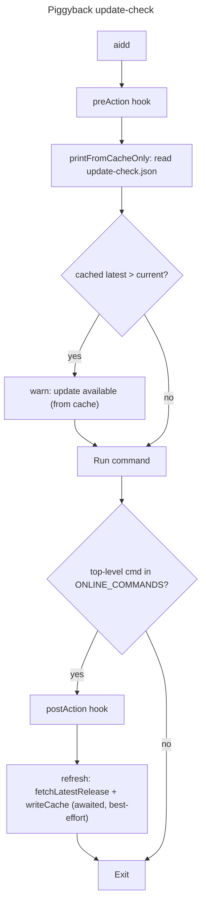

# Instruction: Piggyback update-check (perf) — revert over-design, fix the broken refresh

## Feature

- **Summary**: The startup update-nag is a CLI-shell presentation detail, NOT a domain concern. Hot/offline commands (`status`, `list`, `doctor`, …) must READ the update-check cache and print the nag if outdated — ZERO network, ZERO process spawn. The cache is refreshed by **piggybacking**: only commands that are ALREADY going online (the user is already waiting on the network) refresh the nag cache as a cheap side-effect. The CLI-release fetch (`SelfUpdater.fetchLatestRelease`) happens there, never on the hot path.
- **Stack**: TypeScript ESM, Node.js >=20, commander 12, vitest 2, tsup 8
- **Branch name**: `fix/2026-06-audit-remediation`
- **Parent Plan**: `./2026_06_11-full-audit-remediation-master.md`
- **Sequence**: part 1 of 6
- Confidence: 9/10
- Time to implement: ~0.5 day

## Why this is a redo

Two prior attempts are being replaced by the piggyback design:

1. **Committed Part 1 (commit `8eefcdf`)** — in-process `refreshDetached()` that did `await fetchLatestRelease({ unref: true })` then `await writeCache()`. The `unref: true` un-references the socket so the process can exit before the fetch resolves; the cache is then **never written** (the bug). It "saved time" by making the refresh a no-op.
2. **Uncommitted over-design (on disk now)** — a `BackgroundSpawner` port + adapter that spawns a detached child (`--__refresh-update-check`) which re-enters the CLI to refresh the cache. This is a whole new domain port, a hidden CLI flag, a re-entrant `cli.ts` branch, and a dedicated e2e — far more machinery than a startup nag warrants.

The redo deletes both and replaces them with: **read-cache-and-print on the hot path; piggyback-refresh on already-online commands.**

## Design (final decision)

### Two independent responsibilities, both cheap

- **Hot/offline path (every command via `preAction`)**: `CheckUpdateUseCase.printFromCacheOnly()` — read `update-check.json`, print the nag if the cached `latest` is newer than the current version (fresh OR stale; an aged value is still a useful nudge). No network, no spawn, no refresh trigger.
- **Online piggyback (only commands already on the network)**: after the host command completes, the shell awaits `CheckUpdateUseCase.refresh()` — `fetchLatestRelease()` + `writeCache()`. The user is already paying for network latency on these commands, so one extra round-trip is acceptable, and it warms the cache for the next hot command.

### Why the trigger lives in the shell, not in the host use-cases

- The nag is explicitly a **shell presentation concern**, not domain. Injecting `CheckUpdateUseCase` into `MarketplaceRefreshUseCase` / `UpdateAllUseCase` would make an unrelated domain use-case depend on the nag — wrong layer.
- `.claude/rules/00-architecture/0-error-handling.md`: use-cases throw, never catch. The piggyback refresh must be **best-effort/swallowed** so a failed nag refresh can never fail the host command. That `.catch()` is only legal at the shell layer. Precedent already exists in `cli.ts` `preAction`: `printFromCacheOnly().catch(debug)` and `checkAndOfferMigration`.

→ Implement the trigger as a commander `postAction` hook keyed on an **online-command allow-set** (mirroring the existing `MIGRATION_BYPASS_COMMANDS` set), awaiting `deps.checkUpdateUseCase.refresh().catch(debug)`.

### Host selection — the minimal sensible set of already-online commands

| Command | Already online? | Piggyback host? | Note |
| --- | --- | --- | --- |
| `update` (`UpdateAllUseCase`) | yes — fetches marketplace sources to update | **yes** | Run while the user is still on an old version → the highest-value host (warms the cache for someone who *needs* the nag). |
| `marketplace refresh` | yes — re-fetches catalog sources | **yes** | Routine online command. |
| `marketplace check` | yes — fetches catalog to compare | **yes** | Routine online command. |
| `marketplace list` | yes — `MarketplaceListUseCase` fetches via `fetchMarketplaceSource` | **yes** | Online. |
| `marketplace add` | yes — `MarketplaceAddUseCase` fetches via `fetchMarketplaceSource` | **yes** | Online. |
| `marketplace remove` | **no** — `MarketplaceRemoveUseCase(fs, manifestRepo, marketplaceRegistry, prompter)` has no http/fetcher | **NO** | **Offline.** Must NOT trigger a refresh — doing so would violate the zero-network rule for offline commands. |
| `self-update` | yes — fetches the CLI release | **no** | Already excluded from the nag (`cmd !== "self-update"`); post-update `current == latest` so the nag never fires for this user. It is the *least* useful host and would double-fetch (`SelfUpdateUseCase` already fetched). Do NOT add it. |

**Host set must be subcommand-path-granular, NOT top-level-name-granular.** Keying on the top-level name `"marketplace"` would wrongly include the offline `marketplace remove`. Match on the resolved command path (`resolveCommandPath(actionCommand)`): trigger refresh when the path is `"update"` OR one of `"marketplace refresh" | "marketplace check" | "marketplace list" | "marketplace add"`. Enumerate these explicitly:

```ts
const ONLINE_COMMAND_PATHS = new Set([
  "update",
  "marketplace refresh",
  "marketplace check",
  "marketplace list",
  "marketplace add",
]);
```

`marketplace remove` and `self-update` are deliberately absent.

### Freshness consequence (intended tradeoff, document it)

With zero refresh on hot commands, the cache only warms after the user runs at least one online command (`update` / `marketplace …`). The nag therefore appears only *after* such a command has run at least once. This is the accepted tradeoff — the original risk register already accepted "first-ever run shows no notice." It is NOT a bug: the real upgrade path (`self-update`) always fetches live, so correctness of the actual update is never stale; only the informational nudge lags.

## Architecture projection

### Files to modify

- `src/application/use-cases/check-update-use-case.ts` — keep `printFromCacheOnly()` as-is (read cache, print nag if outdated, no network). Remove the `spawner` constructor param and the `BackgroundSpawner` import. Remove `maybeScheduleRefresh()` (hot-path spawn trigger). Rename `runRefreshNow()` → `refresh()` (plain awaited `fetchLatestRelease()` + `writeCache()`; called only from the online shell path). Decision: `refresh()` is **unconditional** (no TTL gate) — online commands are infrequent, and the host is already paying network cost; simpler than re-reading the cache to check the TTL.
- `src/cli.ts` — `preAction`: keep `printFromCacheOnly().catch(debug)`; **delete** the `maybeScheduleRefresh()` call. **Delete** `runUpdateRefreshChild()`, the `REFRESH_UPDATE_CHECK_FLAG` import, and the `cliArgs.includes(REFRESH_UPDATE_CHECK_FLAG)` branch in the entry dispatch. Add a `postAction` hook that, when the resolved top-level command is in ONLINE_COMMANDS, awaits `deps.checkUpdateUseCase.refresh().catch(debug)`. Add the `ONLINE_COMMANDS` set near `MIGRATION_BYPASS_COMMANDS`.
- `src/infrastructure/deps.ts` — drop `const backgroundSpawner = new BackgroundSpawnerAdapter()`, drop the `BackgroundSpawnerAdapter` import, and remove the 5th `backgroundSpawner` arg from the `CheckUpdateUseCase` constructor call (`check-update-use-case` then takes 4 deps: `cliUpdater`, `currentVersionProvider`, `logger`, `fs`).
- `src/domain/ports/self-updater.ts` — remove `FetchLatestReleaseOptions` interface and the `options?` param on `fetchLatestRelease` (orphaned `unref` plumbing — see below).
- `src/infrastructure/adapters/self-updater-adapter.ts` — drop the `FetchLatestReleaseOptions` import and the `unref` arg; call `this.http.get(url, { token })`.
- `src/infrastructure/http/http-client.ts` — remove the `unref` option from `HttpGetOptions`, the `unref` param threading in `doGet`, and the `req.on("socket", (s) => s.unref())` block.
- `tests/application/use-cases/check-update-use-case.unit.test.ts` — drop the `BackgroundSpawner`/`makeSpawner` mock and the 5th constructor arg from every instantiation; delete the `maybeScheduleRefresh` describe block; rename the `runRefreshNow` describe/test to `refresh`.
- `tests/application/check-update.unit.test.ts` — same spawner/arg cleanup; remove any `maybeScheduleRefresh`/`runRefreshNow`/spawner assertions; ensure it covers the read-cache/print nag behavior.

### Files to delete

- `src/domain/ports/background-spawner.ts`
- `src/infrastructure/adapters/background-spawner-adapter.ts`
- `tests/e2e/update-check.e2e.test.ts`

(`.vscode/` is untracked and unrelated to this task — do not touch it.)

### Files NOT in scope (do not touch)

- `scripts/perf-baseline.json` / `scripts/check-perf-regression.mjs` — the committed baseline (8eefcdf) stands. The piggyback hot path (one cache read, zero spawn, zero in-process fetch) is strictly lighter than both prior designs, so the existing gate holds. Acceptance is "`pnpm bench:check` passes" — do NOT re-capture (no Phase to do so).

### Orphaned `unref` dead code (verified)

`grep unref src/` confirms the only `fetchLatestRelease` callers (`self-update-use-case.ts:26`, `check-update-use-case.ts:60`) call it with **no options**, and no live caller passes `unref: true` to `http.get`. The entire `unref` chain (`FetchLatestReleaseOptions` in the port, the adapter passthrough, the http-client socket-unref) is dead. `.claude/rules/07-quality/7-clean-code.md` (YAGNI / dead code) requires its removal as part of this redo. It existed only to serve the buggy in-process detached fetch from 8eefcdf.

## Applicable rules

| Tool   | Name              | Path                                                        | Why it applies                                                                                                |
| ------ | ----------------- | ----------------------------------------------------------- | ------------------------------------------------------------------------------------------------------------ |
| claude | hexagonal         | `.claude/rules/00-architecture/0-hexagonal.md`              | No new domain port for a shell presentation concern; `CheckUpdateUseCase` keeps only its existing ports.       |
| claude | error-handling    | `.claude/rules/00-architecture/0-error-handling.md`         | Use-cases throw; the best-effort refresh `.catch(debug)` lives only at the shell layer, never inside the use-case. |
| claude | deps-wiring       | `.claude/rules/00-architecture/0-deps-wiring.md`            | `cli.ts` wires only; the `postAction` hook adds no business logic, just routes to the use-case.                |
| claude | layer-responsibilities | `.claude/rules/00-architecture/0-layer-responsibilities.md` | Methods ≤20 lines; use-case returns/throws, no internal catch.                                            |
| claude | clean-code        | `.claude/rules/07-quality/7-clean-code.md`                  | Remove the orphaned `unref`/`BackgroundSpawner` dead code immediately (YAGNI).                                 |
| claude | cli-output        | `.claude/rules/03-frameworks-and-libraries/3-cli-output.md` | The nag is a `warn` (stderr signal), already so in `printFromCacheOnly`.                                       |

## User Journey



## Risk register

| Risk                                                          | Impact                                                                 | Mitigation                                                                                                              |
| ------------------------------------------------------------ | --------------------------------------------------------------------- | --------------------------------------------------------------------------------------------------------------------- |
| Piggyback refresh slows an online command                     | The host command waits one extra GitHub round-trip.                    | The user is already online and waiting on that command's own network I/O; one more request is acceptable. It is awaited (so the cache is actually written — unlike 8eefcdf) but only on commands already paying network cost. |
| A failing nag refresh fails the host command                  | `aidd update` would error because a *nag* refresh threw.              | Refresh is `.catch(debug)`-guarded at the shell layer; it can never propagate into the host command's result.          |
| Nag silent until first online command                         | A user who only runs hot commands never sees the nag.                 | Intended tradeoff (documented above). The real upgrade path (`self-update`) always fetches live, so the *actual* update is never stale — only the informational nudge lags. |
| `postAction` not firing for the online command path           | Cache never warms → nag never appears.                               | Verify the hook fires for `update`, `marketplace refresh`, `marketplace check` by inspection of the resolved command name (the task accepts inspection over a dedicated e2e). |

## Implementation phases

### Phase 1: Revert the over-design and the broken refresh

> Strip the spawner port/adapter, the hidden-flag re-entry, and the orphaned `unref` plumbing.

#### Tasks

1. Delete `src/domain/ports/background-spawner.ts` and `src/infrastructure/adapters/background-spawner-adapter.ts`.
2. Delete `tests/e2e/update-check.e2e.test.ts`.
3. In `cli.ts`: remove the `REFRESH_UPDATE_CHECK_FLAG` import, `runUpdateRefreshChild()`, the `cliArgs.includes(REFRESH_UPDATE_CHECK_FLAG)` dispatch branch, and the `maybeScheduleRefresh()` call in `preAction`.
4. In `deps.ts`: remove the `BackgroundSpawnerAdapter` import, the `backgroundSpawner` instance, and the 5th constructor arg to `CheckUpdateUseCase`.
5. In `check-update-use-case.ts`: drop the `BackgroundSpawner` import and `spawner` field; delete `maybeScheduleRefresh()`; rename `runRefreshNow()` → `refresh()`.
6. Remove the `unref` chain: `FetchLatestReleaseOptions` + `options?` in `self-updater.ts`; the `unref` arg in `self-updater-adapter.ts`; the `unref` option/param/socket-unref block in `http-client.ts`.

#### Acceptance criteria

- [ ] `grep -rn "unref\|BackgroundSpawner\|REFRESH_UPDATE_CHECK_FLAG\|maybeScheduleRefresh\|runRefreshNow" src/ tests/` returns nothing.
- [ ] `pnpm typecheck` passes (no orphaned imports, no arity mismatch).

### Phase 2: Wire the piggyback refresh

> Hot path reads cache only; already-online commands refresh the cache as a side-effect.

#### Tasks

1. In `cli.ts`, add the `ONLINE_COMMAND_PATHS` set (the explicit 5-path enumeration above — `update` + 4 online marketplace subcommands; NOT `marketplace remove`, NOT `self-update`) near `MIGRATION_BYPASS_COMMANDS`.
2. Add a commander `postAction` hook: resolve the **full command path** via `resolveCommandPath(actionCommand)`; if it is in `ONLINE_COMMAND_PATHS`, `await deps.checkUpdateUseCase.refresh().catch((err) => deps.logger.debug(...))`. Reuse the same `createDeps(...).catch(() => null)` guard the `preAction` uses (memoized — no extra I/O).
3. Confirm the entry dispatch uses `program.parse(process.argv)`. The async `postAction` awaits a network refresh; verify commander keeps the process alive until the awaited refresh resolves under `parse()` (the existing async `preAction` with `process.exit` is evidence it sequences hooks/action correctly). If the cache is observed NOT to be written after an online command (Phase 2 acceptance below), switch the entry to `await program.parseAsync(process.argv)` — note this as the contingency.
4. Confirm `preAction` keeps `printFromCacheOnly().catch(debug)` and nothing else update-related.

#### Acceptance criteria

- [ ] `preAction` performs exactly one update action: `printFromCacheOnly()` (read cache + print nag). No network, no spawn, no refresh trigger on the hot path.
- [ ] `postAction` calls `refresh()` only for the 5 enumerated online paths; `marketplace remove` and `self-update` are excluded.
- [ ] A cold-cache `aidd status` (empty `AIDD_USER_CONFIG_DIR`) issues zero network requests and spawns zero children — verified by inspection (the only network/spawn code paths are gone).
- [ ] **Runtime proof (hard, not inspection):** with `AIDD_USER_CONFIG_DIR` pointed at a fresh temp dir, running an online command (`aidd marketplace check` or `aidd update`) leaves a written `update-check.json` in that dir afterwards — proving the `postAction` hook actually invokes `refresh()` post-action and the awaited fetch+write completes before exit. (If absent → apply the `parseAsync` contingency from task 3.)
- [ ] **Runtime proof (hard):** running an offline command (`aidd marketplace remove <name>` or `aidd status`) against a fresh temp dir leaves NO `update-check.json` — proving offline commands never refresh.

### Phase 3: Trim and pin the unit tests (inline, no e2e)

> Prove the three acceptances with the existing two unit files; no dedicated e2e.

#### Tasks

1. In both `tests/application/use-cases/check-update-use-case.unit.test.ts` and `tests/application/check-update.unit.test.ts`: remove `makeSpawner`/`BackgroundSpawner` and the 5th constructor arg from every `new CheckUpdateUseCase(...)`; delete the `maybeScheduleRefresh` describe block; rename the `runRefreshNow` cases to `refresh`.
2. Keep/confirm the `printFromCacheOnly` matrix: fresh → nag + no network; stale → nag from stale value + no network; absent → no nag + no network; never-settling `fetchLatestRelease` → `printFromCacheOnly` still resolves (proves the hot path never awaits the network port).
3. Keep one `refresh()` test: calls `fetchLatestRelease` exactly once and writes the cache (`latest` persisted) — this is the online piggyback contract.

#### Acceptance criteria

- [ ] (Hot never touches network) `printFromCacheOnly` tests pass and assert `fetchLatestRelease` is never called; the spawner mock is gone entirely.
- [ ] (Nag still shows from cache) fresh and stale tests assert the "CLI update available" warn fires from the cached value.
- [ ] (Online command refreshes cache) the `refresh()` test asserts one `fetchLatestRelease` call and a persisted cache entry; the shell call-site is verified by inspection (task accepts this over an e2e).
- [ ] `pnpm test:unit` passes; `pnpm bench:check` passes against the existing baseline.

## Amendments

## Log

## Validation flow demonstration

1. `grep -rn "unref\|BackgroundSpawner\|REFRESH_UPDATE_CHECK_FLAG" src/ tests/` → empty.
2. Point `AIDD_USER_CONFIG_DIR` at a fresh temp dir, `node dist/cli.js status` → returns immediately, no network, no child process (cold cache → no nag, by design).
3. `node dist/cli.js marketplace check` (or `update`) → after it runs, `update-check.json` exists in the temp dir (piggyback refresh wrote it).
4. `node dist/cli.js marketplace remove <name>` against a fresh temp dir → NO `update-check.json` written (offline subcommand, no refresh).
5. `node dist/cli.js status` again → the nag now prints from the freshly-written cache (if a newer version exists).
6. `pnpm test:unit && pnpm bench:check` → green.
