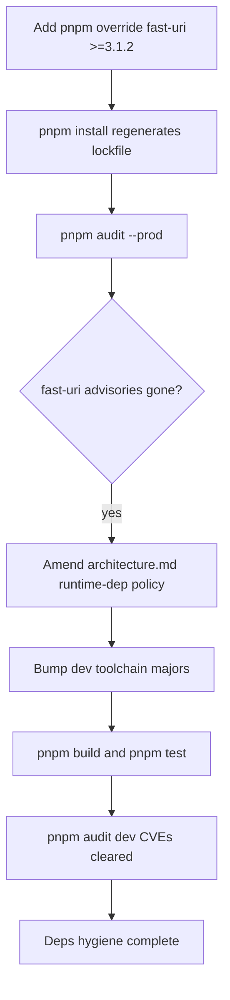

# Instruction: Dependency hygiene + runtime-dep policy decision

## Feature

- **Summary**: `ajv → fast-uri@3.1.0` ships two HIGH CVEs (GHSA-q3j6-qgpj-74h6 path traversal, GHSA-v39h-62p7-jpjc host confusion) in the **prod** tree; one pnpm `override` to `fast-uri ≥3.1.2` closes both. The runtime-dependency policy in `architecture.md` says "2 deps max" but 6 are declared and 4 (`ajv`, `ajv-formats`, `simple-git`, `smol-toml`) are actively imported — amend the policy rather than re-implement. Bump the dev toolchain (vitest 2→≥3.2.6, plus esbuild/vite/postcss/qs/brace-expansion/picomatch transitives via toolchain majors) to clear dev-only CVEs, and drop the unused `@stryker-mutator/typescript-checker` devDep.
- **Stack**: pnpm 9.15.9 (pinned, standalone package — own lockfile, NOT a workspace), TypeScript ESM, vitest, tsup, knip
- **Branch name**: `fix/2026-06-audit-remediation/part-2-deps`
- **Parent Plan**: `./2026_06_11-full-audit-remediation-master.md`
- **Sequence**: `5 of 6` (apply order) / part 2 of 6
- Confidence: 8/10 (major bumps may break the test/build surface)
- Time to implement: ~0.5 day

## Architecture projection

### Files to modify

- `package.json` - add `pnpm.overrides.fast-uri: ">=3.1.2"`; bump `vitest`, `@vitest/coverage-v8` (keep them version-locked together), `tsup`, `knip`, `jscpd` to current majors; remove `@stryker-mutator/typescript-checker` (unused — not referenced in `stryker.conf.json`).
- `pnpm-lock.yaml` - regenerated by `pnpm install` after the above (the CLI's OWN lockfile at `/aidd/cli/pnpm-lock.yaml`; this package is standalone, no workspace).
- `aidd_docs/memory/architecture.md` (line 6) - **POLICY DECISION**: amend "2 runtime deps max" to allow the 6 actually-shipped runtime deps (`commander`, `@inquirer/prompts`, `ajv`, `ajv-formats`, `simple-git`, `smol-toml`), each with a one-line justification; OR document a future plan to shrink. Recommendation: amend to allow the 4 — re-implementing JSON-schema validation (ajv), git operations (simple-git), and a TOML parser (smol-toml) on built-ins is disproportionate.
- `stryker.conf.json` - no change needed if the checker plugin is removed cleanly (it was never wired); confirm only `@stryker-mutator/vitest-runner` remains in `plugins`.

### Files to create

- none

### Files to delete

- none

## Applicable rules

| Tool   | Name      | Path                                       | Why it applies                                                              |
| ------ | --------- | ------------------------------------------ | -------------------------------------------------------------------------- |
| claude | biome     | `.claude/rules/04-tooling/4-biome.md`      | Toolchain bumps must not introduce a second linter/formatter; biome stays sole. |

(Note: most `.claude/rules` are code-content rules and do not apply to a deps/policy change. The architecture memory doc is the policy authority being amended.)

## User Journey

## Risk register

| Risk                                                       | Impact                                                                  | Mitigation                                                                                          |
| ---------------------------------------------------------- | ----------------------------------------------------------------------- | -------------------------------------------------------------------------------------------------- |
| vitest 2→3/4 major breaks config / coverage thresholds      | Test suite or coverage gate fails after bump                            | Bump vitest and `@vitest/coverage-v8` together to the same major; re-run full suite; fix config drift before merging. |
| Override is placed in the wrong package.json                | Override silently ignored if added to a parent dir (not a workspace)    | Add `pnpm.overrides` to the CLI's OWN `package.json` (`/aidd/cli/package.json`); this package has its own lockfile and is not a workspace member. |
| Policy left undecided                                       | Task explicitly lists "policy decision" as a deliverable; a no-op fails it | Take a position in `architecture.md`: amend to 6 with justifications (recommended). Do not leave it open. |
| tsup/esbuild major bump changes bundle output/budget        | Bundle exceeds 500 KB budget or breaks asset inlining                   | Run `pnpm build` (which runs `check-bundle-size.mjs`); verify ≤500 KB and asset loaders still work. |
| `commander` 12→15 / `@inquirer/prompts` 7→8 runtime majors  | CLI surface (flags, prompts) breaks                                     | Out of scope for the CVE-clearing pass — note as a follow-up; only bump dev toolchain here unless tested. |

## Implementation phases

### Phase 1: Close the prod fast-uri CVEs

> One override, both advisories gone.

#### Tasks

1. Add to the CLI's `package.json`: `"pnpm": { "overrides": { "fast-uri": ">=3.1.2" } }`.
2. `pnpm install` to regenerate `pnpm-lock.yaml`.
3. Confirm `ajv` still resolves and the schema validator adapter still works (`ajv-schema-validator-adapter.ts`).

#### Acceptance criteria

- [ ] `pnpm audit --prod` shows no fast-uri advisories.
- [ ] `pnpm build && pnpm test` pass (ajv validation paths unaffected).

### Phase 2: Runtime-dependency policy decision

> Make the policy match reality.

#### Tasks

1. In `architecture.md` line 6, replace the "2 runtime deps max" statement with the actual allowed set: `commander`, `@inquirer/prompts`, `ajv`, `ajv-formats`, `simple-git`, `smol-toml`.
2. Add a one-line justification per dep (e.g. ajv = JSON-schema validation, simple-git = git clone/fetch, smol-toml = TOML round-trip).
3. State the standing rule going forward (e.g. "new runtime deps require an ADR / explicit justification").

#### Acceptance criteria

- [ ] `architecture.md` no longer asserts "2 deps max" while shipping 6.
- [ ] Each runtime dep has a documented reason.

### Phase 3: Dev toolchain bumps + devDep cleanup

> Clear dev-only CVEs, drop dead devDep.

#### Tasks

1. Bump `vitest` and `@vitest/coverage-v8` to ≥3.2.6 (same major), `tsup`, `knip`, `jscpd` to current majors.
2. Remove `@stryker-mutator/typescript-checker` from devDependencies (unused; not in `stryker.conf.json` plugins).
3. `pnpm install`; fix any config breakage from the major bumps.
4. Run `pnpm build`, `pnpm test`, `pnpm test:mutation` (smoke), `pnpm knip:production`.

#### Acceptance criteria

- [ ] `pnpm audit` shows the previously-flagged dev CVEs (vitest, picomatch/esbuild/vite/postcss/qs/brace-expansion class) cleared.
- [ ] `pnpm test` and `pnpm build` pass; bundle ≤500 KB.
- [ ] `pnpm knip:production` no longer flags `@stryker-mutator/typescript-checker`.

## Amendments

## Log

## Validation flow demonstration

1. `pnpm audit --prod` → no fast-uri advisories.
2. `pnpm audit` → no critical/high in the dev toolchain.
3. `pnpm build && pnpm test` → green; bundle ≤500 KB.
4. Open `aidd_docs/memory/architecture.md` → runtime-dep policy reflects the 6 shipped deps with justifications.
