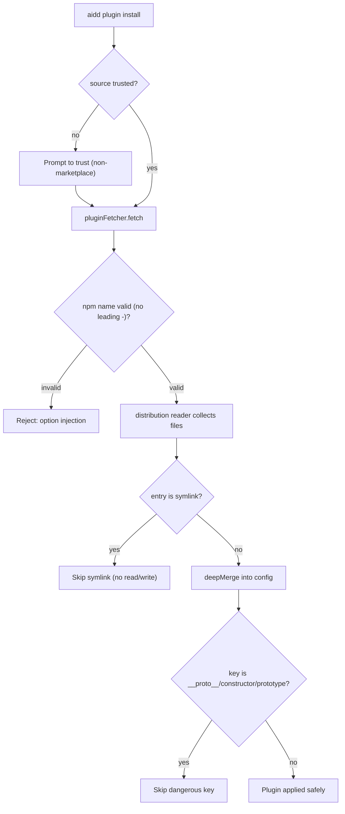

# Instruction: Security hardening of the untrusted-catalog path

## Feature

- **Summary**: Four real exploit surfaces on the path that ingests untrusted plugin catalogs: (1) `execFile("pnpm",["add",…,spec])` in `plugin-fetcher-adapter.ts` with `spec` only `assertString`-validated → a package name like `--registry=…` is pnpm option injection; (2) `plugin-add-use-case.addLocalPlugin` fetches a direct source with NO per-source trust check (trust is only gated at marketplace-add); (3) `deepMerge` in `file-adapter.ts` bracket-assigns untrusted plugin JSON → prototype pollution via `__proto__`/`constructor`/`prototype`; (4) the distribution reader collects+reads files under `skills/` without an `lstat`/symlink check → a symlink to `~/.config/aidd/auth.json` is read and written into the committable project tree (secret disclosure).
- **Stack**: TypeScript ESM, Node.js >=20, simple-git 3.36 (pinned), pnpm
- **Branch name**: `fix/2026-06-audit-remediation/part-3-security`
- **Parent Plan**: `./2026_06_11-full-audit-remediation-master.md`
- **Sequence**: `2 of 6` (apply order) / part 3 of 6
- Confidence: 9/10
- Time to implement: ~0.5-1 day

## Architecture projection

### Files to modify

- `src/domain/models/plugin-source.ts` - add an npm-name validator (reject leading `-`, enforce npm package-name grammar incl. optional `@scope/`), applied in `parseNpm()` alongside `assertString`; optionally tighten `parseUrl()` to require an `https/http/git@` scheme (defense-in-depth, 🟢 from audit).
- `src/infrastructure/adapters/plugin-fetcher-adapter.ts` (lines 115-132, `fetchNpm`) - validate the npm name before building `spec`; pass `--` before `spec` in the `execFile("pnpm",["add",…])` argv so a `-`-leading spec can never be parsed as a flag.
- `src/infrastructure/adapters/file-adapter.ts` (`deepMerge`, lines 205-230) - skip `__proto__`/`constructor`/`prototype` keys; build the accumulator with `Object.create(null)` (or guard each bracket assignment).
- `src/infrastructure/adapters/plugin-distribution-reader-adapter.ts` (`collectFiles`, lines 59-76) AND `src/infrastructure/adapters/file-adapter.ts` (`listDirectory`/`collectFiles`, lines 72-92) - `lstat` each entry and SKIP symbolic links before `readFile` (Dirent from `readdir` already uses lstat, but a symlink currently falls into the file branch and is then `readFile`'d, which follows the link — add an explicit `isSymbolicLink()` skip).
- `src/application/use-cases/plugin/plugin-add-use-case.ts` (`addLocalPlugin`, ~line 134) and/or `src/application/use-cases/plugin/plugin-install-use-case.ts` (`executeLocalSource`, lines 72-80) - gate the direct-source fetch on a per-source trust check before `pluginFetcher.fetch`, mirroring `MarketplaceAddUseCase.ensureTrust` (`marketplace-add-use-case.ts:94-103`) using the existing `MarketplaceTrustStore` port.
- `src/infrastructure/deps.ts` - wire `MarketplaceTrustStore` (already constructed for marketplace-add) + `Prompter` into the plugin-add/install use-case if not already injected.

### Files to create

- `tests/domain/models/plugin-source.unit.test.ts` - npm-name validator + URL scheme cases (or extend an existing one).
- `tests/infrastructure/adapters/plugin-fetcher-adapter.integration.test.ts` - assert `--` separator / rejected `-`-leading spec (extend existing if present).
- `tests/infrastructure/adapters/file-adapter.integration.test.ts` - prototype-pollution and symlink-skip cases (extend existing).

### Files to delete

- none

## Applicable rules

| Tool   | Name                  | Path                                                    | Why it applies                                                        |
| ------ | --------------------- | ------------------------------------------------------- | --------------------------------------------------------------------- |
| claude | error-handling        | `.claude/rules/00-architecture/0-error-handling.md`     | Validators throw typed domain exceptions (e.g. `InvalidPluginSourceError`); adapters translate, commands catch. |
| claude | layer-responsibilities| `.claude/rules/00-architecture/0-layer-responsibilities.md` | npm-name grammar belongs in `domain/models/plugin-source.ts`; the `--` argv guard and `lstat` skip are adapter I/O concerns. |
| claude | hexagonal             | `.claude/rules/00-architecture/0-hexagonal.md`          | Trust gate uses the `MarketplaceTrustStore` port from the use-case, not a direct adapter call. |
| claude | auth                  | `.claude/rules/07-quality/7-auth.md`                    | The symlink fix specifically prevents `~/.config/aidd/auth.json` exfiltration into the project tree. |

## User Journey

## Risk register

| Risk                                                          | Impact                                                                 | Mitigation                                                                                          |
| ------------------------------------------------------------ | --------------------------------------------------------------------- | -------------------------------------------------------------------------------------------------- |
| npm-name validator too strict                                 | Rejects legitimate scoped packages (`@scope/name`)                    | Use the established npm package-name grammar; unit-test scoped + unscoped valid names alongside the malicious ones. |
| `--` separator insufficient                                   | `version` field can still be a tarball/git URL → arbitrary fetch      | Validate `version` too (reject scheme-bearing strings) OR accept that `--` blocks flag-injection and note remaining version-spec risk as residual. |
| Trust gate breaks marketplace flow                            | Marketplace installs prompt twice or block                           | Gate ONLY the direct/local-source path (`executeLocalSource`/`addLocalPlugin`); marketplace path keeps its existing single gate at registration. |
| Symlink skip breaks legitimate symlinked plugin layouts       | A plugin relying on internal symlinks loses files                    | Plugins are file trees, not symlink farms; skip + `logger.warn` the skipped symlink so it is not silent. |
| `Object.create(null)` changes JSON.stringify output           | Null-proto object serializes fine, but spread/merge semantics differ | Verify round-trip with existing merge tests; only the accumulator changes, not the emitted JSON shape. |

## Implementation phases

### Phase 1: pnpm option-injection fix

> Untrusted npm spec can never be parsed as a pnpm flag.

#### Tasks

1. Add npm-name validator in `plugin-source.ts` (reject leading `-`, `.`, enforce grammar); throw `InvalidPluginSourceError` on failure; apply in `parseNpm`.
2. In `fetchNpm`, insert `--` before `spec`: `execFile("pnpm", ["add", "--prefix", cacheDir, "--", spec])`.

#### Acceptance criteria

- [ ] A spec like `--registry=evil` or `-x` is rejected by the validator.
- [ ] `execFile` argv passes `--` before `spec`.

### Phase 2: deepMerge prototype-pollution guard

> Plugin JSON cannot pollute the prototype.

#### Tasks

1. In `deepMerge`, skip keys in `{__proto__, constructor, prototype}` during `Object.entries` iteration.
2. Initialize the accumulator with `Object.create(null)` (or guard each bracket assignment).

#### Acceptance criteria

- [ ] After merging `{"__proto__":{"polluted":true}}`, `({}).polluted` is `undefined`.
- [ ] Existing merge round-trip tests still pass.

### Phase 3: Symlink skip in collection

> Symlinks under plugin trees are not read or written.

#### Tasks

1. In `file-adapter.collectFiles` / `listDirectory`, detect `entry.isSymbolicLink()` and skip (do not push to results).
2. In `plugin-distribution-reader-adapter.collectFiles`, defensively skip symlinks before `readFile`.
3. `logger.warn` the skipped symlink path (not silent).

#### Acceptance criteria

- [ ] A symlink placed under a plugin's `skills/` is skipped — its content is never read or written into the project tree.
- [ ] Regular files are still collected.

### Phase 4: Per-source trust gate for direct installs

> Direct/local plugin sources require trust, like marketplaces.

#### Tasks

1. Inject `MarketplaceTrustStore` + `Prompter` into the plugin-add/install use-case via `deps.ts`.
2. Before fetching a direct source in `executeLocalSource`/`addLocalPlugin`, check `trustStore.isTrusted`; if not, prompt (or honor an `--auto-trust`/`--yes` flag), else throw `TrustDeniedError`.
3. Leave the marketplace path's existing single gate untouched (no double prompt).

#### Acceptance criteria

- [ ] Installing a direct source (`aidd plugin install ./path` or a URL) prompts for trust when untrusted.
- [ ] Marketplace installs are not double-gated.

## Amendments

## Log

## Validation flow demonstration

1. `aidd plugin install --` with a flag-shaped npm name → rejected before any `pnpm add`.
2. Craft a plugin dist containing `settings.json` with `{"__proto__":{"x":1}}`; install → `({}).x` is `undefined` afterward.
3. Symlink `skills/leak.md -> ~/.config/aidd/auth.json` inside a test plugin; install → file is skipped, not materialized in the project.
4. `aidd plugin install ./untrusted-plugin` → trust prompt appears.
