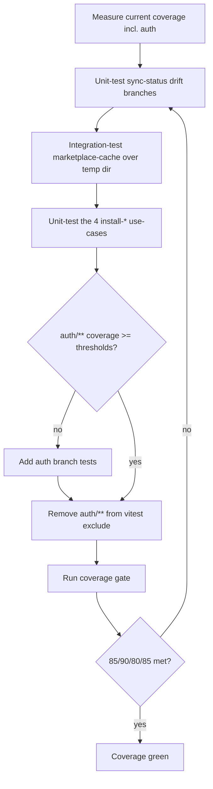

# Instruction: Close the critical-path test gaps

## Feature

- **Summary**: Several critical paths are untested: `sync-status-use-case.ts` (0% — sync drift detection), `marketplace-cache-adapter.ts` (14% — feeds plugin-install-from-marketplace), and the 4 capability installers `install-{commands,agents,rules,skills}-use-case.ts` (10-13% — feed framework build per target). Add direct tests for each. Separately, `vitest.config.ts:21` excludes `src/infrastructure/auth/**` from coverage thresholds even though auth integration tests EXIST — measure auth coverage, fill any gaps, then remove the exclusion. Closing these lifts overall coverage past the 85/90 gate (currently 84.0% L / 85.5% Fn / 86.6% Br — gate red).
- **Stack**: TypeScript ESM, vitest 2 (projects: unit/integration/e2e), in-memory port fakes in `tests/helpers/ports/`
- **Branch name**: `fix/2026-06-audit-remediation/part-4-tests`
- **Parent Plan**: `./2026_06_11-full-audit-remediation-master.md`
- **Sequence**: `6 of 6` (apply order — runs last so the gate measures final code) / part 4 of 6
- Confidence: 9/10
- Time to implement: ~1 day

## Architecture projection

### Files to modify

- `vitest.config.ts` (line 21) - remove `src/infrastructure/auth/**` from the coverage `exclude` list AFTER confirming auth coverage clears the thresholds (order matters — see Risk register).

### Files to create

- `tests/application/use-cases/sync/sync-status-use-case.unit.test.ts` - unit; stub the `FileReader` port (`fileExists`, `readFileHash`); assert drift / no-drift / deleted counts in the returned `Record<string, ToolModificationCounts>`.
- `tests/infrastructure/adapters/marketplace-cache-adapter.integration.test.ts` - integration over a temp `.aidd/cache/` dir; cover `list()` (entries with name/path/sizeBytes/lastFetchedAt from `.fetch-meta.json`) and `clear(name?)` (single vs whole-cache).
- `tests/application/use-cases/install/install-commands-use-case.unit.test.ts` - unit; `DeterministicHasher`; assert produced `InstallationFile[]` (relativePath, content, hash, frameworkPath).
- `tests/application/use-cases/install/install-agents-use-case.unit.test.ts` - same shape.
- `tests/application/use-cases/install/install-rules-use-case.unit.test.ts` - same shape.
- `tests/application/use-cases/install/install-skills-use-case.unit.test.ts` - same shape.
- (optional) `tests/infrastructure/auth/*.integration.test.ts` - add branches only if auth coverage is below threshold after un-excluding.

### Files to delete

- none

## Applicable rules

| Tool   | Name    | Path                                       | Why it applies                                                                 |
| ------ | ------- | ------------------------------------------ | ------------------------------------------------------------------------------ |
| claude | naming  | `.claude/rules/01-standards/1-naming.md`   | Test files: `*.unit.test.ts` for pure use-cases / domain, `*.integration.test.ts` for adapters / temp-dir I/O. |
| claude | testing (memory) | `aidd_docs/memory/testing.md`     | Mirror the three-tier pyramid + existing helper conventions.                   |

Note (tier correction vs audit): the 4 install use-cases take only `Hasher` and return `InstallationFile[]` with NO filesystem I/O — they are **unit** tests, not the "integration" the audit suggested. Match tier to the real I/O surface. `marketplace-cache-adapter` is genuine I/O → **integration** over a temp dir.

## User Journey

## Risk register

| Risk                                                          | Impact                                                          | Mitigation                                                                                          |
| ------------------------------------------------------------ | -------------------------------------------------------------- | -------------------------------------------------------------------------------------------------- |
| Un-excluding auth/** turns the gate RED                       | If auth branches aren't actually covered, removing the exclusion drops global coverage below threshold. | ORDER: measure auth coverage FIRST (`vitest --coverage` with the exclusion temporarily off), add tests to clear it, THEN remove the exclusion permanently. |
| Wrong tier (integration vs unit) for install use-cases        | Slow, brittle, or misplaced tests                              | They take only `Hasher` (no fs) → write **unit** tests with `DeterministicHasher`; do not spin temp dirs. |
| sync-status result shape misunderstood                        | Test asserts wrong keys                                        | Result is `Record<toolId, { modified, deleted }>` driven by `fileExists` + `readFileHash`; stub both, assert counts. |
| marketplace-cache temp dir leaks                              | Flaky tests / disk litter                                      | `mkdtemp` in `beforeEach`, `rm(recursive, force)` in `afterEach`, mirroring `file-adapter.integration.test.ts`. |
| Closing these still misses the gate                           | Other branch gaps (sync-file-propagation, restore, etc.) keep it red. | This part targets the audit's 🔴 critical-path set; if the gate is still short, the 🟡 branch-gap items are a follow-up (out of scope here). |

## Implementation phases

### Phase 1: Sync-status drift unit test

> Pin drift / no-drift / deleted detection.

#### Tasks

1. Stub `FileReader` (`fileExists`, `readFileHash`) with scripted responses.
2. Build a `Manifest` with 2 tools; assert `modified`/`deleted` counts for hash-mismatch and missing-file cases.

#### Acceptance criteria

- [ ] Test covers: file present + hash match (no drift), hash mismatch (modified+1), file absent (deleted+1).
- [ ] `sync-status-use-case.ts` coverage rises from 0%.

### Phase 2: Marketplace-cache integration test

> Cache list/clear over a real temp dir.

#### Tasks

1. `mkdtemp`; lay down `{cacheRoot}/<name>/` with files + `.fetch-meta.json`.
2. Assert `list()` returns name/path/sizeBytes/lastFetchedAt; `clear(name)` removes one; `clear()` removes all.

#### Acceptance criteria

- [ ] `list()` and `clear()` covered with real filesystem assertions.
- [ ] Temp dir cleaned in `afterEach`.

### Phase 3: Four install-* use-case unit tests

> Pin the per-capability install output.

#### Tasks

1. For each of commands/agents/rules/skills: build the matching `AiTool<Has*>` config + a `contentFiles` Map + `docsDir`.
2. Call `execute(options)`; assert the returned `InstallationFile[]` (relativePath via capability path-builder, content, deterministic hash).

#### Acceptance criteria

- [ ] Each of the 4 use-cases has a direct unit test; coverage rises from 10-13%.
- [ ] Frontmatter conversion + path mapping per capability is asserted.

### Phase 4: Enforce auth/** coverage

> Stop excluding security-sensitive code from the gate.

#### Tasks

1. Run coverage with the `src/infrastructure/auth/**` exclusion temporarily removed; read the auth numbers.
2. If below threshold, add branch tests to the existing `tests/infrastructure/auth/*.integration.test.ts`.
3. Permanently remove line 21 (`src/infrastructure/auth/**`) from `vitest.config.ts` `exclude`.

#### Acceptance criteria

- [ ] `src/infrastructure/auth/**` is no longer in the coverage exclude list.
- [ ] Global coverage gate (85/90/80/85) passes WITH auth enforced.

## Amendments

## Log

## Validation flow demonstration

1. `pnpm test:unit` → the new sync-status + 4 install tests pass.
2. `pnpm test:integration` → marketplace-cache test passes.
3. `vitest run --coverage` → thresholds met; `auth/**` counted; report shows the 5 previously-untested modules now covered.
