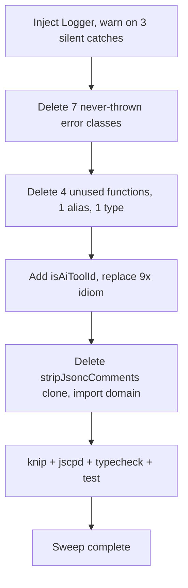

# Instruction: Clean-code sweep

## Feature

- **Summary**: Mechanical, low-risk cleanup. (a) Three silent `catch {}` blocks violate the "no silent errors" rule — convert to `logger.warn`. NOTE: neither host use-case currently has a `Logger` injected, so this is a WIRING change (constructor + `deps.ts`), not a one-liner. (b) Delete knip-confirmed dead code: 7 never-thrown error classes, 4 unused exported functions, 1 vestigial alias, 1 unused type. (c) Replace the 9x `(AI_TOOL_IDS as readonly string[]).includes(id)` idiom with a shared `isAiToolId` type-guard mirroring the existing `isIdeToolId` (`registry.ts:48`) — CORRECTION: the audit's referenced `isAiToolId` does NOT yet exist; create it. (d) Replace the 51-line `stripJsoncComments` clone in `file-adapter.ts` with the domain `stripJsonComments` import (also fixes a dropped EOF bounds guard).
- **Stack**: TypeScript ESM, knip 5, jscpd 4, biome
- **Branch name**: `fix/2026-06-audit-remediation/part-5-clean-code`
- **Parent Plan**: `./2026_06_11-full-audit-remediation-master.md`
- **Sequence**: `1 of 6` (apply order — smallest, lowest-risk, reduces noise) / part 5 of 6
- Confidence: 9/10
- Time to implement: ~0.5 day

## Architecture projection

### Files to modify

- `src/application/use-cases/marketplace/marketplace-list-use-case.ts` (line 58) - inject `Logger`; `logger.warn` the skipped marketplace (in-scope `marketplace.name`).
- `src/application/use-cases/shared/fetch-marketplace-source-use-case.ts` (lines 52, 65) - inject `Logger`; `logger.warn` on both fallback catches (returning `cacheDir` / `null`). Behavior note: throwing-vs-warning changes control flow; `warn` keeps the resilient fallback — prefer `warn`.
- `src/infrastructure/deps.ts` - pass the existing `logger` into the two use-cases above (constructor signature change).
- `src/domain/errors.ts` (lines 36, 205, 274, 465) - delete `NoFrameworkSourceError`, `FlatCollisionError`, `OfflineError`, `MissingAbsOutError`.
- `src/infrastructure/errors.ts` (lines 25, 53) - delete `TarExtractionError`, `CacheMissError`.
- `src/application/errors.ts` (line 59) - delete `NoToolsInstalledError`.
- `src/application/commands/global-options.ts` (line 22) - delete unused `parseCategoryArg`.
- `src/domain/models/framework.ts` (line 69) - delete unused `isLocalPath`.
- `src/domain/models/merge.ts` (line 97) - delete unused `buildConfigNameLookup`.
- `src/domain/tools/registry.ts` (line 42) - delete unused `assertValidToolIds`; ADD `isAiToolId(id): id is AiToolId` mirroring `isIdeToolId` (line 48) in the SAME file.
- `src/domain/formats/relative-link-rewrite.ts` (line 63) - delete vestigial `_CLAUDE_ROOT_PREFIX` re-export alias.
- `src/application/use-cases/framework/strategies/marketplace-strategy-helpers.ts` (line 145) - delete unused `ClaudeStyleMarketplaceEntry` type.
- `src/application/commands/ai.ts` (lines 14, 107, 167, 277) - replace inline `(AI_TOOL_IDS as readonly string[]).includes(id)` with `isAiToolId(id)`.
- `src/application/use-cases/clean-use-case.ts` (line 87) - same dedup.
- `src/application/use-cases/migrate-use-case.ts` (line 94) - same dedup.
- `src/application/use-cases/sync/sync-use-case.ts` (line 124) - same dedup.
- `src/domain/models/migration-plan.ts` (line 176) - same dedup.
- `src/domain/models/tool-ids.ts` (line 25) - `assertValidAiToolId` may delegate to the new `isAiToolId` guard.
- `src/infrastructure/adapters/file-adapter.ts` (lines 236-286) - delete the `stripJsoncComments` clone; import `stripJsonComments` from `src/domain/formats/jsonc.ts` (mirrors `merge.ts:1`); fixes the dropped `i + 1 < content.length` EOF guard.

### Files to create

- none

### Files to delete

- none (all deletions are intra-file symbol removals)

## Applicable rules

| Tool   | Name        | Path                                          | Why it applies                                                          |
| ------ | ----------- | --------------------------------------------- | ---------------------------------------------------------------------- |
| claude | clean-code  | `.claude/rules/07-quality/7-clean-code.md`    | YAGNI / dead-code / DRY — the entire sweep's authority.                |
| claude | error-handling | `.claude/rules/00-architecture/0-error-handling.md` | "No silent errors" — the 3 catches must surface via `logger.warn`. |
| claude | exports     | `.claude/rules/01-standards/1-exports.md`     | Named exports; deleting dead exports keeps the surface minimal.        |
| claude | cli-output  | `.claude/rules/03-frameworks-and-libraries/3-cli-output.md` | `logger.warn` must follow the project's output conventions.    |

## User Journey

## Risk register

| Risk                                                          | Impact                                                          | Mitigation                                                                                          |
| ------------------------------------------------------------ | -------------------------------------------------------------- | -------------------------------------------------------------------------------------------------- |
| Logger injection is treated as a one-liner                    | Forgetting the `deps.ts` wiring + constructor change breaks compile or leaves the catch silent. | Plan the catch fix as a 3-edit change per use-case: constructor param, body `logger.warn`, `deps.ts` injection. |
| Same-file conflict: delete `assertValidToolIds` while adding `isAiToolId` | Editing `registry.ts:42` and `:48` together can trip over line shifts. | Do both edits in one pass on `registry.ts`; verify `isIdeToolId` still exports unchanged. |
| A "dead" symbol is actually referenced from tests/scripts     | Deletion breaks a test or build script.                        | Before deleting, `grep -rn <Symbol>` across `src/`, `tests/`, `scripts/`; rely on `knip:production` confirmation. |
| `stripJsonComments` domain version differs subtly             | Behavior change in JSONC parsing of merge files.               | Domain version is the canonical one (already used by `merge.ts`); the clone DROPPED an EOF bounds guard, so the import is strictly safer. Run merge round-trip tests. |
| `fetch-marketplace-source` warn-vs-throw                      | Changing fallback to throw would alter resilience.             | Keep the fallback (return `cacheDir`/`null`) and just `logger.warn`; do NOT convert to throw.       |

## Implementation phases

### Phase 1: Surface the 3 silent catches

> No failure is swallowed.

#### Tasks

1. Add `Logger` to `marketplace-list-use-case` + `fetch-marketplace-source-use-case` constructors; wire in `deps.ts`.
2. Replace each `catch {}` with `catch (err) { logger.warn(...) }` (keeping the existing fallback return).

#### Acceptance criteria

- [ ] All 3 catches log a warning; no `catch {}` remains in those files.
- [ ] `deps.ts` injects `logger` into both use-cases; `pnpm typecheck` passes.

### Phase 2: Delete knip-confirmed dead code

> Remove the 13 dead symbols.

#### Tasks

1. Delete the 7 error classes, 4 functions, 1 alias, 1 type listed in the projection.
2. `grep` each before deleting; run `pnpm knip:production`.

#### Acceptance criteria

- [ ] `pnpm knip:production` no longer flags any of the listed symbols.
- [ ] `pnpm typecheck && pnpm test` pass.

### Phase 3: isAiToolId dedup

> One guard, nine call sites.

#### Tasks

1. Add `isAiToolId(id): id is AiToolId` to `registry.ts` (mirror `isIdeToolId`); delete `assertValidToolIds`.
2. Replace the 9 inline `(AI_TOOL_IDS as readonly string[]).includes(...)` occurrences with `isAiToolId(...)`.

#### Acceptance criteria

- [ ] Zero remaining `(AI_TOOL_IDS as readonly string[]).includes` occurrences (grep clean).
- [ ] `pnpm jscpd` no longer reports the guard clone.

### Phase 4: JSONC stripper dedup

> One implementation, in the domain.

#### Tasks

1. Delete `stripJsoncComments` (lines 236-286) from `file-adapter.ts`.
2. Import `stripJsonComments` from `domain/formats/jsonc.ts`; update the two call sites (`mergeJsonFile`).

#### Acceptance criteria

- [ ] `file-adapter.ts` imports the domain stripper; the 51-line clone is gone.
- [ ] A trailing-backslash JSONC input no longer reads `undefined` (EOF guard restored); merge tests pass.

## Amendments

## Log

## Validation flow demonstration

1. `pnpm knip:production` → zero dead exports for the listed symbols.
2. `grep -rn "AI_TOOL_IDS as readonly string\[\]).includes" src/` → no matches.
3. `pnpm jscpd src/` → the isAiToolId + stripJsoncComments clones gone.
4. `pnpm typecheck && pnpm test` → green.
