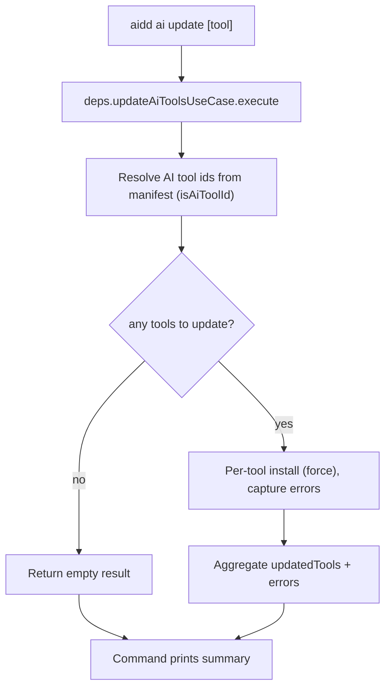

# Instruction: Extract the thin-command update use-cases

## Feature

- **Summary**: `ai update` (`ai.ts:156-189`) and `ide update` (`ide.ts:140-174`) run a multi-tool loop IN the command layer — resolving installed tools, looping, calling `installRuntimeConfigUseCase`/`installIdeConfigUseCase` per tool, and printing per-tool results. This is business orchestration in thin-wiring, unlike the global `update` command (`update.ts`) which delegates cleanly to `UpdateAllUseCase`. Extract `UpdateAiToolsUseCase` and `UpdateIdeToolsUseCase` mirroring `UpdateAllUseCase`'s shape (typed result with `updatedTools` + `errors`), so the commands just call `.execute()` and print the aggregated result.
- **Stack**: TypeScript ESM, commander 12
- **Branch name**: `fix/2026-06-audit-remediation/part-6-thin-command`
- **Parent Plan**: `./2026_06_11-full-audit-remediation-master.md`
- **Sequence**: `3 of 6` (apply order) / part 6 of 6
- **Soft dependency**: relies on Part 5's `isAiToolId` guard for tool-id resolution. If Part 6 is applied BEFORE Part 5, use the existing inline `(AI_TOOL_IDS as readonly string[]).includes(...)` idiom or create the guard here (Part 5 then dedups it). Not a hard blocker.
- Confidence: 9/10
- Time to implement: ~0.5 day

## Architecture projection

### Files to modify

- `src/application/commands/ai.ts` (lines 156-189) - replace the `ai update` loop with a single `deps.updateAiToolsUseCase.execute({ toolArg, projectRoot })` call + aggregated output (mirror `update.ts`). After Part 5, the inline `AI_TOOL_IDS` cast here becomes `isAiToolId`; the extraction removes the loop entirely.
- `src/application/commands/ide.ts` (lines 140-174) - same for `ide update` → `deps.updateIdeToolsUseCase`.
- `src/infrastructure/deps.ts` - instantiate the two new use-cases (inject `manifestRepo`, `currentVersionProvider`, and the per-tool install use-case / shared primitive); add fields to the `Deps` interface and the returned object (follow the `installRuntimeConfigUseCase` registration pattern, deps.ts ~479-492 + the `Deps` struct).

### Files to create

- `src/application/use-cases/global/update-ai-tools-use-case.ts` - `UpdateAiToolsUseCase.execute({ toolArg?, projectRoot })` → typed result `{ updatedTools: {toolId, fileCount}[], errors: GlobalExecutionError[] }`; resolves AI tool ids from the manifest (via `isAiToolId` if Part 5 has landed, otherwise the existing inline `AI_TOOL_IDS` idiom or a locally-created guard — see soft-dependency note below), loops, aggregates partial failures.
- `src/application/use-cases/global/update-ide-tools-use-case.ts` - same for IDE tools.
- `tests/application/use-cases/global/update-ai-tools-use-case.unit.test.ts` - partial-failure (one tool throws → captured in `errors`, others succeed), empty-manifest (no AI tools → empty result), single explicit `toolArg`.
- `tests/application/use-cases/global/update-ide-tools-use-case.unit.test.ts` - same branches for IDE.

### Files to delete

- none

## Applicable rules

| Tool   | Name                  | Path                                                       | Why it applies                                                                 |
| ------ | --------------------- | ---------------------------------------------------------- | ------------------------------------------------------------------------------ |
| claude | hexagonal             | `.claude/rules/00-architecture/0-hexagonal.md`             | `cli.ts`/commands wire only — no business logic in the command layer.          |
| claude | layer-responsibilities| `.claude/rules/00-architecture/0-layer-responsibilities.md`| The per-tool loop + aggregation belongs in a use-case; methods ≤20 lines.      |
| claude | deps-wiring           | `.claude/rules/00-architecture/0-deps-wiring.md`           | New use-cases instantiated in `createDeps`, exposed on `Deps`.                 |
| claude | clean-code            | `.claude/rules/07-quality/7-clean-code.md`                 | DRY — reuse the existing per-tool primitive; do NOT clone the loop twice.      |
| claude | naming                | `.claude/rules/01-standards/1-naming.md`                   | `*-use-case.ts`, `*.unit.test.ts`.                                             |

## User Journey

## Risk register

| Risk                                                          | Impact                                                          | Mitigation                                                                                          |
| ------------------------------------------------------------ | -------------------------------------------------------------- | -------------------------------------------------------------------------------------------------- |
| Two new use-cases re-clone the per-tool loop                  | `UpdateAllUseCase.updateOneTool` already does per-tool dispatch + error aggregation; cloning it twice recreates the very duplication Part 5 removes. | Extract a shared per-tool update primitive (e.g. a private/shared helper) that `UpdateAllUseCase` and both new use-cases reuse; do NOT copy the loop body. |
| Output behavior changes (per-tool vs summary)                 | Users notice different stdout                                  | Mirror `update.ts` output exactly: per-tool success lines from `result.updatedTools`, `errors` as `output.warn`. Keep the "No AI tools installed." info message. |
| `deps.ts` collision with Parts 1 & 5                          | Both also edit `deps.ts`/`ai.ts`.                              | Apply per the master's recommended order (Part 5 → 3 → 6 → 1); append distinct fields.              |
| Single-tool `toolArg` path lost                               | `aidd ai update cursor` must still target one tool.            | Use-case accepts optional `toolArg`; when set, target only that id (with `isAiToolId` validation upstream in the command). |

## Implementation phases

### Phase 1: Extract a shared per-tool primitive

> Avoid cloning the loop; reuse what `UpdateAllUseCase` already has.

#### Tasks

1. Identify/extract the per-tool update step (`updateOneTool`-style: dispatch to install use-case, capture `GlobalExecutionError`, skip handling) into a reusable unit usable by all three aggregators.
2. Keep `UpdateAllUseCase` working against the shared primitive.

#### Acceptance criteria

- [ ] One per-tool update implementation exists; `UpdateAllUseCase` uses it; `pnpm test` green.

### Phase 2: Create the two use-cases

> AI / IDE update aggregators in the application layer.

#### Tasks

1. `UpdateAiToolsUseCase`: resolve AI tool ids from manifest (`isAiToolId`) or honor `toolArg`; loop via the shared primitive; return `{ updatedTools, errors }`.
2. `UpdateIdeToolsUseCase`: same for IDE tools.
3. Wire both into `deps.ts` (`Deps` interface + returned object).

#### Acceptance criteria

- [ ] Both use-cases compile and are reachable via `deps`.
- [ ] Empty-manifest returns an empty result (no throw).

### Phase 3: Thin the commands

> Commands delegate only.

#### Tasks

1. Replace the `ai update` handler body with a single `execute` call + summary output (mirror `update.ts`).
2. Same for `ide update`.
3. Preserve the `toolArg` validation and "No AI/IDE tools installed." messages.

#### Acceptance criteria

- [ ] `ai.ts` and `ide.ts` update handlers contain NO per-tool loop.
- [ ] Output parity: per-tool success lines + warnings for `errors`.

### Phase 4: Unit-test the aggregators

> Pin partial-failure, empty, single-tool branches.

#### Tasks

1. Stub the per-tool install use-case to succeed/throw selectively.
2. Assert: one failing tool → captured in `errors`, others in `updatedTools`; empty manifest → empty; `toolArg` → single target.

#### Acceptance criteria

- [ ] Both unit tests pass and cover partial-failure + empty + single-tool.

## Amendments

## Log

## Validation flow demonstration

1. Install 2 AI tools; `aidd ai update` → both updated, summary printed by the command (no loop in the handler).
2. `aidd ai update cursor` → only cursor updated.
3. Force one tool to fail (e.g. corrupt manifest entry) → it appears under `errors` as a warning; the other still updates.
4. `grep` the `ai update` / `ide update` handlers → no per-tool loop remains.
