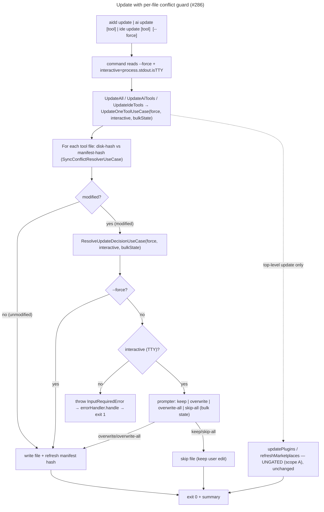

<!-- AI INSTRUCTIONS: ENGLISH ONLY. Append-only Log. Amendments prefixed 🤖. Do NOT write code from this file directly — execute phase by phase via the implementer, gating each phase on its own test gate. -->

# Instruction: Real `--force` + per-file conflict guard on the three update commands (#286)

## Feature

- **Summary**: Today `aidd update`, `aidd ai update`, `aidd ide update` blind-overwrite every tool runtime/config file via a hardcoded `force:true` deep in `UpdateOneToolUseCase` → user edits are silently destroyed (data-loss bug). Add a real per-file conflict guard on the update path: unmodified files (disk-hash == manifest-hash) always update; modified files prompt keep/overwrite in TTY (with an overwrite-all / skip-all-remaining bulk option), exit 1 in non-TTY, and overwrite under `--force`. Plugin updates (`forceRefresh:true`) and marketplace refresh inside top-level `update` stay ungated (scope assumption A). Reuse the existing conflict-detection (`SyncConflictResolverUseCase`) and the restore decision pattern (`ResolveRestoreDecisionUseCase`) rather than inventing new drift logic.
- **Stack**: `TypeScript 5 (ESM, NodeNext)`, `vitest`, `biome`, `commander`, `@inquirer/prompts`
- **Branch name**: `fix/update-force-conflict-guard` (create from `main`; current `fix/cli-docs-reality-sync` is a docs branch — do NOT build feature work on it)
- **Parent Plan**: `none`
- **Sequence**: `standalone`
- Confidence: 8/10
- Time to implement: 2-3 focused sessions

## Architecture projection

### Files to modify

- `src/application/commands/update.ts` — add `--force` option to the top-level `update` command; read `cmdOptions.force`; pass `force` + `interactive: process.stdout.isTTY` into `updateAllUseCase.execute(...)`.
- `src/application/commands/ai.ts` — add `--force` option to `ai update [tool]` (lines ~153-178); pass `force` + `interactive` into `updateAiToolsUseCase.execute({...})`. Mirror the `ai sync` non-TTY pattern already in this file.
- `src/application/commands/ide.ts` — add `--force` option to `ide update [tool]` (lines ~140-166); pass `force` + `interactive` into `updateIdeToolsUseCase.execute({...})`. `ide restore` already reads `cmdOptions.force` + `interactive: process.stdout.isTTY` — mirror it exactly.
- `src/application/use-cases/global/update-all-use-case.ts` — `execute(projectRoot)` → `execute({projectRoot, force, interactive})`; thread `force`/`interactive` only into `updateTools` (per-tool path). `updatePlugins` and `refreshMarketplaces` stay UNCHANGED (scope A — explicitly ungated).
- `src/application/use-cases/global/update-ai-tools-use-case.ts` — `execute({toolArg, projectRoot})` → add `force`/`interactive`; thread into each `updateOneToolUseCase.execute(...)` call.
- `src/application/use-cases/global/update-ide-tools-use-case.ts` — same signature extension + threading.
- `src/application/use-cases/shared/update-one-tool-use-case.ts` — the CENTRAL change. `execute(toolId, manifest, projectRoot, version, errors)` → accept `force`/`interactive` + a shared bulk-resolution state object. Replace blind `force:true` semantics with: detect per-file conflict (reuse `SyncConflictResolverUseCase`); for unmodified files write; for modified files consult the new update conflict-decision use-case (keep/overwrite/exit-1/force); after overwrite, ensure manifest hash is refreshed. Keep the existing error-aggregation try/catch (the one allowed catch) — but `InputRequiredError` from non-TTY must NOT be swallowed into `errors[]`; it must propagate to `errorHandler.handle` for exit 1 (see Risk register).
- `src/application/use-cases/install/install-runtime-config-use-case.ts` — the blind-write site (`writeRegularFiles`, lines ~135-139, `this.fs.writeFile` with no conflict check). Candidate home for the per-file guard (option (a), leaning primary — write+rehash already live here). `install` command keeps force-on-first-install via param defaults. **Decide (a) vs (b) in P1 (M/C/D).**
- `src/application/use-cases/install/install-ide-config-use-case.ts` — same blind-write pattern (lines ~112-116); same P1 decision applies.
- `src/domain/ports/prompter.ts` — extend `Prompter` with the bulk capability (a `resolveConflict` overload/return that can carry "overwrite all" / "skip all remaining", OR a new method e.g. `resolveConflictBulk(...)` returning `"keep" | "overwrite" | "overwrite-all" | "skip-all"`). **Decide shape in P3 (M/C/D).** Today `resolveConflict(relativePath, reason): Promise<"keep"|"overwrite">` has NO bulk option — this is the one genuinely new port capability.
- `src/infrastructure/adapters/prompter-adapter.ts` — implement the new bulk capability in BOTH `InquirerPrompterAdapter` (add the two bulk choices to the `select`) and `SilentPrompterAdapter` (non-TTY: the bulk method is never reached because non-TTY throws `InputRequiredError` before prompting; keep `SilentPrompterAdapter.resolveConflict` returning a safe default and ensure the non-TTY exit-1 decision happens in the use-case, not the adapter).
- `src/infrastructure/deps.ts` — wire the new update conflict-decision use-case into `UpdateOneToolUseCase` (line ~616) and ensure `UpdateAllUseCase` (which constructs its own `UpdateOneToolUseCase` internally, line ~620) gets the same wiring. Confirm `syncConflictResolverUseCase` (line ~540) and the prompter selection (`process.stdout.isTTY ? InquirerPrompterAdapter : SilentPrompterAdapter`) are reachable from the update path.
- `README.md` / command `--help` text — document the new `--force` on the three update commands and the conflict behavior.

### Files to create

- `src/application/use-cases/shared/resolve-update-decision.ts` (new) — `ResolveUpdateDecisionUseCase(prompter)`, modeled DIRECTLY on `resolve-restore-decision.ts`. Given `(relativePath, force, interactive, bulkState)`: unmodified handled by caller; for a modified file → `if (!force && !interactive) throw new InputRequiredError("Use --force to overwrite modified files in non-interactive mode.")`; `if (force) return overwrite`; `if (interactive)` consult bulk state (if "overwrite-all" → overwrite without prompt; if "skip-all" → keep without prompt; else prompt and update bulk state on the bulk choices). Returns whether to write. **This is the locus of the keep/overwrite/exit-1/force decision** — verified that restore already proves this exact shape works and reaches exit 1 via `errorHandler.handle`.
- Tests (per phase): `tests/application/use-cases/shared/resolve-update-decision.unit.test.ts`, `tests/application/use-cases/shared/update-one-tool-use-case.integration.test.ts`, `tests/e2e/update-force-conflict.e2e.test.ts` (the three commands × {unmodified, modified-TTY-prompt, modified-non-TTY-exit-1, modified-force}).

### Files to delete

- None. This is a behavioral fix on existing paths, not a refactor that removes classes.

## Applicable rules

| Tool   | Name            | Path                                                          | Why it applies |
| ------ | --------------- | ------------------------------------------------------------ | -------------- |
| claude | hexagonal       | `.claude/rules/00-architecture/0-hexagonal.md`               | New decision use-case is application; `Prompter` extension is a domain port; adapters in `infrastructure/adapters/`; wiring in `deps.ts`; commands wire only. |
| claude | error-handling  | `.claude/rules/00-architecture/0-error-handling.md`          | Use-cases throw; non-TTY-modified path throws `InputRequiredError` → `errorHandler.handle` → exit 1. The one allowed catch (error-aggregation in `UpdateOneToolUseCase`) must NOT swallow `InputRequiredError`. No silent overwrite — the entire fix is "no silent errors". |
| claude | deps-wiring     | `.claude/rules/00-architecture/0-deps-wiring.md`             | `createDeps` graph change only in `deps.ts`; commands reuse cached instance; no adapter instantiation in command files. |
| claude | cli-lifecycle   | `.claude/rules/03-frameworks-and-libraries/3-cli-lifecycle.md` | The non-TTY exit-1 and the force-overwrite are observable side-effects — assert on the REAL built binary in e2e, not only unit tests. **Note: a spawned binary's `process.stdout.isTTY` is undefined (non-TTY) — so non-TTY-exit-1 / force / unmodified-silent are the e2e-friendly cases; the interactive PROMPT path cannot be driven by a plain spawn (no pty harness in repo) and is tested at integration level with an injected fake `Prompter`, mirroring how `restore` tests its prompt path.** |
| claude | typescript      | `.claude/rules/02-programming-languages/2-typescript.md`     | `.js` ESM imports, `import type`, no `any`, `async/await` only, `readonly`. |
| claude | (naming/exports/method-size — per repo standards) | `.claude/rules/01-standards/*`, `.claude/rules/06-design-patterns/6-method-size.md` | kebab-case files, named exports, methods ≤20 lines (extract the conflict loop into intent-named helpers), `*.unit/integration/e2e.test.ts` suffixes. |

## User Journey



## Reuse inventory (verified against code)

| Need | Reuse | Location (verified) | M/C/D |
| --- | --- | --- | --- |
| per-file conflict detection (disk-hash vs manifest-hash) | `SyncConflictResolverUseCase.isConflict` / `resolveWriteOutcome` | `src/application/use-cases/sync/sync-conflict-resolver-use-case.ts` | reuse (spec-mandated) |
| keep/overwrite/force/non-TTY-throw decision shape | `ResolveRestoreDecisionUseCase` pattern | `src/application/use-cases/shared/resolve-restore-decision.ts` | C → new `ResolveUpdateDecisionUseCase` modeled on it (adds bulk state) |
| drift collection + write + re-hash loop structure | `RestoreRegularFilesUseCase` (`collectDrift` → reason "modified"; `applyRestorations` writes + `readFileHash` → updated hash map) | `src/application/use-cases/shared/restore-regular-files-use-case.ts` | reference pattern (do not import restore directly; update path differs) |
| non-TTY exit 1 mechanism | `InputRequiredError` → `ErrorHandler.handle` → `process.exit(1)` | `src/application/errors.ts`, `src/application/error-handler.ts` | reuse (restore proves it) |
| TTY vs non-TTY prompter selection | `process.stdout.isTTY ? InquirerPrompterAdapter : SilentPrompterAdapter` | `src/infrastructure/deps.ts` | reuse |
| keep/overwrite prompt | `Prompter.resolveConflict(relativePath, reason)` | `src/domain/ports/prompter.ts`, `src/infrastructure/adapters/prompter-adapter.ts` | M → extend with bulk overwrite-all / skip-all |
| non-TTY guard precedent in commands | `ai sync` / top-level `sync` non-TTY `process.exit(1)` | `src/application/commands/ai.ts`, `src/application/commands/sync.ts` | reference (decision lives in use-case, but command-level precedent confirms UX) |
| manifest hash source for drift compare | manifest file hash per tool | manifest repository / `manifest.hasTool` + per-file hash | M → verify hash availability per tool/file (Risk: gaps) |

## M/C/D decisions (why reuse vs new)

- **CREATE `ResolveUpdateDecisionUseCase`, do NOT reuse `ResolveRestoreDecisionUseCase` directly.** Restore's decision is `keep/overwrite` for deleted/modified during a RESTORE; update needs the same force/interactive/non-TTY-throw axes PLUS a stateful bulk choice (overwrite-all / skip-all-remaining) threaded across the whole tool/file loop. Modeling on restore (proven to reach exit 1 via `errorHandler.handle`) keeps the risky axis battle-tested; the bulk state is the only genuinely new logic.
- **REUSE `SyncConflictResolverUseCase` for detection (spec lock), not restore's `collectDrift`.** The spec mandates reusing the sync conflict resolver for "is this file modified?". Restore's `collectDrift` is the closest structural sibling but is restore-scoped; cite it as the pattern reference, use the sync resolver for the actual disk-hash≠manifest-hash check.
- **Decision (the central architectural tension — ranking is CONTESTABLE, settle in P1):** the per-file guard must sit where it can detect + decide + write + refresh-hash atomically. Two candidate homes, both keeping first-install semantics intact:
  - **(a) install-layer gate (likely the cleaner PRIMARY):** inject the decision gate into the `install-runtime-config`/`install-ide-config` write loops, with `interactive`/`userForce` params that the `install` command leaves at force-on-first-install. The write + `readFileHash` re-hash ALREADY live here (that's where `writeRegularFiles` is), so the guard sits next to the write it gates — no duplication, no pre-filter handoff.
  - **(b) update-layer gate:** `UpdateOneToolUseCase` resolves per-file decisions FIRST, then hands install a pre-filtered set / skip-set. Keeps install dumb, but install OWNS the write+rehash — so update-layer placement means either duplicating that or threading a "files to skip" set through install.
  - The hardcoded `force:true` into install today only gates the tool-LEVEL skip (`if manifest.hasTool && !force → skipped`), NOT per-file — that tool-skip bypass stays (update must touch unmodified files); the NEW per-file guard is a separate finer layer. **P1 picks (a) or (b)** based on whether install's write loop cleanly accepts a per-file decision callback; default leaning (a). Record the chosen shape + why in the P1 log.
- **Decision: keep the existing `force:true` literal's INTENT (bypass the tool-level skip) but make per-file writes conflict-aware.** The tool-level skip must still be bypassed on update (update must touch unmodified files), so the tool-skip gate stays effectively "force"; the NEW per-file guard is a separate, finer layer. Do not conflate the two `force` notions — name the new one to avoid collision (e.g. `userForce` for the CLI `--force`).
- **Decision: `InputRequiredError` must escape the error-aggregation catch.** `UpdateOneToolUseCase` aggregates per-tool errors into `errors[]` (allowed catch). A non-TTY-modified file must produce exit 1, not a swallowed aggregated warning. Either rethrow `InputRequiredError` past the aggregator or detect non-TTY-modified BEFORE entering the per-tool try/catch. P2 must prove exit 1 end-to-end.
- **Decision (scope A, from validated spec): plugin + marketplace updates stay ungated.** `updatePlugins` (`forceRefresh:true` in `plugin-update-use-case.ts`) and `refreshMarketplaces` inside `UpdateAllUseCase` keep current behavior. Only tool runtime/config files are guarded. Encoded by threading `force`/`interactive` ONLY into `updateTools`, never into the plugin/marketplace branches.
- **Decision: `--force` is the SOLE non-TTY escape.** No new `--yes` flag (matches install/sync/restore convention). Non-TTY + modified + no `--force` = exit 1, full stop.

## Risk register

| Risk | Impact | Mitigation |
| --- | --- | --- |
| `InputRequiredError` swallowed by the per-tool error-aggregation catch in `UpdateOneToolUseCase` | Non-TTY-modified silently warns instead of exit 1 — the headline fix fails | Rethrow `InputRequiredError` past the aggregator OR resolve the non-TTY-modified decision BEFORE entering the try/catch. P2 e2e asserts exit 1 on the real binary for a non-TTY modified file (`! process.stdout.isTTY` simulated). |
| Manifest hash unavailable / stale for some tool files | Drift compare can't run → either false "modified" (over-prompts) or false "unmodified" (silent overwrite returns) | **Downgraded from unknown to confirm-known**: `RestoreRegularFilesUseCase.collectDrift` already does `diskHash.value !== manifestFile.hash.value` per file over `manifestFiles: {relativePath, hash}[]` and ships working — so a per-file manifest hash IS available for the same tool/config files update touches. P1 only CONFIRMS this holds for the update file set (not a fresh investigation). For any genuinely missing hash, conservative default = treat as modified → prompt/exit-1, never silent-overwrite. After overwrite, manifest hash MUST be refreshed (mirror restore's `readFileHash` → updated hash map) or the next update re-flags. |
| Bulk state ("overwrite-all"/"skip-all") not threaded across the tool/file loop | Bulk choice resets per tool → user re-prompted after choosing "overwrite all" | Thread a single mutable bulk-resolution object from the command-level fan-out down through `UpdateAll/Ai/Ide` → every `UpdateOneToolUseCase` call → `ResolveUpdateDecisionUseCase`. Integration test: two modified files across two tools, "overwrite-all" on file 1 ⇒ file 2 written without prompt. |
| `UpdateAllUseCase` constructs its own `UpdateOneToolUseCase` internally | New decision use-case not injected → top-level `update` keeps blind-overwriting while `ai/ide update` are fixed | `deps.ts` wiring (P2) must give the internally-constructed instance the same decision use-case + prompter. e2e covers the top-level `update` path explicitly, not only `ai/ide`. |
| Top-level `update` fan-out accidentally gates plugin/marketplace | Scope A violated; plugin refresh breaks | Thread `force`/`interactive` ONLY into `updateTools`. Add an assertion/test that `updatePlugins`/`refreshMarketplaces` signatures are unchanged. |
| `SilentPrompterAdapter.resolveConflict` returning "overwrite" causes silent overwrite in non-TTY | Defeats exit-1 requirement | The non-TTY-modified decision throws `InputRequiredError` in `ResolveUpdateDecisionUseCase` BEFORE any prompter call — the silent adapter is never reached for modified files. Unit test asserts the throw, not a prompter return. |
| Install write loop can't cleanly accept a per-file decision callback | Option (a) blocked → fall back to option (b) update-layer pre-filter | Both options recorded in M/C/D; P1 picks based on the install write loop's shape. Either way the `install` command stays force-on-first-install via param defaults. Choose in P1, log it. |

## Implementation phases

> Each phase: files touched + governing layer skill + a runnable test gate. Do NOT reorder — each phase must be independently provable before the next.

### Phase 1: Audit manifest-hash availability + lock the guard-placement decision (no behavior change)

> Resolve the two unknowns that gate the design: (a) is a manifest hash available per tool/file for the drift compare, and (b) can the install layer be driven file-by-file, or must the guard sit in the update layer. No output change yet.

- **Files touched**: read-only audit of `manifest` repository + `install-runtime-config-use-case.ts` + `install-ide-config-use-case.ts` + `update-one-tool-use-case.ts`; append findings to this plan's Log.
- **Governing layer skill**: `use-case` / `domain-model` (manifest + ports).
- **Test gate**: `pnpm typecheck && pnpm test` green (no change yet). Log MUST record: per-tool manifest-hash availability + chosen guard placement + the conservative default for missing hashes.
- **Commit boundary**: one commit — "docs(cli): record #286 P1 audit (manifest-hash availability + guard placement)". (Audit-only; if zero source change, fold P1 findings into the P2 commit instead.)

#### Tasks
1. Confirm (not investigate) per-file manifest-hash availability for the update file set — `RestoreRegularFilesUseCase.collectDrift` already proves it for the same files. Record any gap + the conservative default (missing hash → treat as modified).
2. Decide guard placement — option (a) install-layer write-loop gate (leaning primary) vs option (b) update-layer pre-filter — and record the exact integration shape (per-file callback in the write loop vs filtered file set / skip-set).
3. Decide the `Prompter` bulk extension shape (overload of `resolveConflict` vs new `resolveConflictBulk`) and record it for P3.

#### Acceptance criteria
- [ ] Manifest-hash availability documented per tool/file; conservative default for gaps recorded.
- [ ] Guard placement decided and logged (option (a) install-layer vs (b) update-layer) + integration shape.
- [ ] `Prompter` bulk-extension shape decided and logged.
- [ ] `pnpm typecheck && pnpm test` green; zero behavior change.

### Phase 2: Per-file conflict guard in the update path (force / TTY-prompt / non-TTY exit-1 / unmodified-write)

> The core fix. Detect per-file conflict, decide, and wire exit-1 for non-TTY-modified. Initially WITHOUT the bulk option (single keep/overwrite per file) to isolate the exit-1 correctness; bulk lands in P3.

- **Files touched**: `resolve-update-decision.ts` (new), `update-one-tool-use-case.ts`, `update-all-use-case.ts`, `update-ai-tools-use-case.ts`, `update-ide-tools-use-case.ts`, `update.ts`, `ai.ts`, `ide.ts`, `deps.ts`, plus the chosen guard-placement file(s) from P1 (option (a): `install-runtime-config-use-case.ts` + `install-ide-config-use-case.ts` write loops; option (b): `update-one-tool-use-case.ts` pre-filter).
- **Governing layer skill**: `use-case` (decision + orchestration) — secondary `command` (flag wiring), `deps-wiring`.
- **Test gate**: `pnpm build && pnpm typecheck` + `vitest run` for new unit (`resolve-update-decision.unit.test.ts`: force→overwrite, interactive→prompt path with injected fake `Prompter`, non-interactive+modified→throws `InputRequiredError`, unmodified→write) + integration (`update-one-tool-use-case.integration.test.ts` with injected fake `Prompter`: unmodified writes, modified+force overwrites, modified+non-TTY throws, modified+TTY prompt keep & overwrite) + e2e asserting **non-TTY modified file → exit 1 on the real built binary** for all three commands (e2e covers ONLY the spawn-friendly cases: non-TTY-exit-1, --force-overwrite, unmodified-silent — the interactive prompt path is integration-only).
- **Commit boundary**: one commit — "fix(cli): per-file conflict guard on update path (force / non-TTY exit-1 / unmodified-write)".

#### Tasks
1. Implement `ResolveUpdateDecisionUseCase(prompter)`: `(relativePath, reason, force, interactive)` → throw `InputRequiredError` when `!force && !interactive`; `force`→overwrite; `interactive`→`prompter.resolveConflict`. (Bulk state param accepted but unused until P3.)
2. Wire detection (`SyncConflictResolverUseCase`) + decision into `UpdateOneToolUseCase`; unmodified→write+refresh-hash, modified→decision. Ensure `InputRequiredError` escapes the error-aggregation catch.
3. Thread `force`/`interactive` from the three commands through `UpdateAll/Ai/Ide` into `UpdateOneToolUseCase`; gate ONLY `updateTools` (scope A). Add `--force` to all three commands; set `interactive: process.stdout.isTTY`.
4. `deps.ts`: inject the decision use-case into `UpdateOneToolUseCase` AND the instance `UpdateAllUseCase` builds internally.

#### Acceptance criteria
- [ ] Unmodified file (disk-hash == manifest-hash) → updated with no prompt (all three commands).
- [ ] Modified file + `--force` → overwritten, no prompt.
- [ ] Modified file + non-TTY + no `--force` → exit 1, asserted on the real binary, all three commands.
- [ ] Modified file + TTY + no `--force` → single keep/overwrite prompt (integration, injected fake `Prompter`); keep preserves user edit, overwrite writes + refreshes manifest hash.
- [ ] `updatePlugins`/`refreshMarketplaces` signatures + behavior unchanged (scope A); top-level `update` exercises the guarded tool path.
- [ ] After overwrite, next update of the same (now-unmodified) file is silent (hash refreshed).

### Phase 3: Bulk prompt — overwrite-all / skip-all-remaining (stateful across the loop)

> Add the bulk option to the `Prompter` port + adapter and thread a single mutable bulk-resolution state through the whole tool/file loop.

- **Files touched**: `src/domain/ports/prompter.ts` (bulk extension per P1 decision), `src/infrastructure/adapters/prompter-adapter.ts` (Inquirer adds the two bulk choices; Silent unaffected — never reached for modified), `resolve-update-decision.ts` (consume + mutate bulk state), `update-one-tool-use-case.ts` + the three fan-out use-cases (thread the shared bulk-state object), `deps.ts` (no new dep, just confirm prompter wiring).
- **Governing layer skill**: `domain` (port) — secondary `infrastructure` (adapter), `use-case` (state threading).
- **Test gate**: `pnpm build && pnpm typecheck` + unit (`resolve-update-decision`: "overwrite-all" short-circuits subsequent prompts to overwrite; "skip-all" short-circuits to keep) + integration with injected fake `Prompter` (two modified files across two tools, fake returns "overwrite-all" on file 1 ⇒ file 2 written with NO prompt call; symmetric for "skip-all"). No e2e for the bulk path — the prompt cannot be driven by a plain spawn; integration with a fake prompter is the correct tier.
- **Commit boundary**: one commit — "feat(cli): bulk overwrite-all / skip-all-remaining on update conflicts".

#### Tasks
1. Extend `Prompter` with the bulk capability (shape from P1); implement in `InquirerPrompterAdapter` (add overwrite-all / skip-all-remaining choices to the `select`).
2. Thread a single mutable bulk-resolution object from each command's fan-out down through every `UpdateOneToolUseCase` call into `ResolveUpdateDecisionUseCase`.
3. `ResolveUpdateDecisionUseCase`: if bulk state is "overwrite-all"→overwrite without prompting; "skip-all"→keep without prompting; else prompt and, on a bulk choice, set the bulk state.

#### Acceptance criteria
- [ ] TTY: choosing "overwrite all" on the first modified file overwrites all remaining modified files (across tools) with no further prompts.
- [ ] TTY: choosing "skip all remaining" keeps all remaining modified files with no further prompts.
- [ ] Bulk state survives across the tool boundary (verified with ≥2 tools).
- [ ] `SilentPrompterAdapter` still never reached for modified files (non-TTY throws first); unit asserts the throw, not a silent overwrite.

### Phase 4: Test matrix consolidation + docs/help

> Lock the full behavior matrix in e2e on the real binary and align README/`--help`.

- **Files touched**: `tests/e2e/update-force-conflict.e2e.test.ts` (full matrix), any gaps in unit/integration, `README.md` + command `--help` strings in `update.ts`/`ai.ts`/`ide.ts`.
- **Governing layer skill**: `test` — secondary `command` (help text).
- **Test gate**: `pnpm typecheck && pnpm lint && pnpm test` (full suite green) including the consolidated e2e matrix (spawn-friendly cases only) on the built binary.
- **Commit boundary**: one commit — "test(cli): #286 conflict-guard matrix + docs(cli): --force on update commands". (Splittable into a test commit + a docs commit if preferred.)

#### Tasks
1. Consolidate the test matrix: e2e on the built binary covers the spawn-friendly cases 3 commands × {unmodified→silent update, modified-non-TTY→exit 1, modified-force→overwrite}; the modified-TTY prompt + bulk (overwrite-all/skip-all) cases stay at integration level with an injected fake `Prompter` (prompt path is not spawn-drivable).
2. Update `README.md` and the three commands' `--help` to document `--force` + conflict behavior (per-file guard, non-TTY exit 1, bulk option).
3. Run full `pnpm test` + lint; fix any coverage gaps.

#### Acceptance criteria
- [ ] Spawn-friendly e2e matrix (unmodified-silent / non-TTY-exit-1 / force-overwrite) green on the real built binary for all three commands; prompt + bulk cases green at integration with fake `Prompter`.
- [ ] `--help` for `update`, `ai update`, `ide update` documents `--force` + conflict behavior.
- [ ] `README.md` reflects the new behavior; no dead/stale `--force` claims.
- [ ] `pnpm typecheck && pnpm lint && pnpm test` all green.

## Knowledge update

- After completion, update `aidd_docs/memory/cli.md` (and `architecture.md` if the port changed) to record: the three update commands now carry a real `--force` + per-file conflict guard; non-TTY-modified exits 1; plugin/marketplace updates remain ungated (scope A); `Prompter` gained a bulk overwrite-all/skip-all capability.

## Quality assurance

- Gate every phase on its own test gate above; never advance on a red gate.
- The headline correctness lock is the **non-TTY-modified → exit 1 on the real binary** (P2) — a unit test that awaits a mocked prompter does NOT prove it (cli-lifecycle rule). Assert on the built binary.
- Scope A is a hard boundary: any test or wiring that gates `updatePlugins`/`refreshMarketplaces` is a regression.

## Amendments

<!-- 🤖 prefix any AI-made amendment here -->

## Log

<!-- append-only -->
- 2026-06-19 (iteration 0): Plan authored by Planner. Open decisions deferred to P1: (1) confirm per-file manifest-hash availability for the update file set (already proven by restore's `collectDrift` — confirm, don't investigate) + conservative default for any gap; (2) guard placement — option (a) install-layer write-loop gate (leaning primary, write+rehash already there) vs option (b) update-layer pre-filter; (3) `Prompter` bulk-extension shape (overload vs new `resolveConflictBulk`). Spec scope A locked (plugin/marketplace ungated). `--force` is the sole non-TTY escape. Test-tier rule: interactive prompt + bulk paths are integration-level with an injected fake `Prompter` (spawned binary is non-TTY); e2e on the real binary covers only unmodified-silent / non-TTY-exit-1 / force-overwrite. One commit per phase.
- 2026-06-19 (P1 audit — folded into P2 commit, no source change):
  - **Manifest-hash availability**: CONFIRMED. `manifest.getToolFiles(toolId)` returns `ReadonlyArray<{ relativePath, hash: FileHash }>` — per-file hashes are always present for installed-tool files. `SyncConflictResolverUseCase.isConflict` returns `false` when manifest hash is absent, but this case cannot arise for update-tracked files (they are always added via `manifest.addTool` with a hash). No gap; conservative default is moot for update-tracked files. Any future untracked file is already filtered by `buildConfigFiles`'s `isUserOwned` check.
  - **Guard placement: OPTION (a) chosen** — inject an optional per-file callback `onBeforeWriteRegularFile?: (relativePath: string) => Promise<"write" | "skip">` into `InstallRuntimeConfigOptions` and `InstallIdeConfigOptions`. The guard sits in `writeRegularFiles` (existing private method). Callers not on the update path pass nothing (always-write default). `UpdateOneToolUseCase` builds the callback using the manifest's per-file hashes + `SyncConflictResolverUseCase` + `ResolveUpdateDecisionUseCase`. The install use-case retains `force: true` (to bypass the tool-skip gate — different notion of force). To ensure `InputRequiredError` escapes the `UpdateOneToolUseCase` catch block, it is explicitly rethrown: `if (err instanceof InputRequiredError) throw err`.
  - **Prompter bulk-extension shape**: NEW METHOD `resolveConflictBulk(relativePath, reason)` returning `Promise<"keep" | "overwrite" | "overwrite-all" | "skip-all">` added to the `Prompter` port. Avoids changing the existing `resolveConflict` return type (restore/sync callers untouched). P2 accepts `bulkState` param in `ResolveUpdateDecisionUseCase` but uses it only to document the P3 hook point. P3 consumes + mutates bulk state.

## Validation flow demonstration

```text
# Unmodified file → silent update (all three commands)
aidd update                       # tool files at manifest-hash → rewritten, no prompt, exit 0

# Modified file, non-TTY, no --force → exit 1 (headline fix)
printf 'edit\n' >> .claude/<some-tracked-file>
aidd ai update claude < /dev/null   # non-TTY (no isTTY) + modified → "Use --force..." → exit 1

# Modified file, --force → overwrite
aidd ai update claude --force       # modified files overwritten, no prompt, exit 0

# Modified file, TTY → prompt with bulk option
aidd ide update                     # prompts keep | overwrite | overwrite-all | skip-all
```
