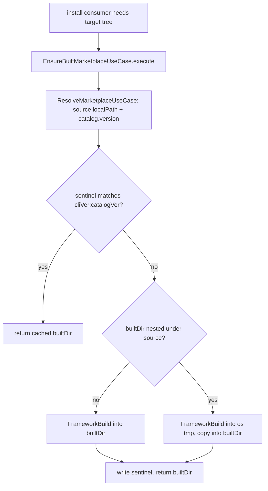

# Instruction: Build-cache foundation

Part of [`plan.md`](./plan.md).

## Architecture projection

```txt
src/
├── domain/models/
│   └── paths.ts                                          🔁 add BUILT_CACHE_SUBDIR + builtMarketplaceDir()
├── application/use-cases/shared/
│   └── ensure-built-marketplace-use-case.ts             ✅ build per-(mkt,target) tree into cache, guard-safe
└── infrastructure/
    └── deps.ts                                          🔁 wire build factory + ResolveMarketplace + EnsureBuilt
```

## User Journey



## Tasks to do

### `1)` Paths helper

> Cache location for built trees, per marketplace and target.

1. Add `BUILT_CACHE_SUBDIR = join(AIDD_DIR, "cache", "built")` to `paths.ts`.
2. Add `builtMarketplaceDir(projectRoot, marketplaceName, target): string` → `.aidd/cache/built/<mkt>/<target>/`.

### `2)` EnsureBuiltMarketplaceUseCase

> Guarantee a fresh per-target built tree exists; return its path.

1. New use-case in `application/use-cases/shared/`; constructor injects `fs` (reader+writer), `ResolveMarketplaceUseCase`, a `FrameworkBuildFactory` closure, `logger`, and `currentVersionProvider`.
2. `execute({ projectRoot, marketplace, target, mode })`: resolve source `localPath` + `catalog.version` via `ResolveMarketplaceUseCase`.
3. Compute sentinel `<cliVersion>:<catalogVersion>` (treat `undefined` catalog version as always-stale); read `.build-version` in builtDir; return cached when it matches.
4. Guard-safe outDir: if builtDir not nested vs localPath build straight in; else build into an `os.tmpdir()` leaf, then `deleteDirectory(builtDir)` + per-file copy (`listFilesRecursive`+read/write) into builtDir.
5. Invoke build via the factory (`createFrameworkBuildUseCase(deps,{target,mode,outDir,force:true})`); write sentinel; return `{ builtDir, version, rebuilt }`. In-process memo keyed `name+target+version`. Each method ≤20 lines; throws on failure.

### `3)` deps wiring

> Make the new use-case constructible and injectable.

1. Define `FrameworkBuildFactory` type and a closure in `createDeps` capturing `deps`.
2. Instantiate `ResolveMarketplaceUseCase` (if not already) and `EnsureBuiltMarketplaceUseCase`; expose on `Deps`; update cached return objects.

## Test acceptance criteria

| Task | Acceptance criteria                                                                                                    |
| ---- | --------------------------------------------------------------------------------------------------------------------- |
| 1    | `builtMarketplaceDir("/p","aidd","codex")` === `/p/.aidd/cache/built/aidd/codex` (unit)                              |
| 2a   | Sentinel match (same cliVer:catalogVer) → `rebuilt:false`, no build invoked (unit, fake factory spy)                  |
| 2b   | Sentinel mismatch / `undefined` version / CLI-version bump → `rebuilt:true`, build invoked once (unit)                |
| 2c   | builtDir nested under source (local source == projectRoot) → build succeeds via temp, files present in builtDir (integration, in-memory fs) |
| 3    | `pnpm typecheck` passes; `EnsureBuiltMarketplaceUseCase` resolvable from `createDeps` (integration)                   |
