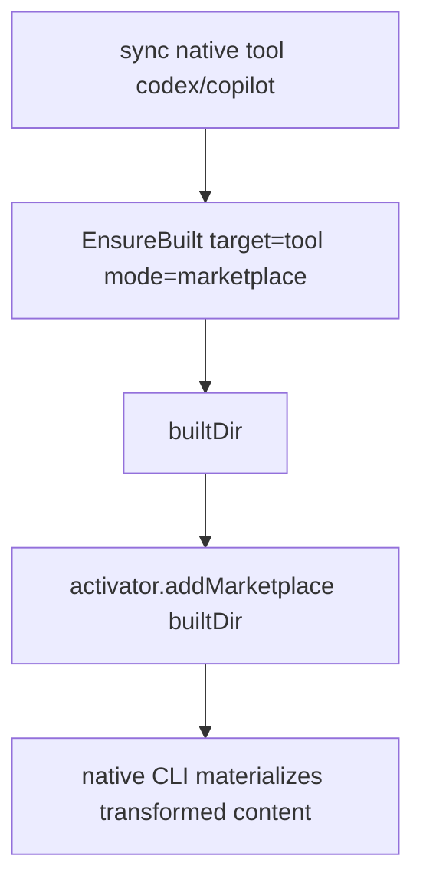

# Instruction: codex/copilot register built tree

Part of [`plan.md`](./plan.md).

## Architecture projection

```txt
src/domain/ports/
└── native-plugin-activator.ts              🔁 add removeMarketplace(name)
src/infrastructure/adapters/
├── codex-cli-adapter.ts                    🔁 removeMarketplace → `codex plugin marketplace remove <name>`
└── copilot-cli-adapter.ts                  🔁 removeMarketplace → `copilot plugin marketplace remove <name>`
src/application/use-cases/marketplace/
└── marketplace-sync-settings-use-case.ts   🔁 remove-then-add built dir; activateNativeTools async+awaited; delete marketplaceSourceArg
```

> **Why this phase matters most:** the native CLI **rejects** `marketplace add` when the
> name already exists from a different source (`'aidd-framework' is already added from a
> different source; remove it before adding this source`), and `bestEffort` swallows it as
> a warning. Every existing user already has `aidd-framework` at the **raw** source, so a
> naive `addMarketplace(builtDir)` silently does nothing and they keep reading raw content.
> This collision IS the original bug for the upgrade path. Confirmed empirically; remove-then-add fixes it.

## User Journey



## Tasks to do

### `1)` Async activation

> Build before registering; await the whole activation.

1. Make `activateNativeTools` / `activateTool` / `registerMarketplace` async; `await this.activateNativeTools(...)` at `execute` (line 53).
2. Inject `EnsureBuiltMarketplaceUseCase` into the use-case constructor (deps wiring).

### `2)` removeMarketplace capability

> The native CLI can't switch a marketplace's source in place — must remove first.

1. Add `removeMarketplace(name: string): void` to `NativePluginActivator` port (doc: idempotent, never throws on not-found).
2. Implement in codex + copilot adapters: `<binary> plugin marketplace remove <name>` (wrap in the adapters' existing error handling so "not found" is benign).

### `3)` Remove-then-add built dir

> Hand the native CLI the per-target built tree, replacing any stale registration.

1. In `registerMarketplace`, derive `target` from the activation binary (codex→codex, copilot→copilot).
2. `const { builtDir } = await ensureBuilt.execute({ marketplace, projectRoot, target, mode:"marketplace" })`.
3. `bestEffort(() => activator.removeMarketplace(marketplace.name))` then `bestEffort(() => activator.addMarketplace(builtDir))`. (Remove-then-add is idempotent and also forces a re-pull when content changed; codex built manifest is `.codex-plugin/`, copilot is `.plugin/marketplace.json` — both already emitted, don't assume `.claude-plugin/`.)
4. Delete `marketplaceSourceArg` (raw-path feeder) and its call sites; extract `buildAndResolveSource(marketplace, projectRoot, target)` helper to keep methods ≤20 lines.

## Test acceptance criteria

| Task | Acceptance criteria                                                                                                  |
| ---- | ------------------------------------------------------------------------------------------------------------------- |
| 1    | `activateNativeTools` is awaited; build completes before `addMarketplace` (integration, fake activator + spy order) |
| 2    | port + codex/copilot adapters expose `removeMarketplace`; calling it for an absent name does not throw (integration) |
| 3a   | activation calls `removeMarketplace(name)` **then** `addMarketplace(builtDir)`; builtDir ends `.aidd/cache/built/<mkt>/<codex\|copilot>` (integration, spy order) |
| 3b   | **Production-path discriminator (real-binary):** isolated home, pre-`add <RAW source>`, run aidd path → codex/copilot end up materializing transformed `[assets/...](../assets/...)` from the built tree (e2e/manual; confirmed manually) |
| 3c   | `marketplaceSourceArg` removed; `grep` finds no references; `pnpm typecheck` + `pnpm lint` pass                     |
