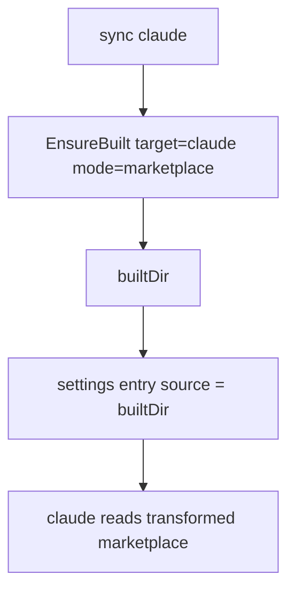

# Instruction: claude repoint settings at built tree

Part of [`plan.md`](./plan.md).

## Architecture projection

```txt
src/application/use-cases/marketplace/
└── marketplace-sync-settings-use-case.ts   🔁 claude settings entry computed from built dir, not raw source
```

## User Journey



## Tasks to do

### `1)` Built source for settings

> The claude marketplace settings file must point at the built claude tree.

1. In `syncMarketplacesFile`/`resolveSourceForSettings`, before computing the entry, `await ensureBuilt.execute({ marketplace, projectRoot, target:"claude", mode:"marketplace" })`.
2. Compute the entry from `{ kind:"local", path: builtDir }` instead of the raw source path.
3. Thread the await through `syncTool`/`syncToolSettings` (already async); keep methods ≤20 lines.

## Test acceptance criteria

| Task | Acceptance criteria                                                                                          |
| ---- | ---------------------------------------------------------------------------------------------------------- |
| 1a   | claude settings file entry path ends `.aidd/cache/built/<mkt>/claude` (integration, in-memory fs)          |
| 1b   | Built claude tree contains an agent/skill with `@../` rewritten to `[..](..)` (integration: read builtDir) |
| 1c   | `pnpm typecheck` + full suite green                                                                          |
