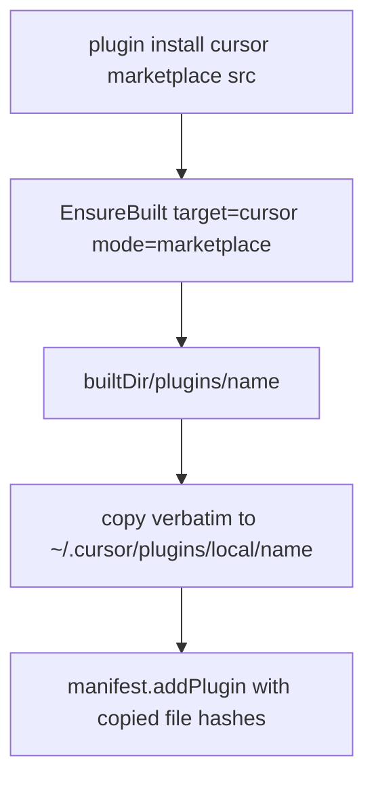

# Instruction: cursor materialize from built tree

Part of [`plan.md`](./plan.md).

## Architecture projection

```txt
src/application/use-cases/plugin/translator/
├── built-tree-materialization-translator.ts   ✅ copy built plugins/<name>/ → tool plugin dir, no PluginTranslator
└── plugin-translator-factory.ts               🔁 route cursor (installScope user) to new translator
```

## User Journey



## Tasks to do

### `1)` BuiltTreeMaterializationTranslator

> Place built content verbatim; skip the install-side transform entirely.

1. New translator implementing the `PluginTranslator` shape; inject `EnsureBuiltMarketplaceUseCase`, `fs`, `hasher`, homedir provider.
2. cursor: ensure-built (`target:"cursor", mode:"marketplace"`); resolve base via `plugins.resolvePluginsBaseDir(projectRoot, home)` → `~/.cursor/plugins/local`.
3. Copy `builtDir/plugins/<name>/` → `<base>/<name>/` (strip the `plugins/<name>` prefix; drop marketplace.json) via `listFilesRecursive`+read/write. No `rewriteContent`, no frontmatter convert.
4. Register `manifest.addPlugin(toolId, ...)` with the copied file set + hashes so remove/update keep working.

### `2)` Route cursor

> Send cursor marketplace installs to the new translator.

1. In `resolveTranslator`, route cursor (`installScope:"user"`, marketplace source) to `BuiltTreeMaterializationTranslator`.
2. Keep the old translator for non-marketplace `plugin install ./local-path` (cache requires a marketplace).

## Test acceptance criteria

| Task | Acceptance criteria                                                                                                  |
| ---- | ------------------------------------------------------------------------------------------------------------------- |
| 1a   | Installed cursor files land at `~/.cursor/plugins/local/<name>/...` with `plugins/` prefix stripped (integration)    |
| 1b   | An installed agent/skill byte-equals the same file in `builtDir/plugins/<name>/` (parity, integration)               |
| 1c   | `.mcp.json` keeps its dotted name (came from build, not remapped to `mcp.json`) (integration)                        |
| 2    | Non-marketplace `plugin install ./path` for cursor still uses old translator; `pnpm typecheck`+suite green           |
