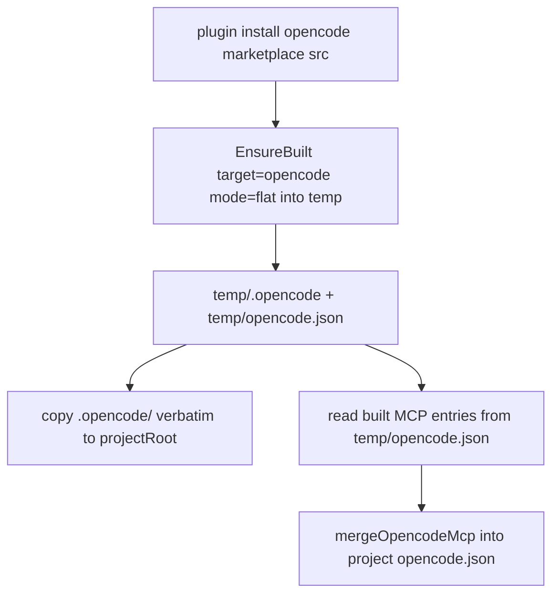

# Instruction: opencode materialize from flat build

Part of [`plan.md`](./plan.md).

## Architecture projection

```txt
src/application/use-cases/plugin/translator/
├── built-tree-materialization-translator.ts   🔁 add opencode flat branch (copy .opencode/ + MCP merge)
└── plugin-translator-factory.ts               🔁 route opencode (flat) to new translator
```

## User Journey



## Tasks to do

### `1)` opencode flat materialization

> opencode build is flat-only and merges a workspace — copy components, merge MCP into the real project config.

1. ensure-built with `mode:"flat"` into a temp workspace (opencode has no marketplace mode; flat writes `.opencode/...` + a merged `opencode.json`).
2. Copy the `.opencode/...` component files verbatim into `projectRoot` via `listFilesRecursive`+read/write.
3. **MCP exception (forward-looking — no plugin ships MCP today):** do NOT overwrite the project `opencode.json`. When the temp build emits an `opencode.json`, read its MCP entries and feed them to the existing `mergeOpencodeMcp` against the project config (preserves project-merge + previous-entry diffing). When absent, skip.
4. Register manifest with copied component files + merged MCP.

### `2)` Route opencode

> Send opencode marketplace installs to the new translator.

1. In `resolveTranslator`, route opencode (`mode:"flat"`, marketplace source) to `BuiltTreeMaterializationTranslator`.

## Test acceptance criteria

| Task | Acceptance criteria                                                                                                |
| ---- | ----------------------------------------------------------------------------------------------------------------- |
| 1a   | Installed `.opencode/...` files byte-equal the flat-build temp output (parity, integration)                        |
| 1b   | An installed skill/action shows `@../` rewritten to `[..](..)` (came from build) (integration)                     |
| 1c   | Project `opencode.json` is MCP-merged (pre-existing user entries preserved), not overwritten by build's file (integration) |
| 2    | opencode marketplace install routes to new translator; `pnpm typecheck`+suite green                                |
