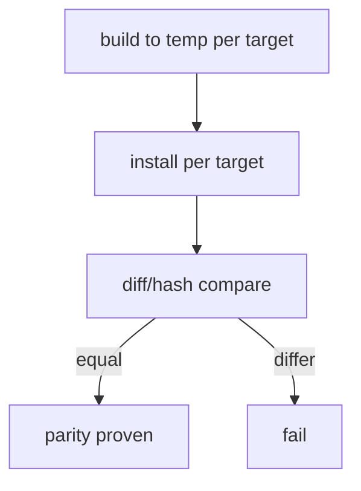

# Instruction: Cleanup dead path + parity tests

> **Scope change (user-directed):** the materialized-tool parity makes sync
> plugin-propagation unworkable for cursor/opencode (built-transformed paths can't
> map back to source). Per the user's decision, the **sync feature was deleted**
> instead of preserving `componentPaths`: removed the `sync`/`ai sync` commands,
> SyncUseCase, SyncFilePropagation, SyncSourceResolver, SyncAll, SyncPlugins,
> sync-transform, sync-policy, and their tests. Kept `SyncConflictResolverUseCase`
> (used by `update`). Per-translator byte-parity tests cover cursor + opencode; the
> golden baseline was regenerated (sync gone, built-cache artifact, `<BUILT_CACHE>`
> path normalization). `ModeBFlatMaterializationTranslator` is retained as the
> raw-local-path fallback (not dead).

Part of [`plan.md`](./plan.md).

## Architecture projection

```txt
src/domain/models/
└── plugin-translator.ts                                 🔁 remove rewriteContent calls for materialize path (lines ~111/217/231)
src/application/use-cases/plugin/translator/
└── mode-b-flat-materialization-translator.ts            ❌ delete if cursor+opencode were its only users (grep-gated)
tests/integration/
└── build-install-parity.integration.test.ts             ✅ per-tool build==install discriminator test
```

## User Journey



## Tasks to do

### `1)` Remove the second pipeline

> Eliminate the install-side transform now that build is the only engine.

1. Grep all callers of `ModeBFlatMaterializationTranslator` and `PluginTranslator` content-transform branches.
2. Delete the now-orphaned `tool.rewriteContent`/frontmatter-convert branches used only by the old cursor/opencode materialize path; delete `ModeBFlatMaterializationTranslator` iff fully orphaned.
3. Keep `PluginTranslator` for `detectFlatCollisions` + local-path installs; keep `mergeOpencodeMcp`, command-name prefixing, `resolvePluginsBaseDir`.

### `2)` Parity discriminator test

> One test that fails on any divergence or double-transform.

1. New integration test: for each of codex, copilot, claude, cursor, opencode — `framework build` to temp + run install, then hash/`diff` compare.
2. Native (codex/copilot/claude): assert registered path / settings entry === built dir AND a sampled built file shows the transform.
3. Materializing (cursor/opencode): assert installed bytes === built bytes.

### `3)` Suite + real-binary

> Prove on disk, not only mocks.

1. `pnpm build && pnpm test`, `pnpm typecheck`, `pnpm lint`, golden suite unchanged.
2. Isolated `CODEX_HOME` codex + isolated-home copilot real-binary check: add builtDir → materialized content transformed.

## Test acceptance criteria

| Task | Acceptance criteria                                                                                       |
| ---- | -------------------------------------------------------------------------------------------------------- |
| 1    | No dead transform branch remains for the materialize path; `pnpm knip:production` reports no new dead code |
| 2    | Parity test green for all 5 tools (installed == built)                                                     |
| 3    | Full suite + typecheck + lint green; golden hashes unchanged; codex/copilot real-binary materialize transformed content |
