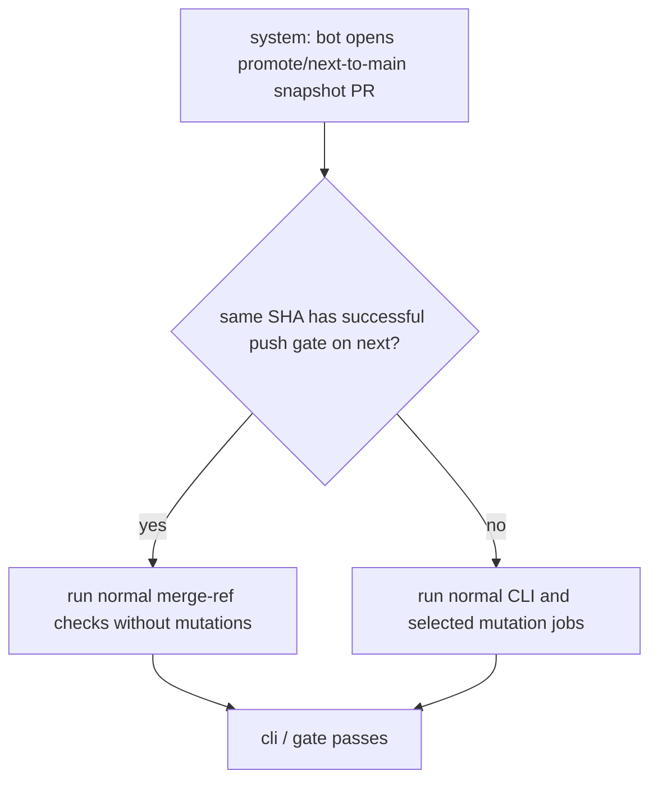
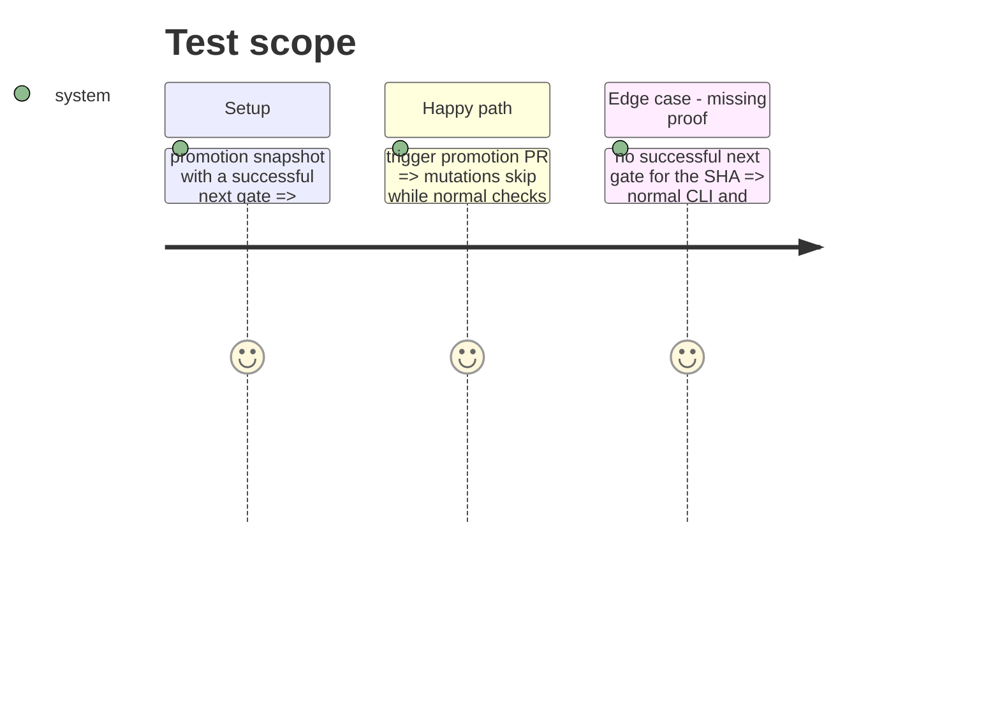

# Instruction: Reuse a validated promotion snapshot

## Architecture projection

> Tree of the final files. ✅ create · ✏️ modify · ❌ delete

```txt
.
└── .github/
    └── workflows/
        └── cli-ci.yml  ✏️ classify promotion snapshots, verify a prior next gate, and skip only the duplicate mutation matrix
```

## User Journey



## Test Scope



## Tasks to do

### `1)` Classify a trusted promotion snapshot

> Prove the snapshot was already gated on `next`, fail closed otherwise.

1. Add the least privilege needed to read workflow runs.
2. Query successful `push` runs on `next` for the exact PR head SHA and require the `cli / gate` job to have succeeded.
3. Expose an empty mutation scope list only after that proof; preserve normal scope selection otherwise.

### `2)` Keep merge integration coverage

> Remove only repeated source mutation testing from the PR merge ref.

1. Skip only `cli-mutation` for a trusted promotion snapshot.
2. Preserve all existing non-mutation jobs and their gate wiring.

## Test acceptance criteria

| Task | Acceptance criteria |
| --- | --- |
| 1 | Only a `promote/next-to-main-<run-id>` PR whose exact head SHA already has a successful `push` `cli / gate` on `next` may set mutation scopes to empty. |
| 1 | Missing, failed, or unreadable validation proof does not skip mutations. |
| 2 | A trusted promotion still runs coverage, smoke, build, platform, and other non-mutation checks against GitHub's PR merge ref. |
| 2 | Ordinary pull requests retain their existing job and mutation behavior. |
