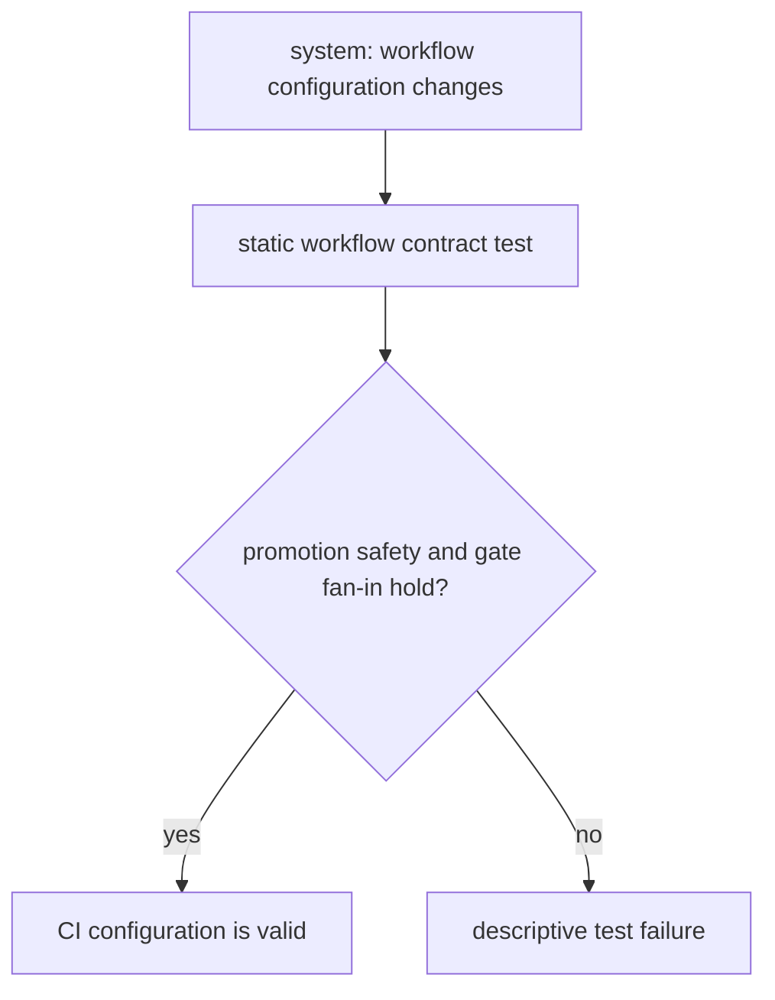
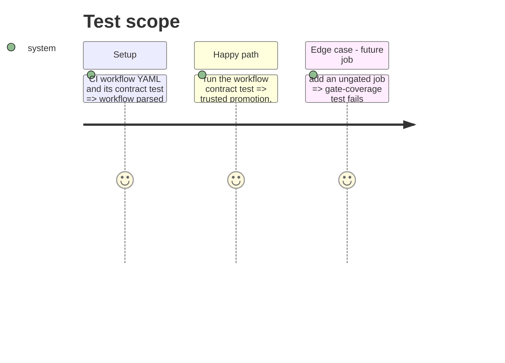

# Instruction: Lock the workflow contract

## Architecture projection

> Tree of the final files. ✅ create · ✏️ modify · ❌ delete

```txt
.
├── scripts/
│   └── __tests__/
│       └── cli-ci-gate-covers-every-job.test.js  ✏️ assert promotion reuse and required-gate coverage
└── aidd_docs/
    └── memory/
        └── deployment.md  ✏️ describe promotion-specific mutation reuse
```

## User Journey



## Test Scope



## Tasks to do

### `1)` Assert promotion safety structurally

> Make regressions in the promotion fast path visible before merge.

1. Extend the existing workflow contract test with the trusted-promotion and fallback invariants.
2. Assert a trusted promotion empties only mutation scopes and retains the existing gate fan-in.

### `2)` Record the operating model

> Keep deployment memory aligned with the workflow.

1. Replace the generic CLI CI description with its promotion reuse rule and fail-closed fallback.

## Test acceptance criteria

| Task | Acceptance criteria |
| --- | --- |
| 1 | The contract test fails if trusted promotion detection, mutation fallback, retained checks, or gate fan-in is removed. |
| 2 | Deployment memory accurately states when promotion skips mutations and what still runs. |
