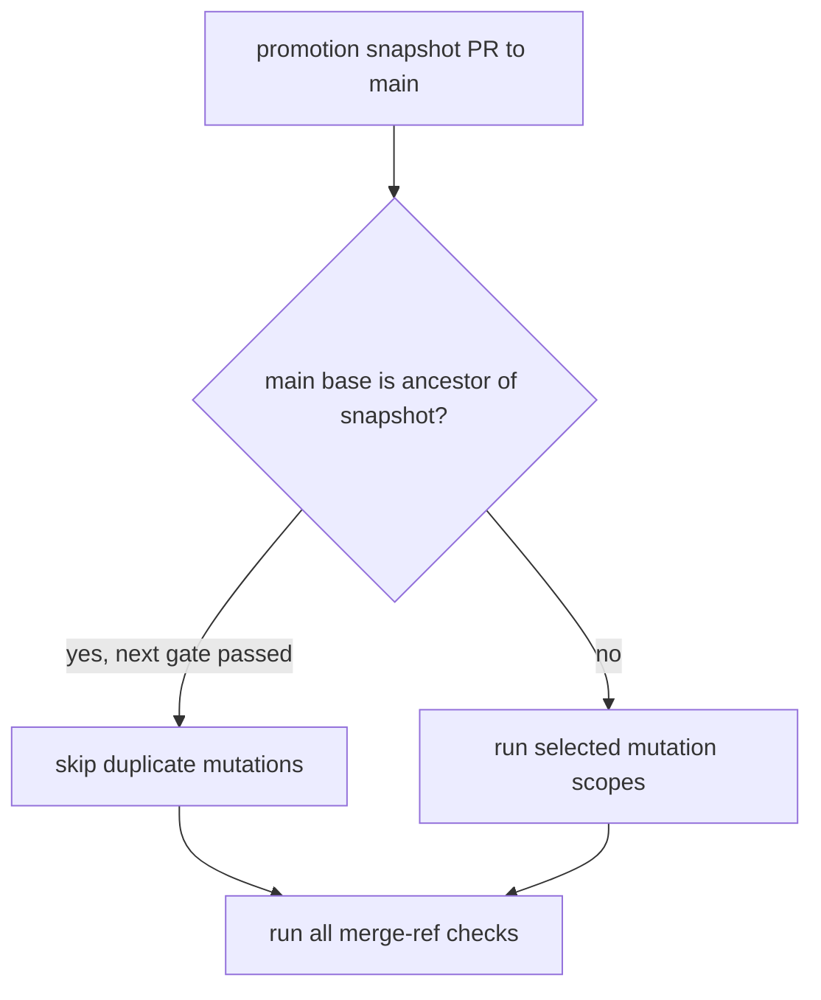
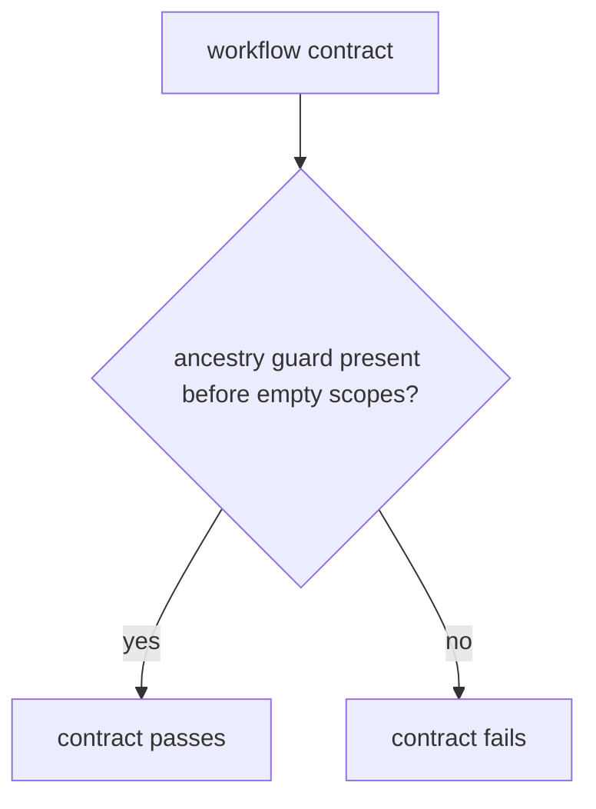

# Instruction: Bind promotion reuse to the tested merge tree

## Architecture projection

> Tree of the final files. ✅ create · ✏️ modify · ❌ delete

```txt
.
├── .github/
│   └── workflows/
│       └── cli-ci.yml  ✏️ fail closed when main is not already contained by the promotion snapshot
└── scripts/
    └── __tests__/
        └── cli-ci-gate-covers-every-job.test.js  ✏️ lock the ancestry requirement
```

## User Journey



## Test Scope



## Wireframe

```txt
No UI: GitHub Actions workflow behavior only.
```

## Tasks to do

### `1)` Prove promotion content is unchanged

> Reuse a `next` mutation result only when the PR merge cannot add untested main content.

1. Read the promotion PR base and snapshot SHAs from the event.
2. Require the base SHA to be an ancestor of the snapshot before marking a promotion trusted.
3. Keep every failed or unreadable Git proof on the normal mutation path.

### `2)` Lock the fail-closed guard

> Make a future removal of the ancestry check fail locally.

1. Extend the workflow contract test with the base-to-snapshot proof and fallback expectation.

## Test acceptance criteria

| Task | Acceptance criteria |
| --- | --- |
| 1 | A promotion with uncontained `main` content cannot set `mutation_scopes=[]`. |
| 1 | A promotion whose base is contained by its exact snapshot and whose `next` gate passed retains the mutation skip. |
| 2 | The contract test fails when the ancestry proof or fail-closed fallback is removed. |
