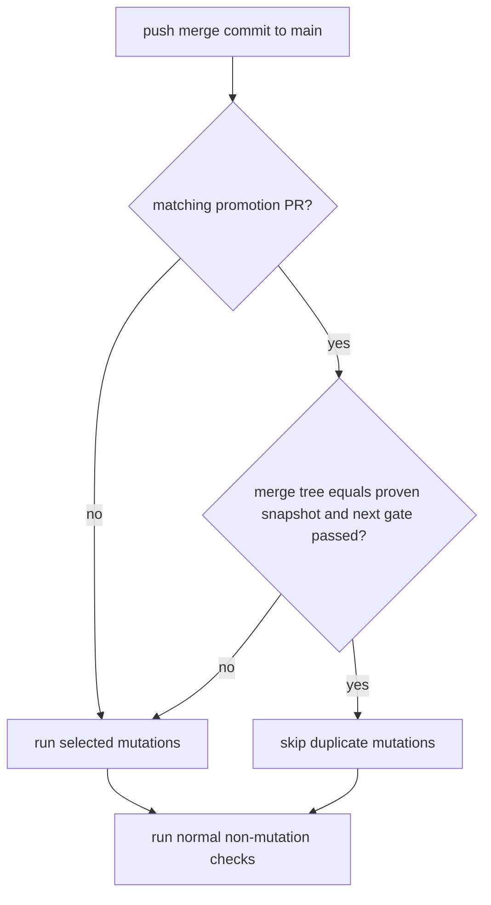
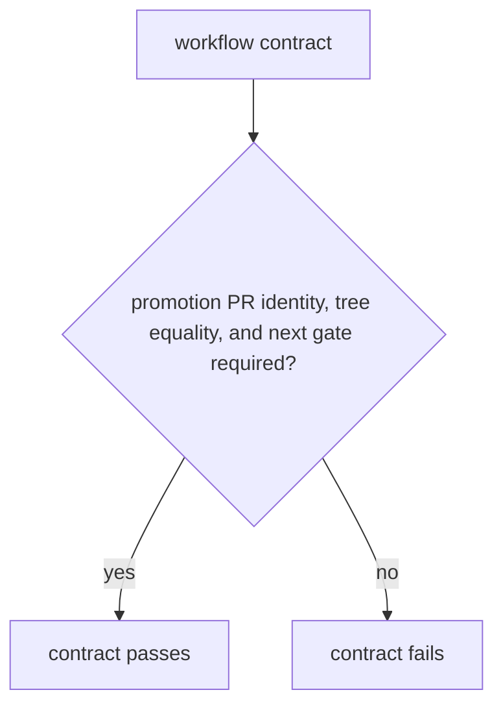

# Instruction: Reuse the proven promotion merge on main

## Architecture projection

> Tree of the final files. ✅ create · ✏️ modify · ❌ delete

```txt
.
├── .github/
│   └── workflows/
│       └── cli-ci.yml  ✏️ recognize a proven promotion merge on main and skip only duplicate mutations
├── scripts/
│   └── __tests__/
│       └── cli-ci-gate-covers-every-job.test.js  ✏️ lock main-merge proof and unchanged fallback
└── aidd_docs/
    └── memory/
        └── deployment.md  ✏️ document both trusted reuse paths
```

## User Journey



## Test Scope



## Wireframe

```txt
No UI: GitHub Actions workflow behavior only.
```

## Tasks to do

### `1)` Classify a trusted main promotion merge

> Skip mutations on main only for the exact content already gated on next.

1. Identify the merged promotion PR and its snapshot with read-only repository data.
2. Require the final main commit tree to equal that snapshot's tree.
3. Reuse only the successful `cli / gate` run for the snapshot's exact SHA on `next`.

### `2)` Preserve normal behavior and explain it

> Keep every ambiguous, failed, or unrelated main push fully protected.

1. Route missing PR identity, unavailable API data, mismatched trees, and failed gates to normal mutation scope selection.
2. Assert the trusted-main contract structurally and update deployment memory.

## Test acceptance criteria

| Task | Acceptance criteria |
| --- | --- |
| 1 | Only a merge from the numbered promotion branch whose final tree equals the snapshot may skip mutations on `main`. |
| 1 | The matching snapshot must have a successful `push` `cli / gate` on `next`. |
| 2 | Every missing, unreadable, mismatched, or unrelated proof preserves normal mutation execution. |
| 2 | Non-mutation jobs and gate fan-in remain unchanged for all events. |
