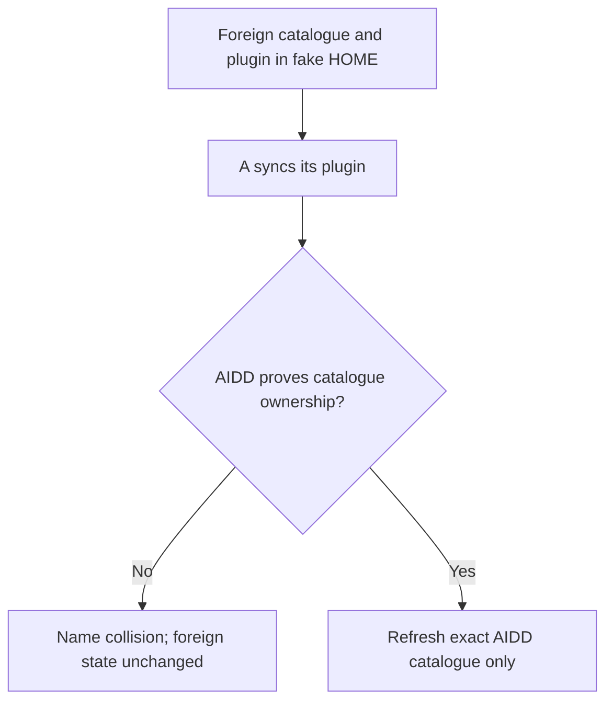
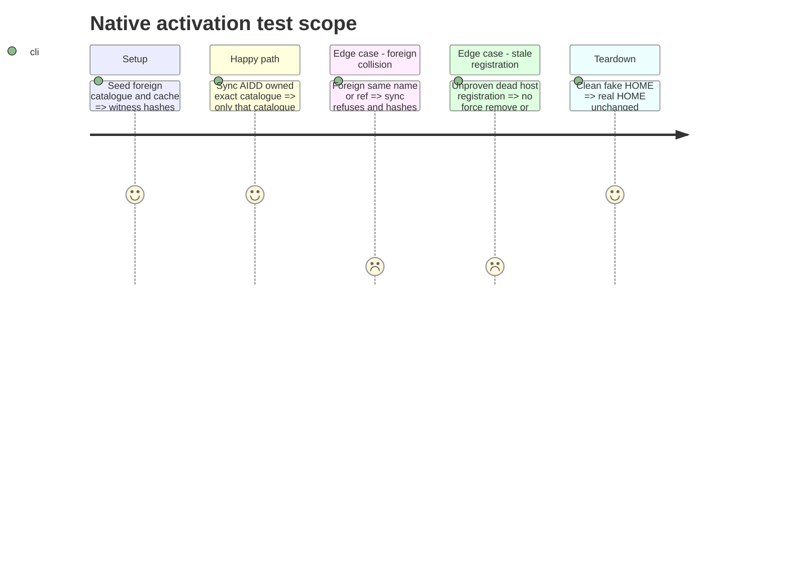

# Instruction: guard native activation

## Architecture projection

> Tree of the final files. ✅ create · ✏️ modify · ❌ delete

```txt
cli/
  src/contexts/framework/application/flows/marketplace-sync-settings-use-case.ts ✏️ provenance before upgrade/reclaim
  src/contexts/tools/domain/ports/native-plugin-activator.ts ✏️ exact catalogue refresh contract if supported
  src/contexts/tools/infrastructure/native-plugin-cli-adapter.ts ✏️ exact host CLI dispatch if supported
  tests/contexts/framework/application/flows/ ✏️ foreign collision and A/B activation
  tests/contexts/tools/infrastructure/ ✏️ exact CLI process arguments
  scripts/smoke-collision.sh ✏️ catalogue and cache witnesses
```

## User Journey



## Test Scope



## Tasks to do

### `1)` Prove ownership before host mutation

> No unscoped refresh or forced takeover can run on foreign state.

1. Write failing fake-host collision tests and targeted mutation checks.
2. Limit refresh to exact proven host catalogues; refuse when the host cannot target safely.
3. Guard reserved-name reclaim with canonical ownership and no foreign refs; update older migration expectations.

## Test acceptance criteria

| Task | Acceptance criteria |
| --- | --- |
| 1 | A sync preserves foreign catalogue registration, plugin ref, and cache bytes; only a proven AIDD catalogue changes, with exact host arguments. |
