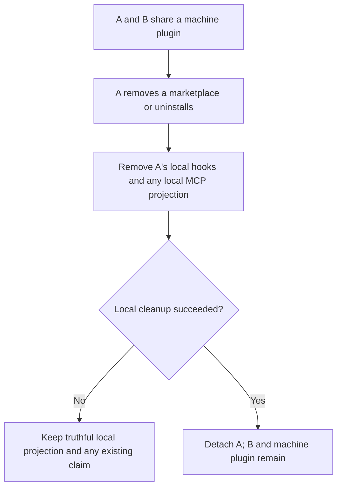
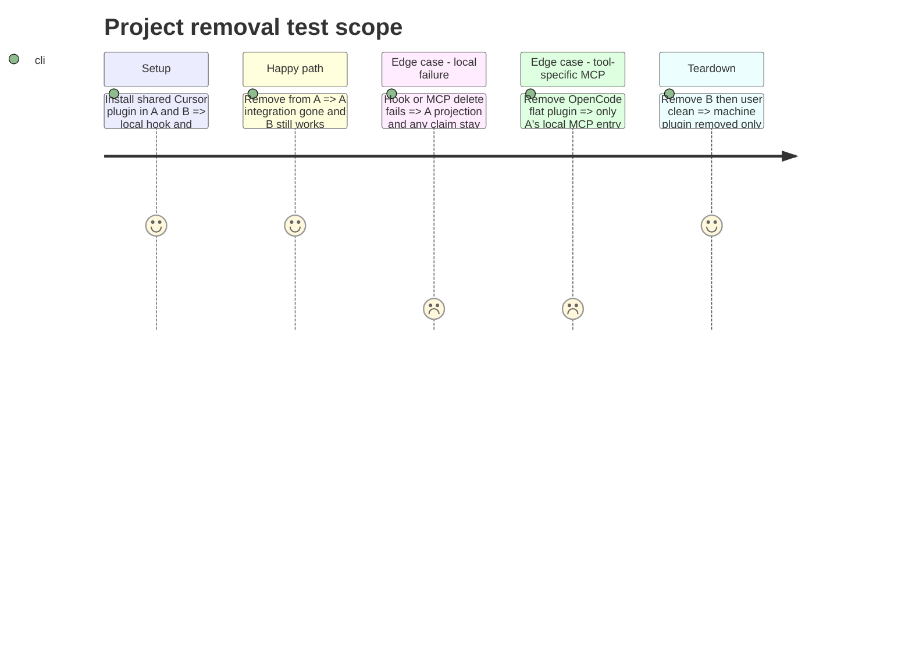

# Instruction: finish project-local removal

## Architecture projection

> Tree of the final files. ✅ create · ✏️ modify · ❌ delete

```txt
cli/
  src/contexts/framework/application/flows/marketplace-remove-use-case.ts ✏️ local cleanup before orphan detach
  src/contexts/framework/application/uninstall/uninstall-plugin-use-case.ts ✏️ local cleanup before uninstall detach
  src/contexts/framework/application/ownership/project-plugin-cleanup.ts ✏️ reuse or narrow shared cleanup
  tests/contexts/framework/application/flows/ ✏️ Cursor hook and MCP orphan removal
  tests/contexts/framework/application/ ✏️ uninstall failure and B survival
```

## User Journey



## Test Scope



## Tasks to do

### `1)` Complete local cleanup before detachment

> Do not leave A's local projections behind without a plugin record; do not remove Cursor's global MCP.

1. Write failing `marketplace remove` and `uninstall plugin` integration tests.
2. Reuse project-local cleanup for hooks/MCP before manifest removal and claim detach.
3. Prove failure retains A's claim and B's global plugin remains intact.

## Test acceptance criteria

| Task | Acceptance criteria |
| --- | --- |
| 1 | Both commands remove A's project hooks/scripts and any local MCP projection created by that flow before detach; failure retains A's projection and any existing machine claim; Cursor's global MCP, B, and machine-owned state remain unchanged. |
