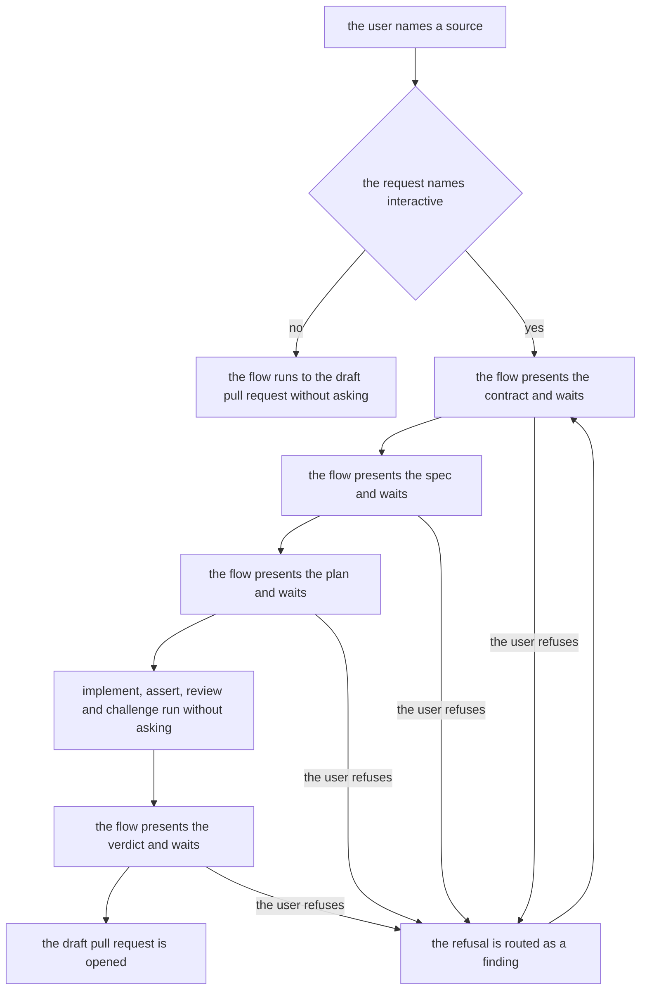
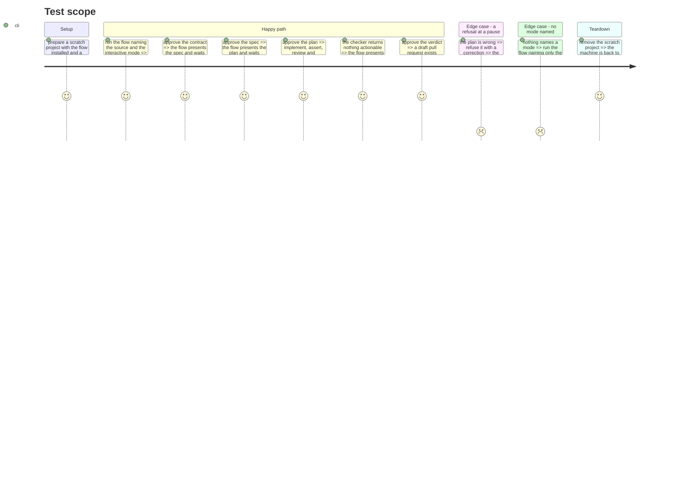

# Instruction: the mode and its four pauses

## Architecture projection

> Tree of the final files. ✅ create · ✏️ modify · ❌ delete

```txt
.
└── plugins/
    └── aidd-orchestrator/
        └── skills/
            └── 01-sdlc/
                └── ✏️ SKILL.md
```

## User Journey



## Test Scope



## Tasks to do

### `1)` State the two modes in the router

> The flow reads its mode from the request, and nothing else has to be told.

1. In `## Behavior`, make `auto` the mode when the request names none, and `interactive` the mode when it does.
2. Keep the `auto` branch declaring autonomy in the terms a called skill reads as such. No literal string is shared: `aidd-dev:01-plan` carries its own `Under an autonomous orchestrator` clause and infers the case from what the router declares, so the switch is inference, not a match.
3. Write the `interactive` branch: present what was produced and wait after the contract, after the plan, and after the outcome.
4. State that under `interactive` no zone and no delegated step claims autonomy, so a called skill takes its own interactive branch.
5. State that a refusal at a pause is a finding, routed the way the check zone already routes one.
6. Write every one of these in `## Behavior` only. The three references say nothing about the mode.

### `2)` Name what the user brings

> The frontmatter admits the mode word.

1. Set `argument-hint` to `request | auto | interactive`.
2. Expect the mixed form to be questioned in review, and answer with the precedent: `aidd-vcs:01-commit` ships `paths | auto | push`, an artifact beside a mode and an option, and it passes the gate.

### `3)` Make the description true for both modes

> The only always-on text stops promising a single mode.

1. Rewrite `description` so it no longer opens by promising autonomy alone.
2. Hold it to the contract: verb-led, third person, about 240 characters, an intent clause, an optional exclusion, no colon, no dash, no other skill named.

### `4)` Prove it on a real run

> A gate that passes says the file is well formed, not that the flow stops.

1. Run the repository's pre-commit gate.
2. Run the flow twice against a scratch project, once with no mode word and once with `interactive`, and observe the pauses.
3. Confirm in the interactive run that the planning step asked for approval on its own score, which is how the switch is observed from outside.
4. Treat this observation as the only guard there is. No gate and no test covers the inference, so a later rewording of `## Behavior` can break the switch in silence.

## Test acceptance criteria

| Task | Acceptance criteria              |
| ---- | -------------------------------- |
| 1 | A run naming no mode reaches the draft pull request without a single pause; a run naming `interactive` waits on the contract, on the plan, and on the outcome before the pull request, whether Frame yields the contract directly or through a spec |
| 1 | Refusing at any of the four pauses sends the run back through the zone that owns the artifact, and the run continues afterwards |
| 1 | No reference file mentions a mode |
| 2 | The argument-hint gate passes and the hint names the two mode words |
| 3 | The description reads true in both modes and satisfies the skill contract |
| 4 | The interactive run shows the planning step waiting for approval, which no code change caused |
