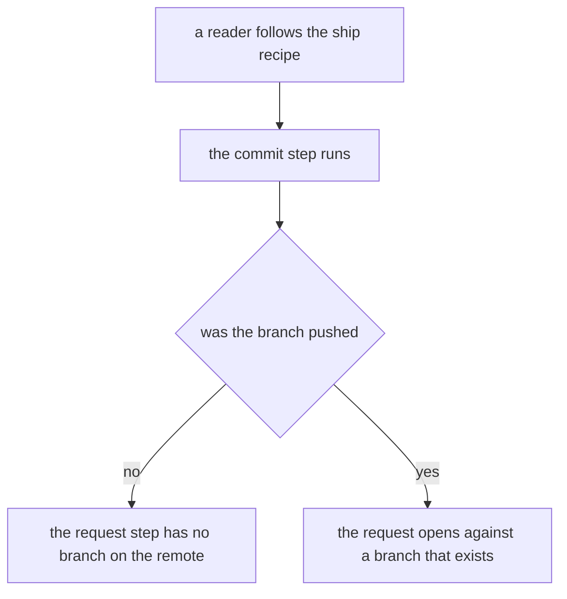
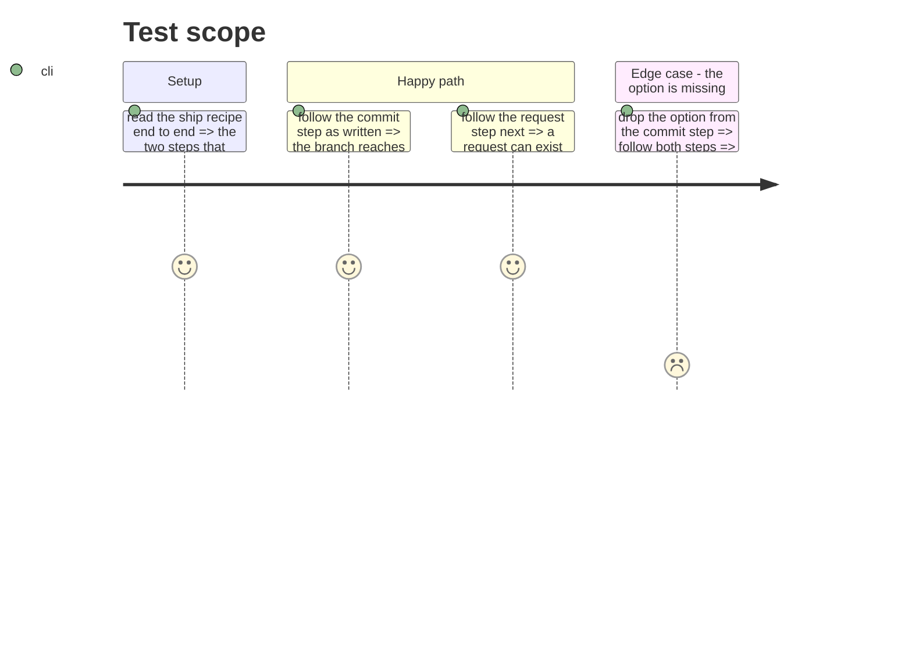

# Instruction: the recipe that opens a request on a branch nobody pushed

## Architecture projection

> Tree of the final files. ✅ create · ✏️ modify · ❌ delete

```txt
.
└── plugins/
    └── aidd-context/
        └── skills/
            └── 12-cook/
                └── assets/
                    └── recipes/
                        └── ✏️ ship-a-feature.md
```

## User Journey



## Test Scope



## Tasks to do

### `1)` Push in the step that commits

> A recipe that ends in a request needs a branch the remote has.

1. In `ship-a-feature.md`, make the commit step run the commit skill with its `push` option, in the prose and in the copyable block.
2. Say why in the step's own sentence, so the option does not read as decoration.
3. Change nothing else: the commit skill already pushes when that option is set, and the request skill keeps its rule against pushing.

## Test acceptance criteria

| Task | Acceptance criteria              |
| ---- | -------------------------------- |
| 1 | Following the recipe as written leaves the branch on the remote before the request step runs |
| 1 | The commit skill and the request skill are unchanged |
| 1 | The step says why it pushes |
