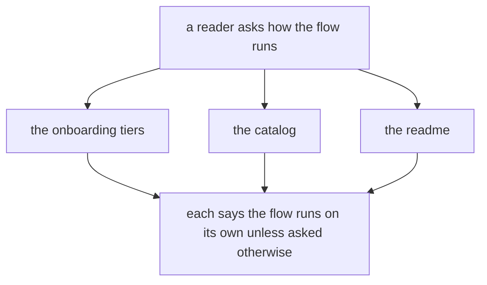
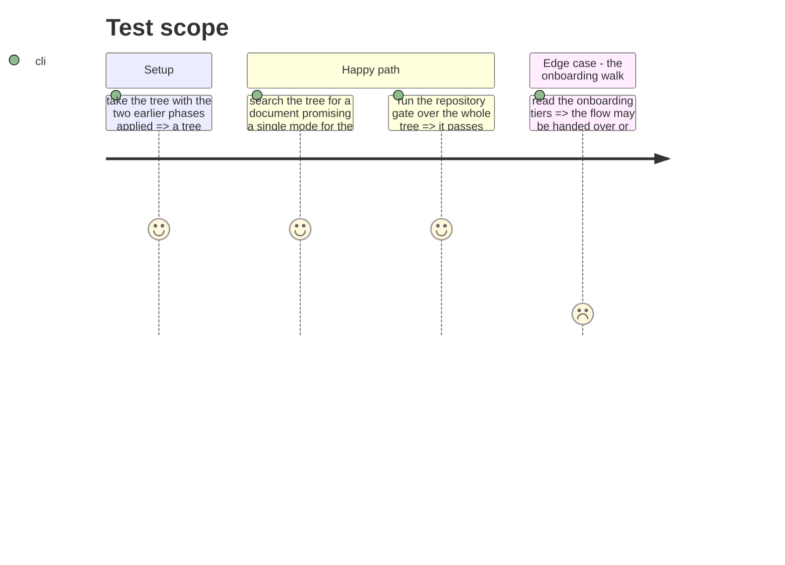

# Instruction: the documents that claim one mode

## Architecture projection

> Tree of the final files. ✅ create · ✏️ modify · ❌ delete

```txt
.
├── ✏️ README.md
├── docs/
│   └── ✏️ CATALOG.md
└── plugins/
    └── aidd-context/
        └── skills/
            └── 00-onboard/
                └── references/
                    └── run/
                        └── ✏️ tiers.md
```

## User Journey



## Test Scope



## Tasks to do

### `1)` Drop the exception that forbids the walk

> The generic rule already covers a skill with two modes.

1. In `references/run/tiers.md`, delete the line making the flow autonomous by contract and forbidding its downgrade.
2. Keep the line above it, which already says a dual-mode skill runs the other way when the user asks and the skill supports it.
3. Read `references/flow.md` and decide whether the choice it offers between walking step by step and handing the whole flow over still reads right. Change it only if it now misleads.

### `2)` Reword the two hand-written catalogs

> Neither is generated, so neither fixes itself.

1. In `docs/CATALOG.md`, reword the flow's row so autonomy is the default rather than the whole story.
2. In `README.md`, reword the flow's row the same way, without copying the sentence used in the catalog.
3. Leave every generated catalog alone: the pre-commit hook rewrites those from each skill's own description.

### `3)` Prove nothing else still claims it

> The claim may sit somewhere this plan did not look.

1. Search the tree for the words promising autonomy about this flow, and read each hit.
2. Reword a hit that is now false; leave a hit that describes something else.
3. Run the repository's pre-commit gate over the whole tree.

## Test acceptance criteria

| Task | Acceptance criteria              |
| ---- | -------------------------------- |
| 1 | The onboarding walk may offer the flow as a guided step, and no line forbids it |
| 2 | Both hand-written catalogs describe a flow that is autonomous by default and can be asked to pause |
| 2 | No generated catalog was edited by hand |
| 3 | No document in the tree states that the flow only runs autonomously |
| 3 | The whole-tree gate passes |
