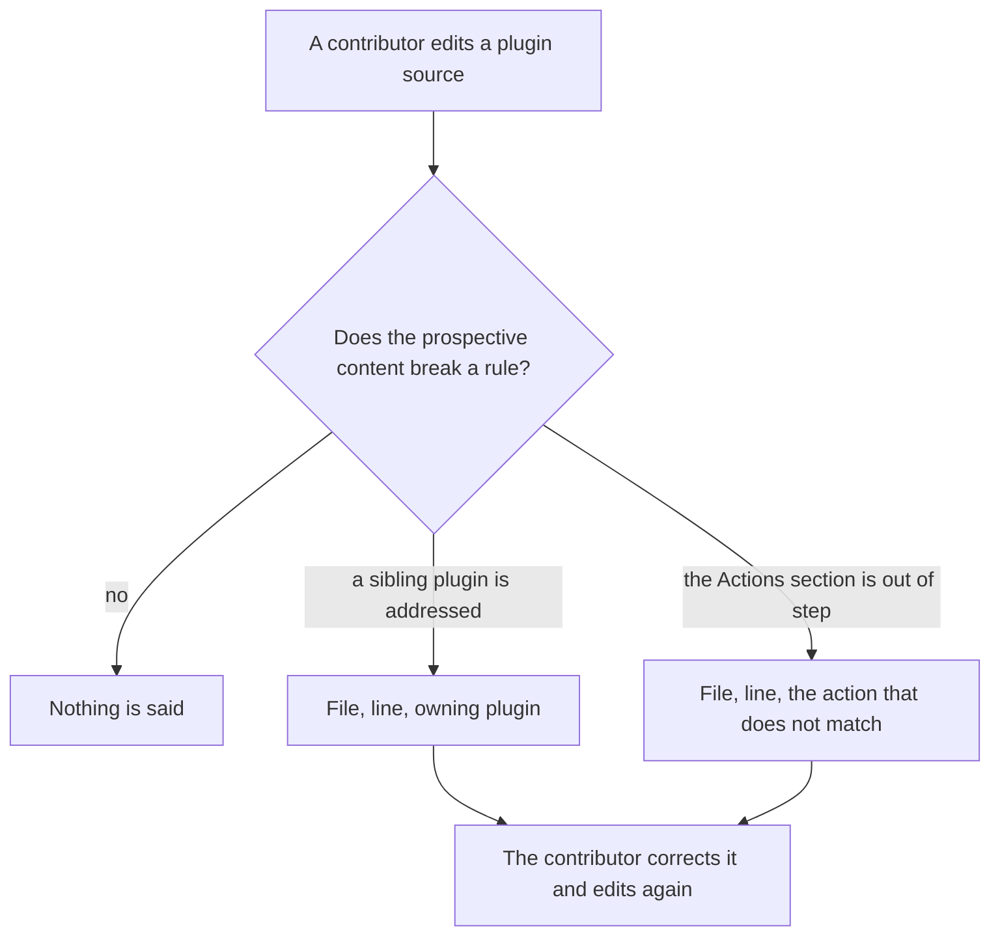
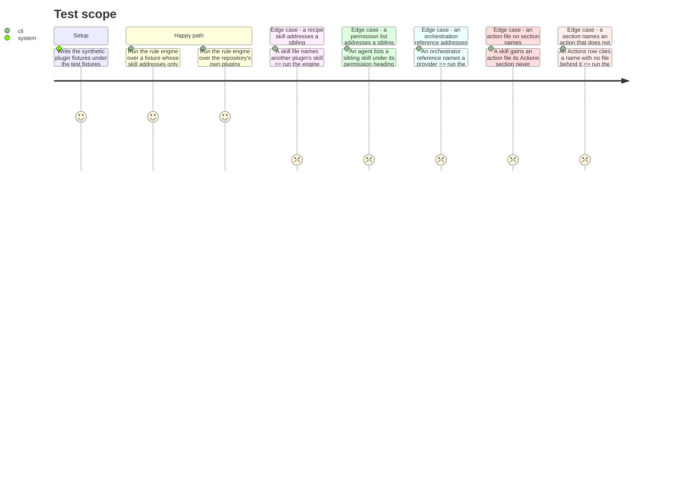

# Instruction: The two rules, as a tested engine

## Architecture projection

> Tree of the final files. ✅ create · ✏️ modify · ❌ delete

```txt
.
├── scripts
│   ├── lib
│   │   └── architecture-rules.js          ✅ the two rules, as pure functions
│   └── __tests__
│       ├── architecture-rules.test.js     ✅ both rules, both directions, plus the clean-tree sweep
│       └── fixtures
│           └── architecture-rules         ✅ synthetic plugin trees, written for this task
└── docs
    └── ARCHITECTURE.md                    ✏️ one line pointing at the guard that now enforces the rule
```

## User Journey



## Test Scope



## Tasks to do

### `1)` The failing tests come first

> Every rule gets its red before it gets its engine.

1. Write the synthetic fixtures: a plugin tree with a clean skill, a skill addressing a sibling, an agent permission list addressing a sibling, an orchestrator reference addressing a sibling, a skill with an unnamed action file, a skill citing an absent action.
2. Write `architecture-rules.test.js` covering each fixture and each expected verdict, plus one case that sweeps the repository's real `plugins/` and expects zero violations.
3. Run the suite and watch every case fail for the absence of the module, not for a typo.

### `2)` The orthogonality rule

> A dispatch surface never names a sibling plugin.

1. Expose a function taking a repository-relative path and the prospective content, returning violations with a line, a 1-indexed number, the address found and the plugin that owns it.
2. Match `/<plugin>:<skill>` and `@<plugin>:<agent>` addresses; a match whose plugin equals the file's own owner is not a violation.
3. Govern only `SKILL.md`, `actions/*.md`, `references/*.md` and `agents/*.md`. Anything under `assets/` returns nothing.
4. Exempt a file owned by an orchestrator plugin, and exempt the lines under an agent's `# Skills you may invoke` heading.

### `3)` The router coherence rule

> An Actions section names exactly the actions that exist.

1. Take the prospective `SKILL.md` content and the names of the skill's action files.
2. Isolate the `## Actions` section, up to the next second-level heading.
3. Report an action file the section names by neither its stem nor its file name, and report a name the section cites that no file backs.
4. Report the line of the section heading when the violation is an absent mention, and the line of the citation when it is a phantom one.

### `4)` The rule the repository already follows

> A guard that is red on a clean tree is a guard nobody keeps.

1. Run the sweep case over the real `plugins/` tree.
2. When a rule fires there, the rule is wrong, not the tree. Narrow it and record why in `plan.md`'s decisions.

### `5)` The rule document points at its enforcement

> `docs/ARCHITECTURE.md` states the rule; say where it is now checked.

1. Add one sentence naming the guard, plugin-relative and in backticks, never as a link.

## Test acceptance criteria

| Task | Acceptance criteria |
| --- | --- |
| 1 | Every case in the suite fails before the engine exists, each for the missing module |
| 2 | A skill addressing a sibling yields a violation naming file, line and owning plugin; an agent permission list and an orchestrator reference yield none; a file under `assets/` yields none |
| 3 | An action file the section never names yields one violation; a cited name with no file yields one violation; a skill whose section and files agree yields none |
| 4 | Sweeping the repository's own `plugins/` yields zero violations |
| 5 | `docs/ARCHITECTURE.md` names the guard, and the markdown-link check still passes |
