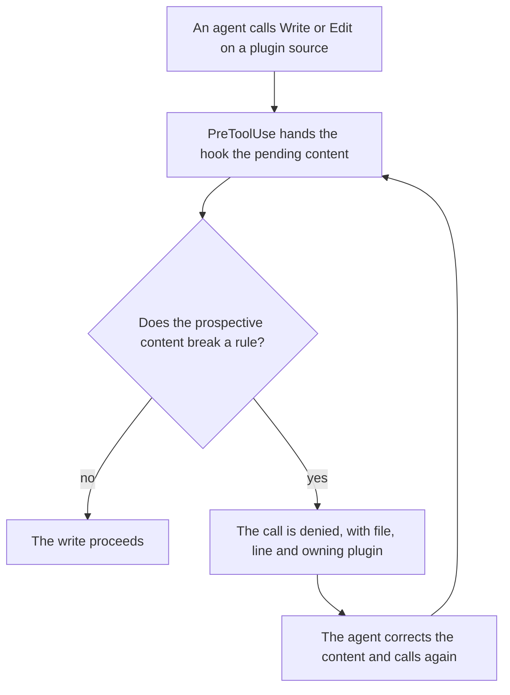
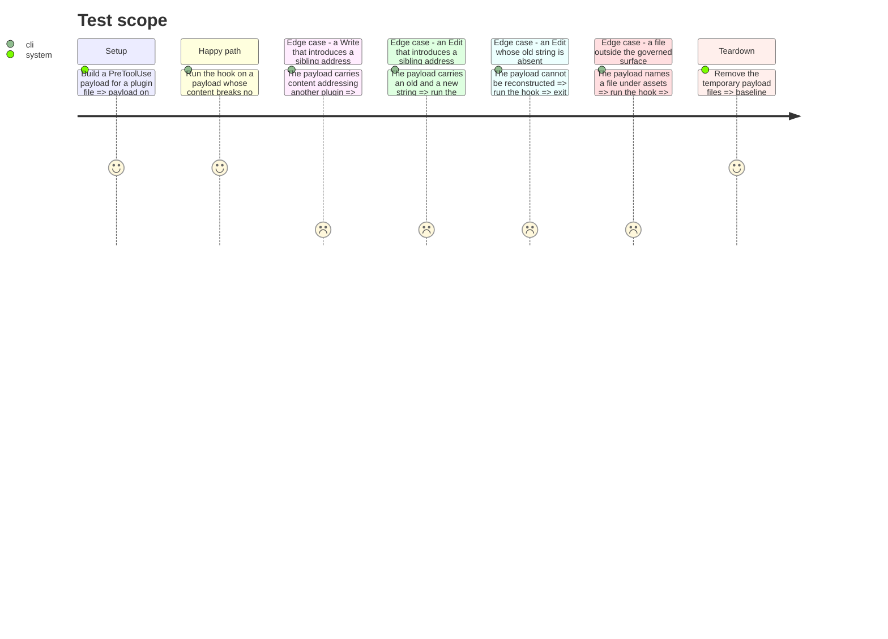

# Instruction: The refusal, at the AI host's write moment

## Architecture projection

> Tree of the final files. ✅ create · ✏️ modify · ❌ delete

```txt
.
├── .claude
│   ├── hooks
│   │   └── check-architecture-rules.js    ✅ reads the pending edit, calls the engine, refuses
│   └── settings.json                      ✏️ one PreToolUse entry matching Write and Edit
└── scripts
    └── __tests__
        └── architecture-hook.test.js      ✅ the payload shapes and the refusal contract
```

## User Journey



## Test Scope



## Tasks to do

### `1)` The hook, generated by the capability that owns hooks

> The decider asked for a host-native lifecycle hook produced by the hook capability, not a hand-placed script.

1. Run `/aidd-context:08-hook-generate` for a `PreToolUse` hook matching `Write|Edit`, at the project scope, for Claude Code — the one host this repository configures hooks for, per the plan's decisions.
2. Keep the generated entry and script; give the script the name the projection states.

### `2)` The prospective content

> Judge what the file will hold, not what it holds now.

1. Read the payload from standard input. Take `tool_input.file_path`.
2. For a `Write`, the prospective content is `tool_input.content`.
3. For an `Edit`, read the file and apply `old_string` to `new_string`, once or everywhere per `replace_all`.
4. When the file path is outside the governed surface, or the reconstruction fails, exit zero and say nothing.

### `3)` The refusal

> A refusal a reader cannot act on is noise.

1. Call the engine with the path, the prospective content, and the skill's action file names when the path is a `SKILL.md`.
2. On a violation, emit the `PreToolUse` deny decision, with a reason naming each file, line, and the plugin that owns the address, and what to write instead.
3. On no violation, exit zero with no output.

### `4)` The failing tests come first

> The hook is a contract with the host; test it as one.

1. Write `architecture-hook.test.js` driving the hook as a subprocess with each payload shape.
2. Watch each case fail before the hook exists.
3. Assert the decision is a deny and the reason carries the file and the line, never only the rule.

### `5)` The proof

> A guard nobody watched fire is a comment.

1. Write a plugin file addressing a sibling, through the agent's own Write tool, and record that the call was refused and what it said.
2. Write an agent permission list naming a sibling the same way, and record that it was applied.

## Test acceptance criteria

| Task | Acceptance criteria |
| --- | --- |
| 1 | The hook entry exists in `.claude/settings.json` at the project scope and fires on `Write` and `Edit` |
| 2 | A `Write` payload and an `Edit` payload over the same file yield the same verdict for the same resulting content |
| 3 | A denied call returns a reason naming file, line and owning plugin; a clean call returns nothing at all |
| 4 | Every case fails before the hook exists, then passes |
| 5 | An attempted write of a sibling address is refused in the same turn; an attempted write of a permission list is applied |
