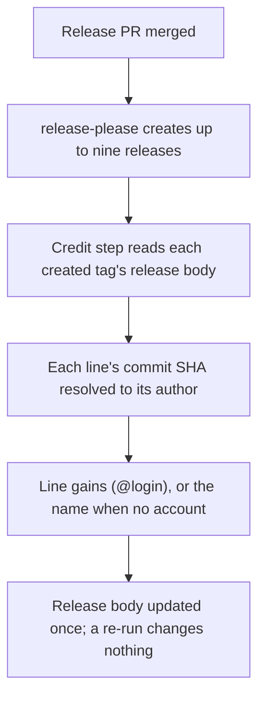
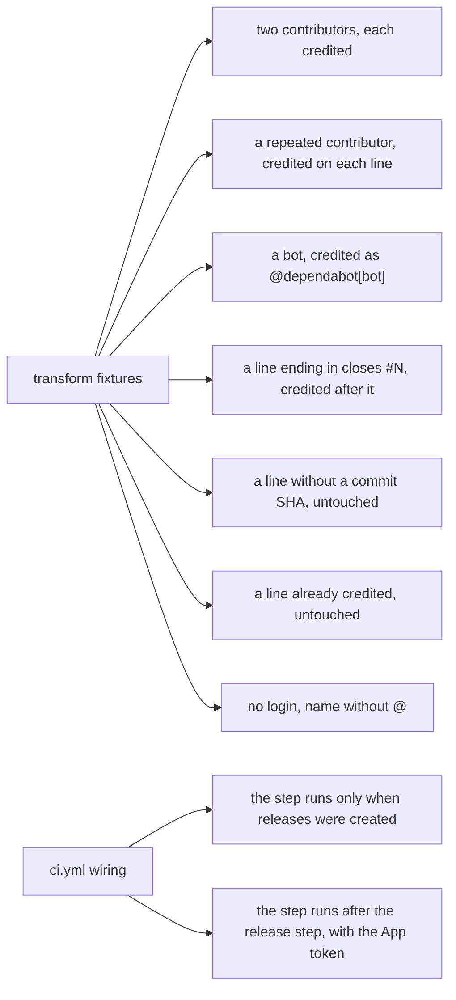

# Instruction: Credit commit authors in GitHub releases

## Architecture projection

> Tree of the final files. ✅ create · ✏️ modify · ❌ delete

```txt
.
├── scripts/credit-release-authors.cjs                    ✅ pure line transform plus a thin gh runner
├── scripts/__tests__/credit-release-authors.test.js      ✅ transform fixtures and ci.yml wiring
├── .github/workflows/ci.yml                              ✏️ credit step after the release is created
└── aidd_docs/memory/deployment.md                        ✏️ Release: releases credit authors, and why it is a step
```

## User Journey



## Test Scope



## Tasks to do

### `1)` Write the failing transform tests

> Pin the line format on real release lines before any code.

1. Create `scripts/__tests__/credit-release-authors.test.js` with T1 to T7, fixtures copied from `v5.10.0`'s real lines.
2. The transform takes a body and a `sha → display` resolver, so no fixture touches the network.
3. Run it and watch it fail on the missing module.

### `2)` Write the transform and its runner

> Pure function first, the runner only fetches and writes.

1. Create `scripts/credit-release-authors.cjs` exporting `credit(body, resolve)`.
2. A header comment links googleapis/release-please#2761 and #2892 and says to delete the script once a fixed release-please is pinned.
3. The runner takes the created tags, reads each body with `gh release view`, resolves each SHA once with `gh api repos/<repo>/commits/<sha>`, and writes back with `gh release edit --notes-file -` only when the body changed.
4. An API failure exits non-zero and names the tag, never writes a partial body.
5. Tests green. Mutation: drop the already-credited guard and watch T6 go red.

### `3)` Wire the step

> After the releases exist, on the run that created them.

1. Read how `release-please-action` v5.0.0 exposes each created tag (root `tag_name`, per path `<path>--tag_name`) from its `action.yml` or source before relying on it.
2. Add a step to the `release-please` job, after "Pin umbrella release as latest", guarded on `releases_created`, passing the action's outputs to the runner and the App token as `GH_TOKEN`.
3. Extend the test with W1 and W2, loading `ci.yml` with js-yaml.
4. Mutation: drop the guard and watch W1 go red.

### `4)` Document

> Once, where the release is described.

1. In `aidd_docs/memory/deployment.md`'s Release section, state that a step credits each release line's commit author, as a workaround for the upstream bug.

## Test acceptance criteria

| Task | Acceptance criteria |
| --- | --- |
| 1 | The tests fail first for a missing module |
| 2 | T1 to T7 pass. Removing the already-credited guard turns T6 red |
| 3 | W1 and W2 pass. Removing the `releases_created` guard turns W1 red |
| 4 | `pnpm exec lefthook run pre-commit` is green |
| all | `node scripts/check-tests-leave-git-alone.js -- node --test 'scripts/__tests__/**/*.test.js'` is green |
| live | the first release after merge shows `(@login)` on every line |
