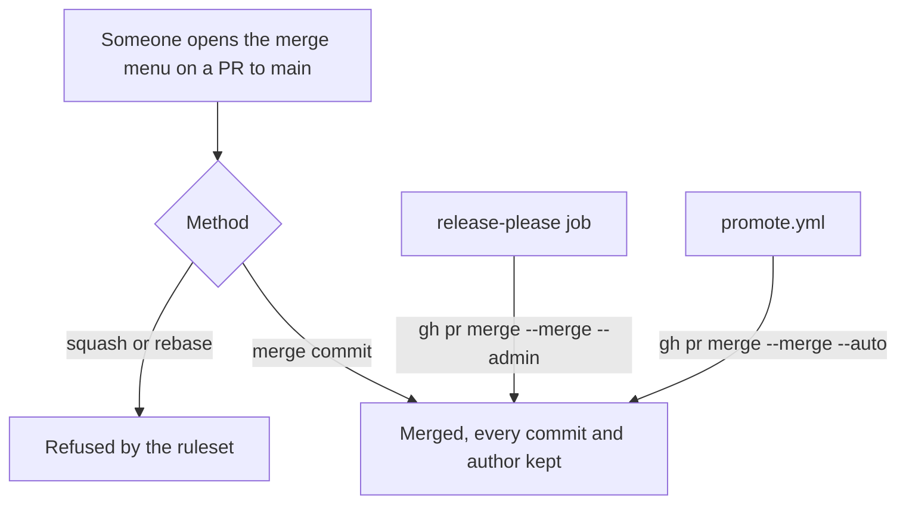
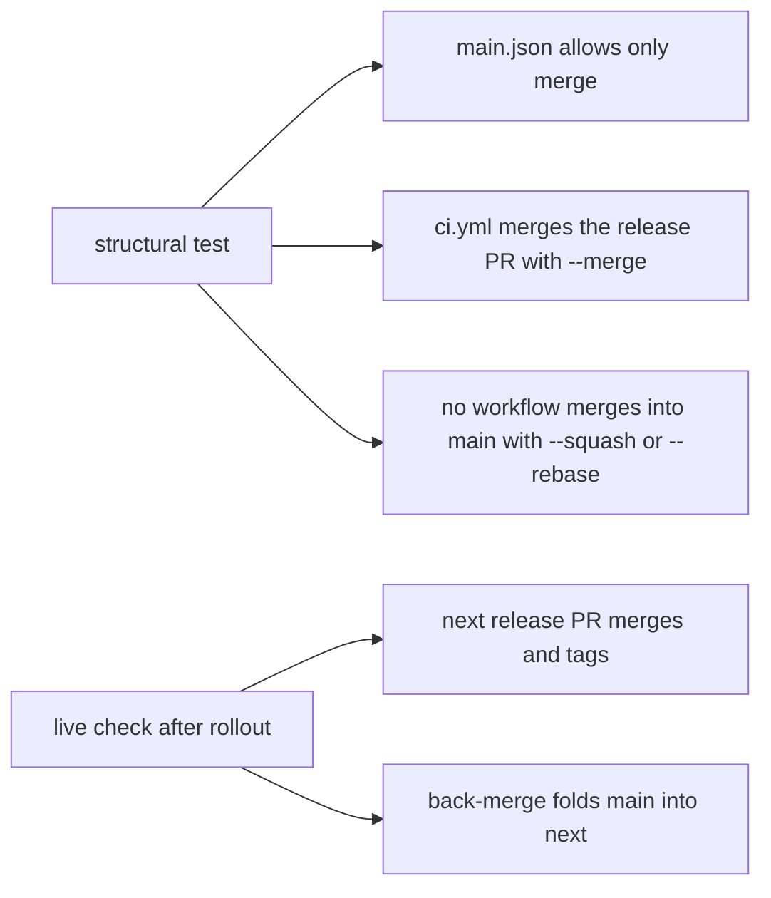

# Instruction: Restrict main to merge commits

## Architecture projection

> Tree of the final files. ✅ create · ✏️ modify · ❌ delete

```txt
.
├── .github/workflows/ci.yml                                  ✏️ release PR merged with --merge --admin
├── .github/rulesets/main.json                                ✏️ pull_request rule: allowed_merge_methods ["merge"]
├── scripts/__tests__/main-merges-by-merge-commit.test.js     ✅ merge-method assertions
├── aidd_docs/memory/deployment.md                            ✏️ Release step 1: merge commit, not squash
└── RELEASE.md                                                ✏️ Hotfix lands as a merge commit
```

## User Journey



## Test Scope



## Tasks to do

### `1)` Write the failing assertions

> Pin the merge method in the files before changing them.

1. Create `scripts/__tests__/main-merges-by-merge-commit.test.js` asserting T1 to T3, loading the files as `release-covers-every-plugin.test.js` does.
2. Watch T1 and T2 fail on the current files.

### `2)` Switch the release PR to a merge commit

> The one bot merge into `main` that squashes today.

1. In `ci.yml`, replace `--squash --admin` with `--merge --admin` on the release PR merge, and update its comment.
2. T2 and T3 green. Mutation: put `--squash` back and watch T3 go red.

### `3)` Declare the ruleset change

> The file, not the live ruleset.

1. In `.github/rulesets/main.json`, add `"allowed_merge_methods": ["merge"]` to the `pull_request` rule's parameters.
2. T1 green.

### `4)` Document

> Where the release and the hotfix are described.

1. `deployment.md` Release step 1: the release PR merges as a merge commit; `main` allows no other method.
2. `RELEASE.md` Hotfix: the PR lands as a merge commit, so each of its commits must be conventional.

### `5)` Roll out, in this order, with the maintainer

> The live ruleset changes last, only after the new merge has proven itself. Applied first, it refuses the `--squash --admin` release merge: proven in the sandbox.

1. Ship phases 1 and 2 through `next` and a promote. The ruleset file changes; the live ruleset does not yet.
2. Wait for that cycle's release PR to merge with `--merge` and for release-please to tag it.
3. Check back-merge folded `main` into `next`.
4. Only then, with the maintainer's explicit go: `gh api -X PUT repos/ai-driven-dev/framework/rulesets/12902947 --input .github/rulesets/main.json`.
5. Read back `allowed_merge_methods` from the live ruleset.

## Test acceptance criteria

| Task | Acceptance criteria |
| --- | --- |
| 1 | T1 and T2 fail on the current files for the reason they name |
| 2 | T2 and T3 pass. Restoring `--squash` turns T3 red |
| 3 | T1 passes, and `.github/rulesets/main.json` stays valid JSON |
| 4 | `pnpm exec lefthook run pre-commit` is green |
| 5 | A release PR merged with `--merge` is tagged, back-merge succeeds, and the live ruleset reads `["merge"]` |
