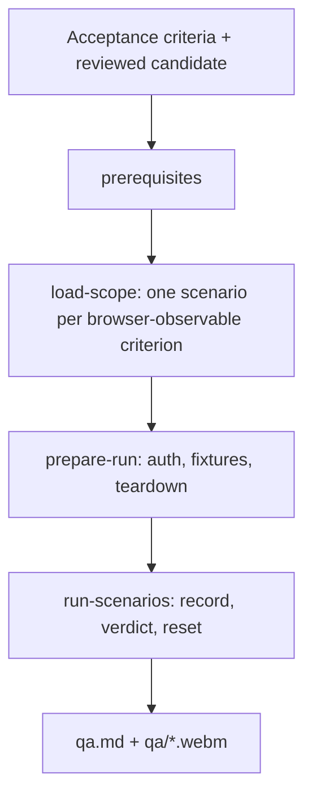
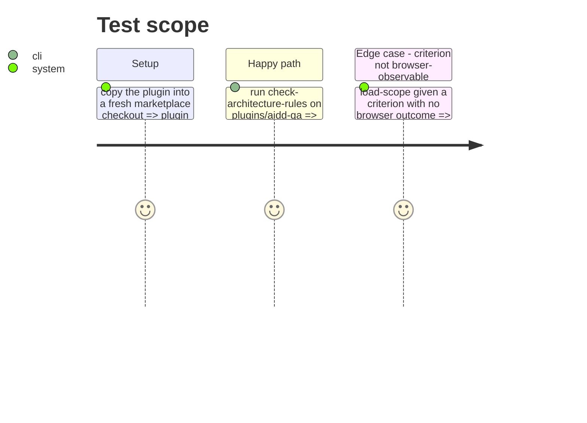

# Instruction: Scaffold `aidd-qa` with the acceptance QA skill

## Architecture projection

> Tree of the final files. ✅ create · ✏️ modify · ❌ delete

```txt
plugins/aidd-qa/
├── .claude-plugin/plugin.json                              ✅ name, version 1.0.0, description, skills[]
├── README.md                                               ✅ concern, skill table, browser-only scope, install line
└── skills/01-acceptance-qa/
    ├── SKILL.md                                            ✅ router: prerequisites → load-scope → prepare-run → run-scenarios
    ├── actions/00-prerequisites.md                         ✅ moved from aidd-dev, unchanged behavior
    ├── actions/01-load-scope.md                            ✅ rewritten: scenarios derive from acceptance criteria only
    ├── actions/02-prepare-run.md                           ✅ moved, deterministic setup and teardown kept
    ├── actions/03-run-scenarios.md                         ✅ moved, report fields expected/actual/verdict/evidence
    ├── assets/qa-report-template.md                        ✅ one row per scenario: expected, actual, verdict, evidence
    └── references/interface-browser-playwright-cli.md      ✅ moved recording contract, names browser as the supported interface
```

## User Journey



## Test Scope



## Tasks to do

### `1)` Manifest and README

> The plugin declares itself and one skill.

1. `plugin.json` from `aidd-ui`'s shape: `name: aidd-qa`, `version: 1.0.0`, description "Acceptance QA: validates observable behavior against acceptance criteria and records reviewer evidence. Use when … Do NOT use for …", `skills: ["./skills/01-acceptance-qa"]`, keywords.
2. `README.md`: concern, skill table, browser as the only interface today, `/plugin install aidd-qa@aidd-framework`. No sibling-plugin address.

### `2)` Move the skill

> Browser QA lives under `aidd-qa` with history kept.

1. `git mv plugins/aidd-dev/skills/11-browser-qa plugins/aidd-qa/skills/01-acceptance-qa` (phase 2 recreates the redirect in `aidd-dev`).
2. Rename `references/run-scope-playwright-cli.md` to `references/interface-browser-playwright-cli.md`; update the link in `03-run-scenarios.md`.
3. `SKILL.md`: frontmatter `name: 01-acceptance-qa`, description stating input = acceptance criteria + reviewed candidate, browser interface; router table and transversal rules kept; add rule "never derive a scenario from the diff or the source code".

### `3)` Acceptance-derived scope

> Scenarios come from acceptance criteria, not from implementation.

1. `01-load-scope` Input: acceptance criteria (issue, spec, plan) + reference to the reviewed candidate (branch, commit, or running URL).
2. Process: one happy path from the criteria's primary journey, edge cases only from criteria or the plan's browser Test Scope; each scenario keeps the criterion it proves; a criterion with no browser-observable outcome is listed as out of interface, never tested by reading code.
3. Remove steps that source edge cases from the implementation artifact or related tests.
4. Add a `## Test` section to every action that lacks one.

### `4)` Report per scenario

> Each scenario states expected, actual, verdict, evidence.

1. `qa-report-template.md`: header verdict, source (acceptance criteria path), candidate, run date; table `Scenario | Criterion | Expected | Actual | Verdict | Evidence`.
2. `03-run-scenarios` Report step and Test reference those fields; video validation steps kept.

## Test acceptance criteria

| Task | Acceptance criteria |
| --- | --- |
| 1 | `plugin.json` validates against its schema; no `aidd-<x>:<y>` of another plugin in README |
| 2 | `plugins/aidd-qa/skills/01-acceptance-qa/` holds 4 actions, 1 asset, 1 reference; `check-architecture-rules.js` passes |
| 3 | `01-load-scope` names acceptance criteria as its only scenario source and forbids diff or source-derived scenarios |
| 4 | the report template has Expected, Actual, Verdict, Evidence columns; video checks (codec, dimension, duration, frames) still present |
