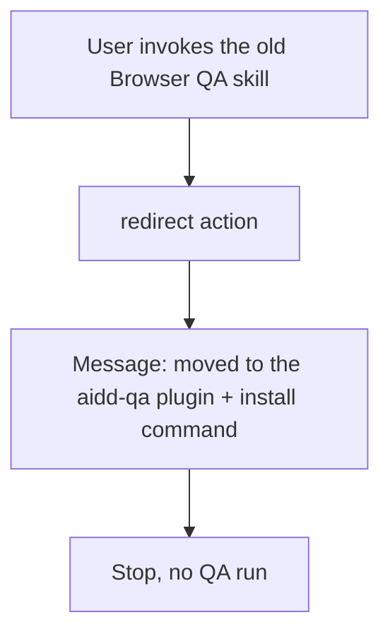
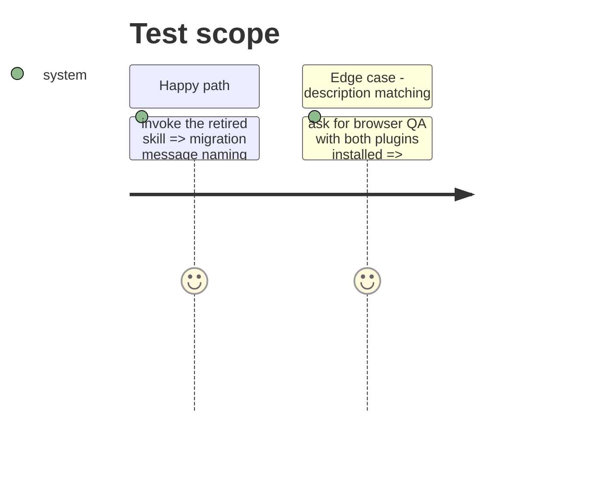

# Instruction: Retire `aidd-dev:11-browser-qa` to a redirect

## Architecture projection

> Tree of the final files. ✅ create · ✏️ modify · ❌ delete

```txt
plugins/aidd-dev/
├── .claude-plugin/plugin.json                 ✏️ description drops Browser QA; skills[] keeps ./skills/11-browser-qa
├── README.md                                  ✏️ Browser QA row becomes a moved note
└── skills/11-browser-qa/
    ├── SKILL.md                               ✅ retired redirect router, one action
    └── actions/01-redirect.md                 ✅ prints the migration message and stops
aidd_docs/memory/testing.md                    ✏️ Browser QA owner is aidd-qa
```

## User Journey



## Test Scope



## Tasks to do

### `1)` Redirect skill

> The old invocation answers with a migration message.

1. `SKILL.md`: `name: 11-browser-qa`, description "Retired. Explains where browser QA moved. Use only when this skill is invoked by name. Do NOT use to run QA or record evidence." Actions table with `redirect`.
2. `actions/01-redirect.md`: Input none; Output the message "Browser QA moved to the `aidd-qa` plugin. Install it with `/plugin install aidd-qa@aidd-framework` (or `aidd plugin install aidd-qa`) and run its acceptance QA skill."; Process print and stop, never run QA; `## Test`.
3. No `aidd-<x>:<y>` token anywhere in the redirect.

### `2)` aidd-dev surface

> aidd-dev no longer claims Browser QA.

1. `plugin.json` description: remove "plus short standalone Browser QA evidence".
2. `README.md`: remove Browser QA from the covers sentence; row 2.11 says retired, moved to the `aidd-qa` plugin.
3. `aidd_docs/memory/testing.md`: owner `aidd-qa`, skill `01-acceptance-qa`.

## Test acceptance criteria

| Task | Acceptance criteria |
| --- | --- |
| 1 | the redirect holds no QA process; `check-architecture-rules.js` passes on it |
| 2 | `grep -i "browser qa" plugins/aidd-dev/.claude-plugin/plugin.json` finds nothing; memory names `aidd-qa` as owner |
