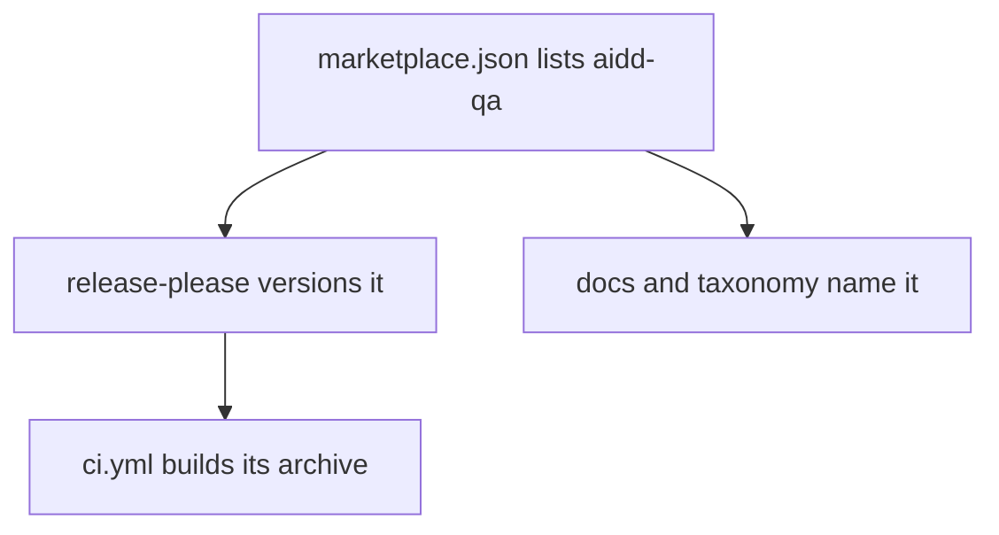
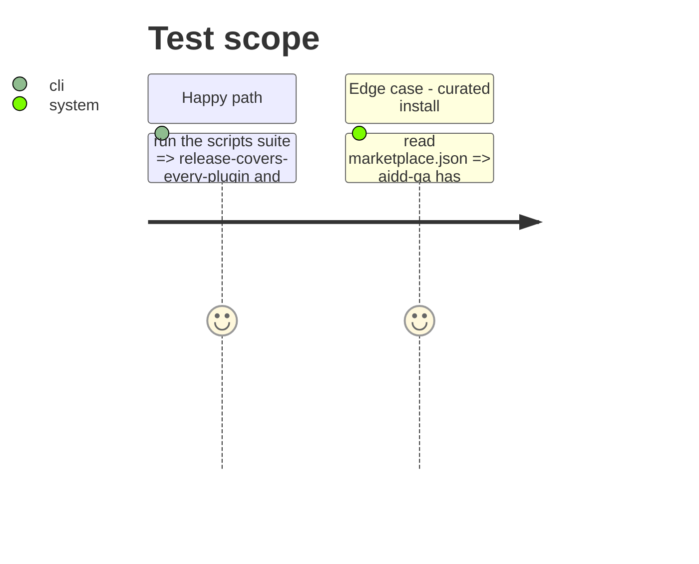

# Instruction: Register the plugin and update the docs

## Architecture projection

> Tree of the final files. ✅ create · ✏️ modify · ❌ delete

```txt
.claude-plugin/marketplace.json            ✏️ aidd-qa entry, strict, metadata.recommended false
release-please-config.json                 ✏️ plugins/aidd-qa package
.release-please-manifest.json              ✏️ "plugins/aidd-qa": "0.1.0"
.github/workflows/ci.yml                   ✏️ build-plugin matrix gains aidd-qa
commitlint.config.cjs                      ✏️ scope-enum gains aidd-qa, qa
docs/ARCHITECTURE.md                       ✏️ concerns table row: aidd-qa, Acceptance QA, Execution + status note
docs/CATALOG.md                            ✏️ aidd-qa section; Browser QA row removed from aidd-dev
README.md                                  ✏️ plugin counts, aidd-qa section, aidd-dev line drops Browser QA
aidd_docs/memory/architecture.md           ✏️ 9 plugins, 3 off the curated path
aidd_docs/memory/project-brief.md          ✏️ key feature row for acceptance QA
```

## User Journey



## Test Scope



## Tasks to do

### `1)` Registration

> Every release and CI guard sees the plugin.

1. Marketplace entry after `aidd-telemetry`, description by concern, `recommended: false`.
2. release-please package block copied from `plugins/aidd-ui`; manifest `0.1.0`.
3. `ci.yml` matrix and commitlint scopes.

### `2)` Docs and memory

> Every place that counts or lists plugins stays true.

1. `docs/ARCHITECTURE.md` row + a one-line status note (off the curated path until proven).
2. `docs/CATALOG.md` and `README.md`: add aidd-qa, fix counts and the aidd-dev description, keep the README badge/status style used for `aidd-ui`/`aidd-telemetry`.
3. Memory `architecture.md` gotcha count, `project-brief.md` feature row.
4. Let `pnpm exec lefthook run pre-commit` regenerate catalogs and counts; never hand-edit generated files.

## Test acceptance criteria

| Task | Acceptance criteria |
| --- | --- |
| 1 | `release-covers-every-plugin.test.js` passes; marketplace JSON validates |
| 2 | `architecture-doc-matches-the-tree.test.js` passes; no doc still says 8 plugins or attributes Browser QA to aidd-dev |
