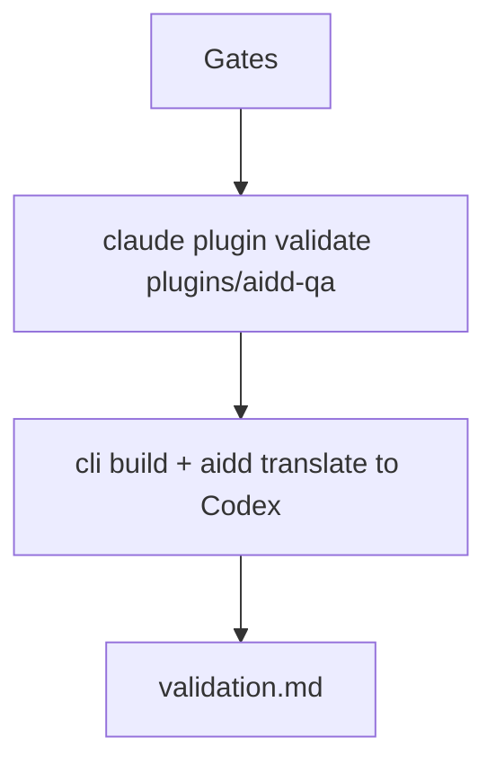
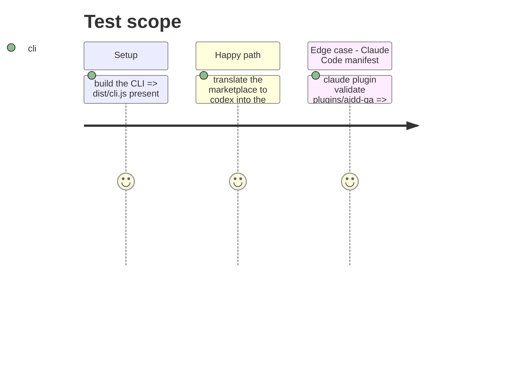

# Instruction: Prove it installs and translates to a second host

## Architecture projection

> Tree of the final files. ✅ create · ✏️ modify · ❌ delete

```txt
aidd_docs/tasks/2026_09/2026_09_24_aidd-qa-plugin/validation.md   ✅ commands run and their decisive output
```

## User Journey



## Test Scope



## Tasks to do

### `1)` Gates

> Every repository gate is green.

1. `pnpm exec lefthook run pre-commit`.
2. `node scripts/check-tests-leave-git-alone.js -- node --test 'scripts/__tests__/**/*.test.js'`.
3. `pnpm test:changed`.

### `2)` Host proof

> The plugin works in Claude Code and Codex.

1. `claude plugin validate plugins/aidd-qa` (and the marketplace root).
2. `cd cli && pnpm install && pnpm build`; read `node cli/dist/cli.js translate --help`; translate to Codex into the scratchpad; list the aidd-qa output.
3. Record commands and decisive lines in `validation.md`.

## Test acceptance criteria

| Task | Acceptance criteria |
| --- | --- |
| 1 | all three commands exit 0 |
| 2 | Claude Code validation passes and the Codex output contains the acceptance QA skill with its four actions |
