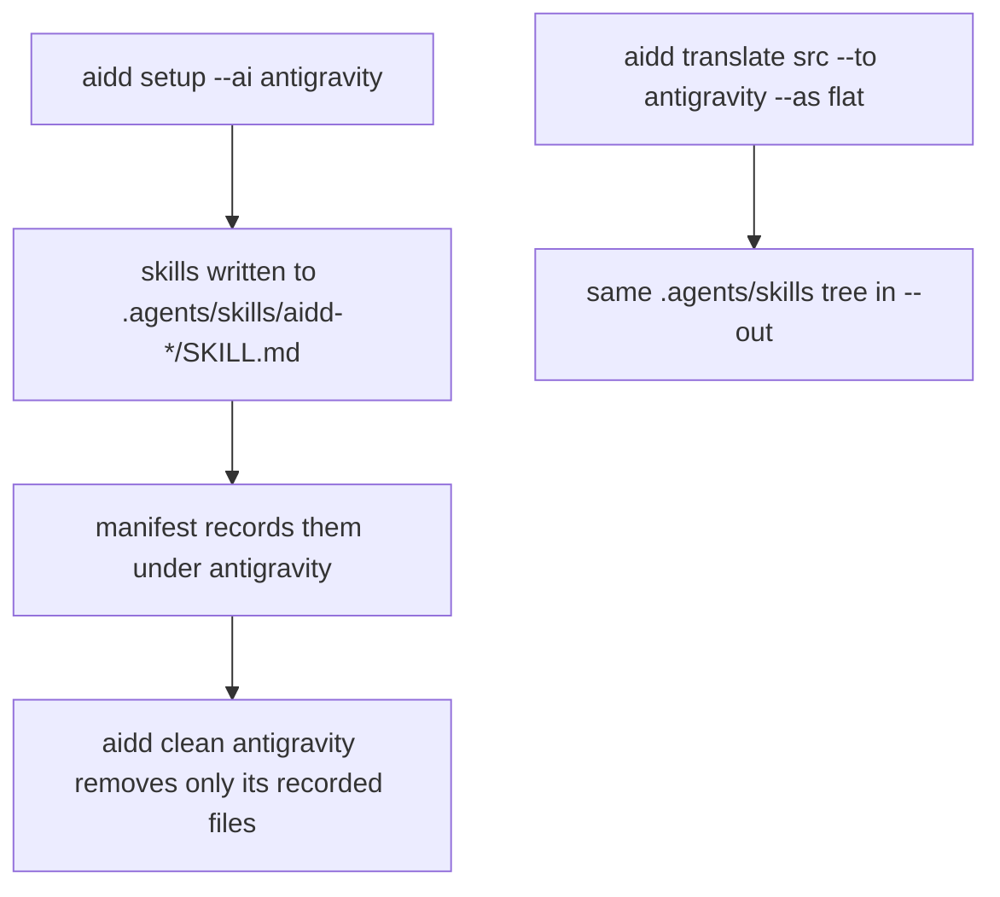
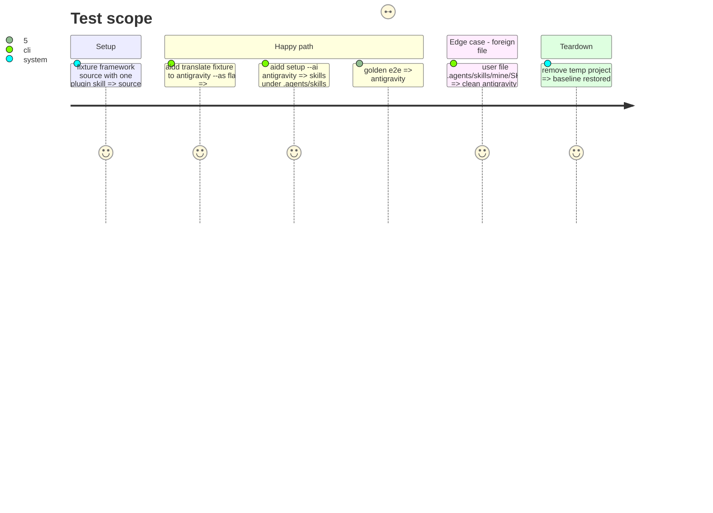

<!-- Fill or omit these sections; never add, rename, or reorder one. -->

# Instruction: `antigravity` profile with skills, registered everywhere, golden cell

## Architecture projection

> Tree of the final files. ✅ create · ✏️ modify · ❌ delete

```txt
cli/
├── src/kernel/tool.ts                                       ✏️ AiToolId union and AI_TOOL_IDS
├── src/contexts/framework/application/framework/translator/built-tree-materialization-translator.ts  ✏️ recognise a skill at the profile's declared flat layout, not only `skills/<plugin>/…`
├── src/contexts/tools/domain/profiles/antigravity/
│   ├── antigravity-paths.ts                                 ✅ `.agents/` directory and skills dir constants
│   ├── profile.ts                                           ✅ AiTool<HasSkills & HasPlugins>, flat plugins, no hooks yet, registerTool
│   └── build.ts                                             ✅ flat contract: skills only, agents/hooks/mcp/rules/commands unsupported
├── src/runtime/wiring/{tools,framework,translate}.ts        ✏️ side-effect profile import
├── src/runtime/assets/asset-loader.ts                       ✏️ CONFIG_ASSETS entry (Record<ToolId,…>)
├── src/presentation/commands/translate.ts                   ✏️ `--to` help string
├── src/presentation/prompts/menu-use-case.ts                ✏️ example strings
├── scripts/smoke-tools.sh                                   ✏️ AI_TOOLS
├── scripts/check-bundle-size.mjs                            ✏️ only if the budget breaks, with a registry line
├── mutation-scopes.json, package.json                       ✏️ `tools-antigravity` scope and script
├── tests/architecture/tool-addition-cost.arch.test.ts       ✏️ BASELINE counts +1 for the files above
├── tests/contexts/tools/domain/profiles/antigravity/
│   ├── profile.unit.test.ts                                 ✅ paths, capabilities, telemetry reason
│   └── build.unit.test.ts                                   ✅ skill paths, link rewriting
├── tests/golden/framework-build-golden.e2e.test.ts          ✏️ FLAT_TARGETS + cell count
├── tests/golden/snapshots/framework-build/golden.json       ✏️ new `antigravity:flat` cell only
├── tests/golden/snapshots/{help/surface,phase0/snapshot}.json, tests/fixtures/cli-owns-read/expected-envelope.json  ✏️ regenerated
└── tests/** enumerating tool ids (tool-config, registry-conformance, build-hooks-support-declaration, asset-loader, interactive-menu, translate-wiring, uninstall-use-case, build-unit-deps, telemetry-route-supply, plugin-root-token-declaration, metrics-contract, cost-report-envelope, tool-attribution, host-marketplace-registry-reader-adapter)  ✏️
.github/workflows/ci.yml                                     ✏️ `{ tool: antigravity, mode: flat }` row, comment count
scripts/__tests__/smoke-real-user-scope-tool-list-parity.test.js   ✏️ flat-only list
docs/MAINTAINERS.md                                          ✏️ archive count
```

## User Journey



## Test Scope



## Tasks to do

### `1)` Profile, paths and flat contract

> Skills only; every other artifact `supported: false` until its phase.

1. `antigravity-paths.ts`: `ANTIGRAVITY_DIRECTORY = ".agents/"`, skills dir.
2. `build.ts`: skills `fullTree`, `rewriteSkillName: true`, path `.agents/skills/<plugin>-<skill>/<rest>`, one directory level (same shape as Codex flat). Measured 2026-10-05 on `agy` 1.2.14: `.agents/skills/flat-probe/SKILL.md` logs `expanded slash command "flat-probe" (skill)`; `.agents/skills/aidd-probe/nested-probe/SKILL.md` logs no expansion. Never `<plugin>/<skill>/`.
3. Install side: setup reads the built flat tree back through `belongsToPlugin` in `built-tree-materialization-translator.ts`, which accepts only `skills/<plugin>/…` and so installs 0 files from the one-level layout. Let the profile declare its flat skill layout and have the materializer recognise it; test first (red: setup installs 0 skills), keep every existing tool's behaviour unchanged.
4. `profile.ts`: `SkillsCapability` on `.agents/skills/`, `PluginsCapability` `mode: "flat"`, `acceptsHooks: false` with a reason pointing to phase 3; `telemetryLocalRead` unsupported with the canonical reason string `registry-conformance` expects; no `distributionProbes.marketplace`.
5. Unit tests first: profile and build, red then green.

### `2)` Register the id everywhere the arch test demands

> Kilo review lesson: a static id is not a runtime registration.

1. `tool.ts`, three wiring files, asset loader, translate help, menu strings.
2. Raise each `tool-addition-cost` BASELINE count by one; nothing else in that file.
3. Update every test enumeration listed in the projection; regenerate help and phase0 snapshots and the cli-owns-read envelope.

### `3)` Golden cell and CI matrix

> Only the new cell may move.

1. Add `antigravity` to `FLAT_TARGETS`, update the cell-count title, run with `UPDATE_FRAMEWORK_GOLDEN=1`.
2. `git diff` the golden file: every changed key is `antigravity:flat`.
3. `ci.yml` matrix row, `MAINTAINERS.md` archive count, root parity test list, `smoke-tools.sh`, mutation scope and script.

### `4)` Ownership under a shared `.agents/`

> The Codex-shared case is a known bug outside #511; prove only that AIDD never touches a foreign file.

1. Integration test: setup antigravity, add a user file under `.agents/skills/`, clean antigravity, user file intact.

### `5)` Full suite and size

1. `cd cli && pnpm test`, `pnpm exec lefthook run pre-commit`, bundle size check; raise the budget only with a registry line.
2. Diff size: if over 600 lines, move task 4 or the test-enumeration edits that are pure lists into a follow-up commit, never the golden cell.

## Test acceptance criteria

| Task | Acceptance criteria |
| ---- | ------------------- |
| 1 | `translate --to antigravity --as flat` writes `.agents/skills/<plugin>-<skill>/SKILL.md`, one level deep, and no other artifact; `aidd setup --ai antigravity` installs the same skills; no other tool's setup output changes |
| 2 | `aidd setup --ai antigravity` succeeds, `aidd --help` and the menu list it, the arch tests pass |
| 3 | `golden.json` gains exactly one key, `antigravity:flat`; no existing cell changes; `ci.yml` builds the new archive |
| 4 | Cleaning Antigravity leaves a user file under `.agents/` in place |
| 5 | The full CLI suite and pre-commit pass on the branch |
