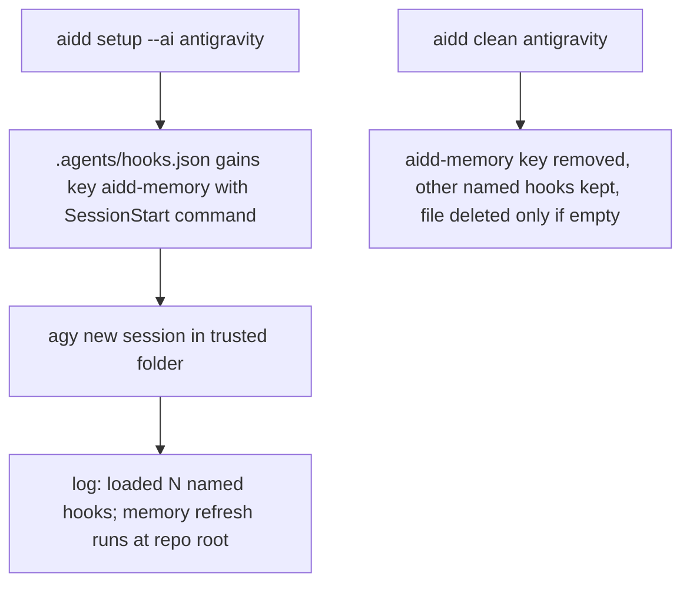

<!-- Fill or omit these sections; never add, rename, or reorder one. -->

# Instruction: Memory hook in `.agents/hooks.json`

## Architecture projection

> Tree of the final files. ✅ create · ✏️ modify · ❌ delete

```txt
cli/
├── src/contexts/tools/domain/profiles/antigravity/
│   ├── antigravity-hooks.ts      ✅ named-hook shape: merge AIDD's `aidd-memory` key into `.agents/hooks.json`, strip it on uninstall, convert Claude-shaped flat hooks
│   ├── profile.ts                ✏️ HooksCapability on `.agents/hooks.json`
│   └── build.ts                  ✏️ hooks artifact: scripts under `.agents/hooks/<plugin>/`, hooksMerge into `.agents/hooks.json`
├── tests/contexts/tools/domain/profiles/antigravity/
│   └── antigravity-hooks.unit.test.ts   ✅ merge, idempotence, foreign keys kept, invalid JSON, strip
├── tests/contexts/tools/domain/build-hooks-support-declaration.unit.test.ts   ✏️ antigravity now supports hooks
└── tests/golden/snapshots/framework-build/golden.json   ✏️ `antigravity:flat` cell only
```

## User Journey



## Test Scope


## Tasks to do

### `1)` Measure the hook `cwd` on 1.2.14

> #890 measured `cwd = <repo>/.agents` on 1.2.5; `update_memory.js` silently no-ops when `aidd_docs/` is not in `cwd`.

1. Local probe: a `SessionStart` hook writing `pwd` and its stdin payload to a marker; read the marker, not the turn.
2. Pick the command from the result: if `cwd` is `.agents`, the command must reach the repo root (e.g. `node ../.aidd/scripts/update_memory.cjs`, or a root resolved from `workspacePaths[0]`); record the evidence in the PR.

### `2)` Named-hook merge, test first

> Shape `{ "<name>": { "SessionStart": [ { "hooks": [ { "type": "command", "command": "…", "timeout": 30 } ] } ] } }`, no wrapper.

1. Tests: empty file, existing foreign keys, re-run idempotent, invalid JSON fails loud (Codex's silent `catch { parsed = {} }` is not copied), strip leaves foreign keys.
2. Implement in `antigravity-hooks.ts`; mutate the foreign-key preservation and watch its test fail.

### `3)` Wire setup and translate

1. `profile.ts`: `HooksCapability` targeting `.agents/hooks.json` with the merge and strip; `acceptsHooks` stays false for plugin flat install so the hook is not written twice.
2. `build.ts`: hooks `hooksBundle`, scripts to `.agents/hooks/<plugin>/`, `hooksMerge` + `hooksMergeDest` converting the rewritten Claude-shaped JSON to one named key per plugin.
3. Confirm the flat-rewritten script path resolves from the measured `cwd`.

### `4)` Golden and suite

1. Regenerate golden; only `antigravity:flat` moves.
2. `cd cli && pnpm test`, pre-commit.

## Test acceptance criteria

| Task | Acceptance criteria |
| ---- | ------------------- |
| 1 | The PR quotes the measured `cwd` and the marker line from a real `agy` session |
| 2 | Foreign named hooks survive setup and clean; a second setup changes nothing; invalid JSON stops with the file named |
| 3 | After setup, a new `agy` session logs `loaded … named hooks` and the memory refresh marker appears at repo root |
| 4 | Only the `antigravity:flat` golden cell changes; full suite passes |
