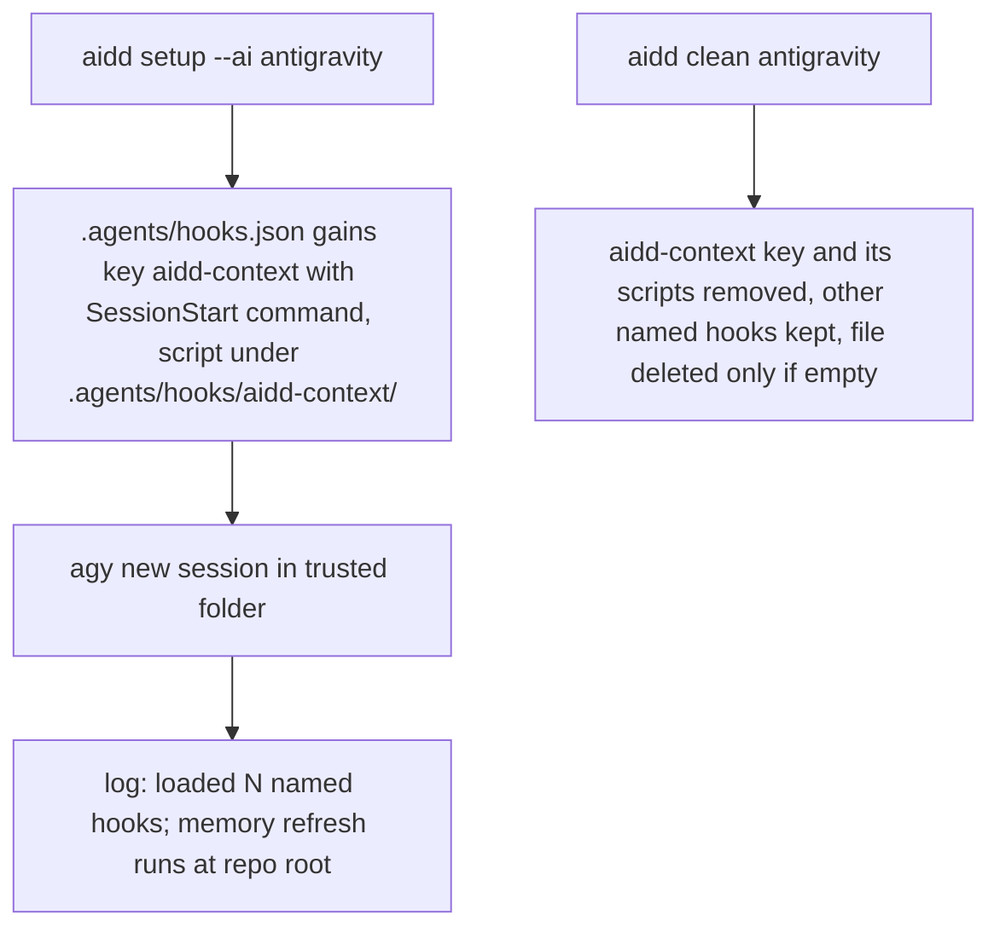
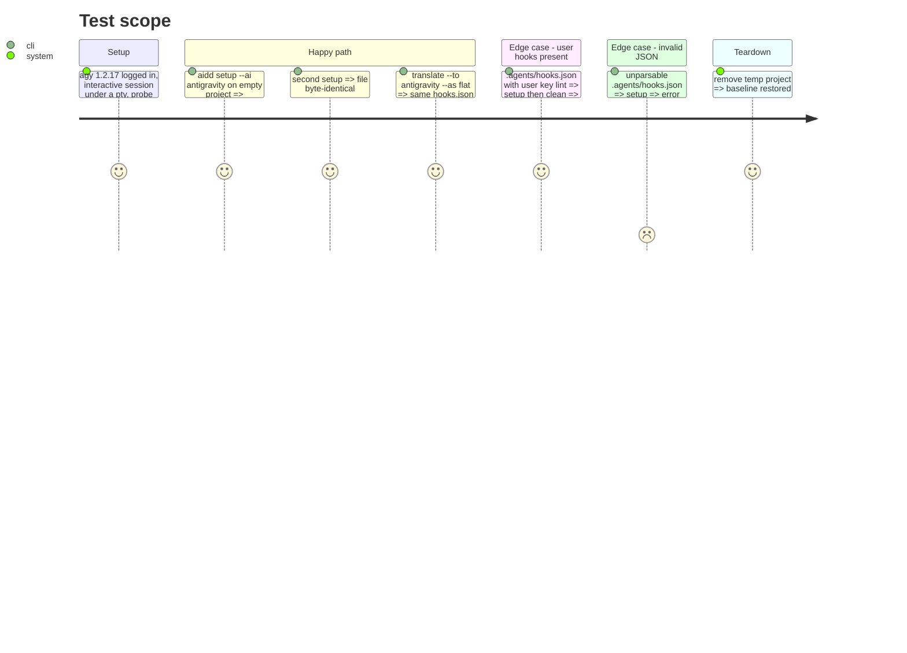

<!-- Fill or omit these sections; never add, rename, or reorder one. -->

# Instruction: Memory hook in `.agents/hooks.json`

## Architecture projection

> Tree of the final files. ✅ create · ✏️ modify · ❌ delete

```txt
cli/
├── src/contexts/tools/domain/
│   ├── formats/
│   │   ├── project-hooks-format.ts        ✅ per-tool project hooks file strategy: merge, unmerge, contributed entries, empty check, script path and dir
│   │   └── cursor-hooks-project-merge.ts  ✏️ Cursor's functions exposed as one `ProjectHooksFormat`, behaviour unchanged
│   ├── capabilities/plugins-capability.ts ✏️ `hooksDestination: "project"` + `projectHooksRelativePath` + `projectHooksFormat` allowed on flat params too
│   ├── build-contract.ts                  ✏️ `hooksMerge` receives the plugin name
│   └── profiles/
│       ├── cursor/profile.ts              ✏️ declares Cursor's `ProjectHooksFormat`
│       └── antigravity/
│           ├── antigravity-hooks.ts       ✅ named-hook shape: one `<plugin>` key, handlers under `SessionStart`, `cd .. && ` prefix, other events skipped with a warning
│           ├── profile.ts                 ✏️ flat `acceptsHooks: true`, `hooksDestination: "project"` on `.agents/hooks.json`
│           └── build.ts                   ✏️ hooks artifact: scripts under `.agents/hooks/<plugin>/`, hooksMerge into `.agents/hooks.json`
├── src/contexts/framework/application/
│   ├── framework/translator/project-hooks-materializer.ts  ✏️ reads the tool's `ProjectHooksFormat`; invalid JSON names the file; messages name the tool
│   └── shared/remove-project-hooks.ts                      ✏️ same, no Cursor import left
├── src/contexts/translate/application/strategies/flat-build-strategy.ts  ✏️ passes the plugin name to `hooksMerge`
├── tests/contexts/tools/domain/profiles/antigravity/
│   └── antigravity-hooks.unit.test.ts     ✅ merge, idempotence, foreign keys kept, invalid JSON, unmerge, empty check, unmapped event warning
├── tests/ (Cursor project-hooks suites)   ✏️ only messages that named Cursor generically, if any; behaviour assertions untouched
├── tests/ (antigravity profile, build, build-hooks-support-declaration, registry-conformance)  ✏️ antigravity now delivers hooks to `.agents/hooks.json`
└── tests/golden/snapshots/framework-build/golden.json   ✏️ `antigravity:flat` cell only
```

## User Journey



## Test Scope



## Tasks to do

### `1)` Measure the hook `cwd` on 1.2.17

> #890 measured `cwd = <repo>/.agents` on 1.2.5; `update_memory.js` silently no-ops when `aidd_docs/` is not in `cwd`.

1. Local probe: a `SessionStart` hook writing `pwd` and its stdin payload to a marker; read the marker, not the turn. On 1.2.17 a print-mode turn never reaches the model and fires no hook at all, so the probe runs interactive under a pty: `script -q /dev/null agy -i "reply OK" --add-dir <ws>`, killed after 60s. Without `--add-dir` it loads 0 hooks.
2. Measured on 2026-10-05: `cwd` is `<repo>/.agents`, as on 1.2.5; stdin carries `workspacePaths[0]` = `<repo>`. A root-relative command needs a `cd .. && ` prefix, and `agy` runs it through a shell: a real session running `cd .. && node <root-relative script>` wrote `AIDD-MEMORY-MARKER cwd=<repo> docs=true`. Record the evidence in the PR.

### `2)` Named-hook format, test first

> Shape `{ "<name>": { "SessionStart": [ { "type": "command", "command": "…", "timeout": 30 } ] } }`: no top-level `hooks` wrapper, and handlers sit directly under the event. 1.2.17 rejects the Claude-style nested `[ { "hooks": [ … ] } ]` with `command hook must specify 'command'`; only `PreToolUse` and `PostToolUse` take a `matcher` entry.

1. Tests: empty file, existing foreign keys, re-run idempotent, invalid JSON fails loud (Codex's silent `catch { parsed = {} }` is not copied), unmerge leaves foreign keys, empty check, an event other than `SessionStart` skipped with a warning (Claude and `agy` tool names differ; the telemetry host is out of scope).
2. Implement in `antigravity-hooks.ts` as a `ProjectHooksFormat`: the key is the plugin name, each command gets `cd .. && ` and runs `./.agents/hooks/<plugin>/<script>`. Mutate the foreign-key preservation and watch its test fail.

### `3)` Wire setup, clean and translate

> `HooksCapability` is not the route: no config ref `codex-hooks` exists, so Codex's own declaration never writes anything and nothing installs `.aidd/scripts/update_memory.cjs`. The memory hook reaches a project through the `aidd-context` plugin; Cursor already merges plugin hooks into a project hooks file with per-entry provenance, and both install routes call `ProjectHooksMaterializer` whenever a tool declares `hooksDestination: "project"`.

1. Generalise, Cursor behaviour unchanged first: extract `ProjectHooksFormat`, have the materializer and `remove-project-hooks.ts` read it from the capability instead of importing Cursor's functions. Cursor's suites stay green with no assertion change. If the PR nears 600 lines, this step ships as its own PR first.
2. Allow flat params to declare `hooksDestination: "project"`, `projectHooksRelativePath` and `projectHooksFormat`; the constructor guard keeps requiring the path.
3. `profile.ts`: flat `acceptsHooks: true`, `hooksDestination: "project"`, `projectHooksRelativePath: ".agents/hooks.json"`, the Antigravity format.
4. `build.ts`: hooks `hooksBundle`, scripts to `.agents/hooks/<plugin>/`, `hooksMerge` + `hooksMergeDest` with the same format function, the plugin name now passed by `flat-build-strategy.ts`.
5. Confirm with a real `aidd setup --ai antigravity` in a temp project, then `agy` under a pty: the memory refresh runs at repo root.

### `4)` Golden and suite

1. Regenerate golden; only `antigravity:flat` moves.
2. `cd cli && pnpm test`, pre-commit.

## Test acceptance criteria

| Task | Acceptance criteria |
| ---- | ------------------- |
| 1 | The PR quotes the measured `cwd` and the marker line from a real `agy` session |
| 2 | Foreign named hooks survive setup and clean; a second setup changes nothing; invalid JSON stops with the file named; a non-`SessionStart` event is skipped with a warning |
| 3 | After setup, a new `agy` session logs `loaded … named hooks` and the memory refresh marker appears at repo root |
| 4 | Only the `antigravity:flat` golden cell changes; full suite passes |
