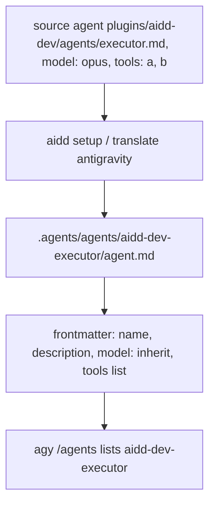
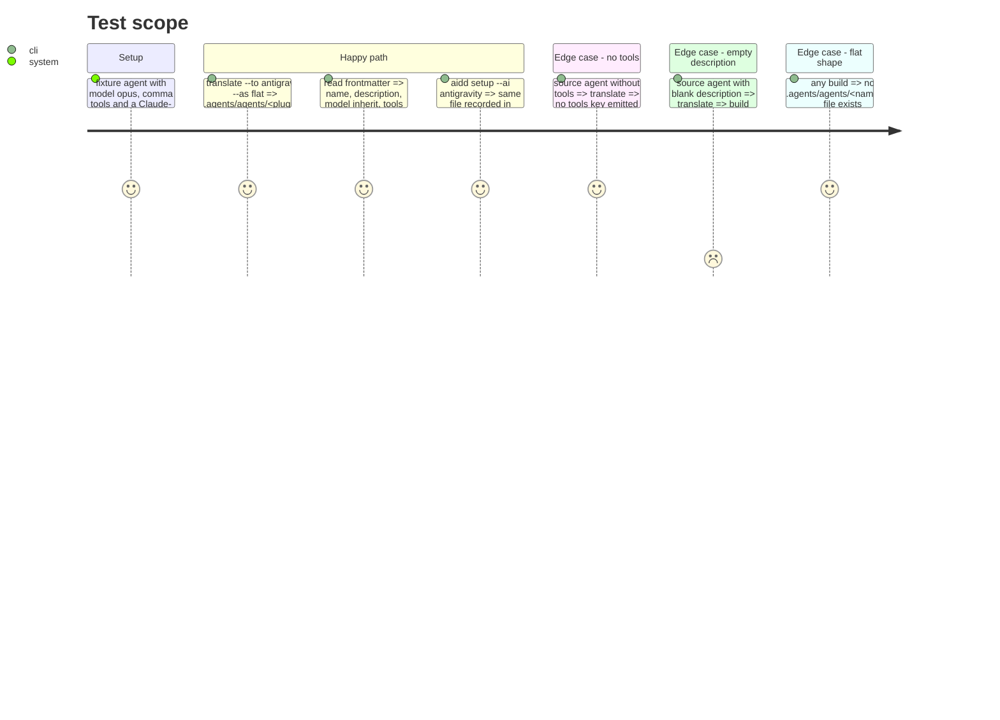

<!-- Fill or omit these sections; never add, rename, or reorder one. -->

# Instruction: Portable agents under `.agents/agents/<name>/agent.md`

## Architecture projection

> Tree of the final files. ✅ create · ✏️ modify · ❌ delete

```txt
cli/
├── src/contexts/tools/domain/formats/
│   └── portable-agent.ts            ✅ rebuild frontmatter: name, description, model: inherit, tools as YAML list; drop everything else
├── src/contexts/tools/domain/profiles/antigravity/
│   ├── antigravity-paths.ts         ✏️ agents dir
│   └── build.ts                     ✏️ agents artifact, nested `<name>/agent.md`, link rewriting relative to the nested path
├── src/kernel/errors.ts             ✏️ `InvalidAgentFrontmatterError`
├── package.json, scripts/check-bundle-size.mjs   ✏️ budget 742 KB, measured 734.5 KB
├── tests/contexts/tools/domain/formats/
│   └── portable-agent.unit.test.ts  ✅ model mapping, tools string → list, Claude-only keys dropped, empty description rejected
├── tests/contexts/tools/domain/profiles/antigravity/build.unit.test.ts   ✏️ agent path and body
└── tests/golden/snapshots/framework-build/golden.json   ✏️ `antigravity:flat` cell only
```

## User Journey



## Test Scope



## Tasks to do

### `1)` Portable frontmatter, test first

> One builder #916 can reuse for Codex flat and Kimi.

1. Tests for the four rules in #916, then implement `portable-agent.ts`.
2. Mutate `model: inherit` back to the source value; watch the model test fail.

### `2)` Antigravity agents in setup and translate

1. Flat `agents` artifact writing `.agents/agents/<plugin>-<agent>/agent.md`, body links rewritten from that nested path. No `AgentsCapability`: a flat tool declaring one also gets the raw fallback route (`content-translator.ts`'s `flatSectionFile`), which copies Claude frontmatter to `.agents/agents/<plugin>/<file>.md`, where `agy` 1.2.17 drops it in silence (measured: `model: opus` and comma `tools` both missing from `/agents`). `setup` takes the built-tree route, which reads the artifact.
2. Unit test the path and body; regenerate golden, only `antigravity:flat` moves.

### `3)` Live check

1. Local `agy --add-dir <repo> --output-format json -p "/agents"` lists a generated agent; quote the line in the PR, with an invented-name negative control.

## Test acceptance criteria

| Task | Acceptance criteria |
| ---- | ------------------- |
| 1 | A source agent with `model: opus` and `tools: "a, b"` yields `model: inherit` and `tools: [a, b]`, and no Claude-only key |
| 2 | Agents land only at `.agents/agents/<name>/agent.md`; only the `antigravity:flat` golden cell changes; full suite passes |
| 3 | `agy /agents` lists the generated agent and not the invented one |
