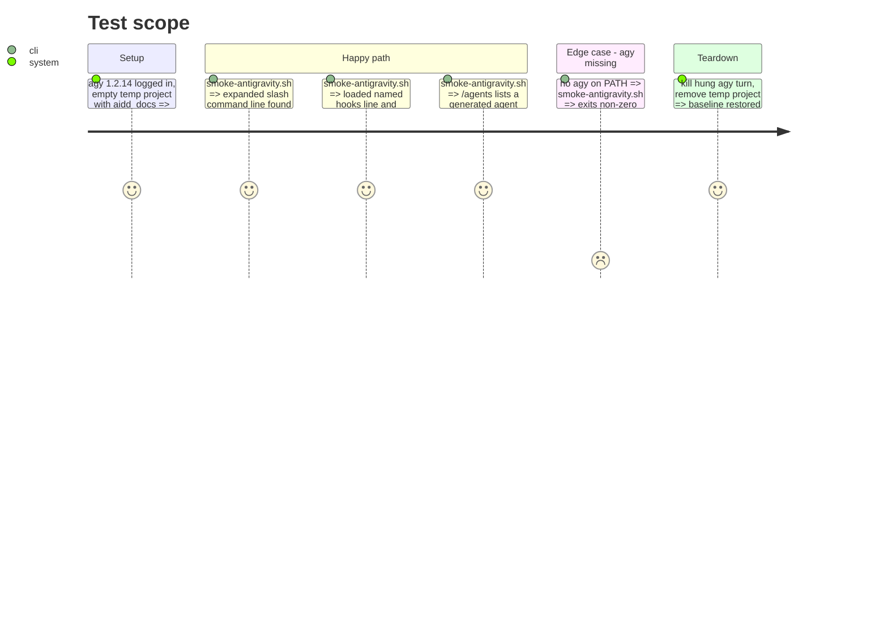

<!-- Fill or omit these sections; never add, rename, or reorder one. -->

# Instruction: Docs, AIDD skill references and local runtime evidence

## Architecture projection

> Tree of the final files. ✅ create · ✏️ modify · ❌ delete

```txt
README.md                                        ✏️ compatibility line, tool table, install section
cli/README.md                                    ✏️ tool and config-path rows
docs/FAQ.md                                      ✏️ tool lists
cli/aidd_docs/memory/codebase-map.md             ✏️ profiles/antigravity entry
plugins/aidd-context/hooks/update_memory.js      ✏️ TOOL_FILES antigravity → AGENTS.md
plugins/aidd-context/skills/02-project-memory/references/tools.md   ✏️ mirror of TOOL_FILES
plugins/aidd-context/skills/{04..08}-*/references/tool-paths.md, tool-detect.md   ✏️ `.agents/` paths, detection
plugins/aidd-context/skills/11-explore/…/ai-mapping.md, 00-onboard/…/detection.md  ✏️ antigravity row
cli/scripts/smoke-antigravity.sh                 ✅ local only: setup, then assert `expanded slash command`, `loaded … named hooks`, `/agents` line from logs and markers, never the turn's end
```

## User Journey

```mermaid
flowchart TD
  A[developer reads README] --> B[aidd setup --ai antigravity]
  B --> C[agy in the project]
  C --> D[/aidd skill expands, memory refreshes, agents listed]
  E[maintainer runs smoke-antigravity.sh locally] --> F[three log assertions pass or name the missing line]
```

## Test Scope



## Tasks to do

### `1)` Docs and references

1. README tables, FAQ, CLI README, codebase map.
2. `TOOL_FILES` and its mirror `tools.md`; the generate skills' path and detection references.
3. `pnpm exec lefthook run pre-commit` (doc duplication, links, paths named in prose).

### `2)` Local runtime smoke

> Print mode hangs after answering: bound each turn with a timeout and read the log, as the spike did.

1. Script asserting the three log lines; documented as local-only with why (login required) in `docs/MAINTAINERS.md`.
2. Run it; paste the three shortest lines, date and `agy --version` into the PR.

### `3)` Close the loop on #511

1. Tick #511's criteria with links to each phase's PR; file follow-ups named in the plan's decisions if not already filed (native plugin mode, telemetry host, migration guide).

## Test acceptance criteria

| Task | Acceptance criteria |
| ---- | ------------------- |
| 1 | README and FAQ list Antigravity; `update_memory.js` refreshes `AGENTS.md` for `antigravity`; pre-commit passes |
| 2 | On a logged-in machine the script reports all three lines; without `agy` it fails naming it |
| 3 | Every #511 criterion points to the PR that proves it |
