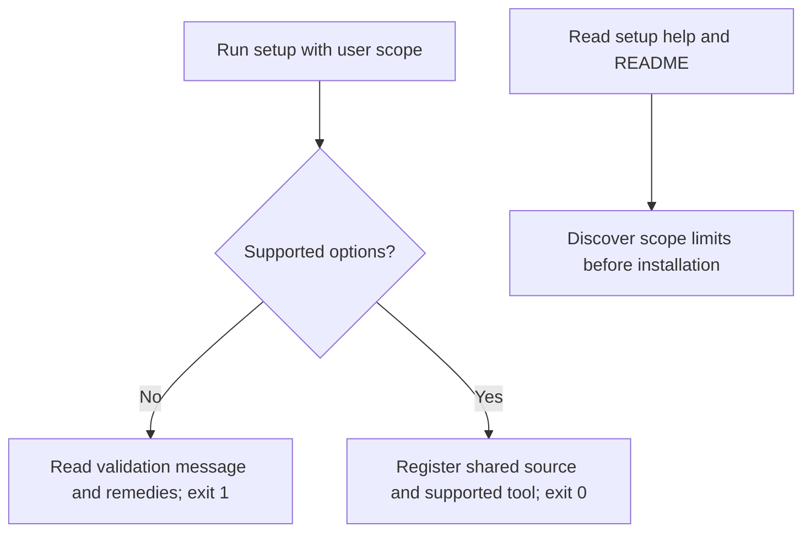
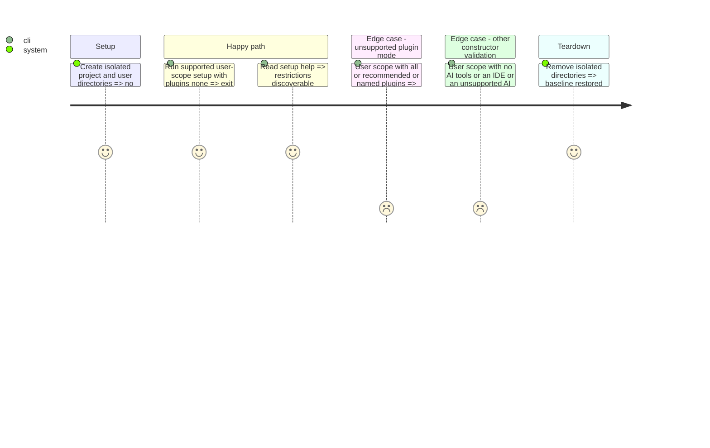

# Instruction: Guard setup validation

## Architecture projection
```txt
cli/
  src/presentation/commands/setup.ts                       modify: guard constructor and clarify help
  tests/presentation/commands/setup-wiring.integration.test.ts  modify: prove constructor failures render before dependency creation
  tests/e2e/setup-scope-user.e2e.test.ts                    modify: prove clean refusal in the real binary
  tests/golden/snapshots/help/surface.json                  modify: record the intended setup help change
  README.md                                               modify: document current scope support and restrictions
```
No source files are created or deleted. Domain validation and tool activation remain unchanged.

## User Journey


## Test Scope


## Wireframe
Not applicable: command-line validation only.

## Tasks to do
### 1) Reproduce and guard constructor errors
1. Add regression tests and demonstrate failure against the current command.
2. Move SetupFlow construction and dependent banner into the existing try block before dependency creation.
3. Preserve the existing error messages, exit status, domain policy, and supported setup behavior.

### 2) Explain shipped scope support
1. Extend the existing README scope documentation with support grounded in current profiles and registry.
2. Clarify setup help: explicit supported AI tools, no IDE tools, no plugin enabling at user scope; native activation depends on available host CLI.
3. Distinguish setup registration from plugin installation and avoid promising global configuration rewriting.
4. Regenerate the existing help golden snapshot and confirm only setup help changes.

### 3) Validate
1. Run relevant command, domain, and user-scope e2e tests, typecheck, architecture suite, and lint on changed files.
2. Reproduce the issue through the hermetic built-binary tests after other checks.
3. Report exact commands and results, including limitations.

## Test acceptance criteria
| Task | Acceptance criteria |
| --- | --- |
| 1 | Unsupported plugin modes print the existing cause and remedies, exit 1, and emit no exception name, stack frame, or minified bundle; dependencies are not created. Other constructor validation errors use the same boundary. |
| 2 | Help and README accurately explain current user-scope setup and plugin installation limitations from source; no installation capability is added. |
| 3 | Relevant tests, typecheck, architecture checks, and changed-file lint pass; built-binary reproduction runs with isolated user directories. |
