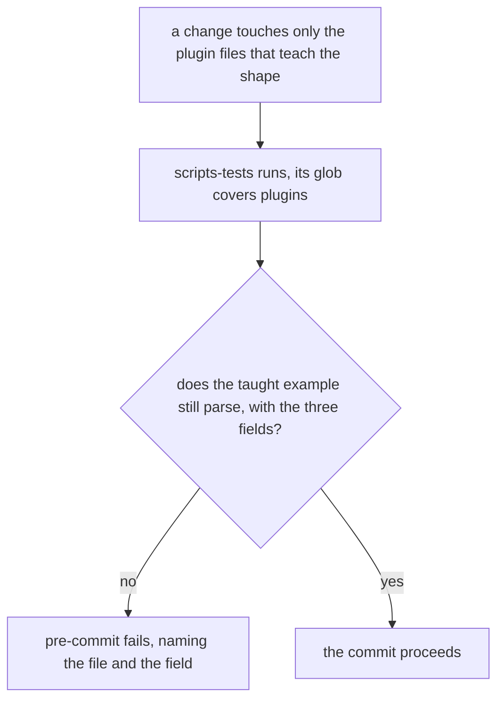
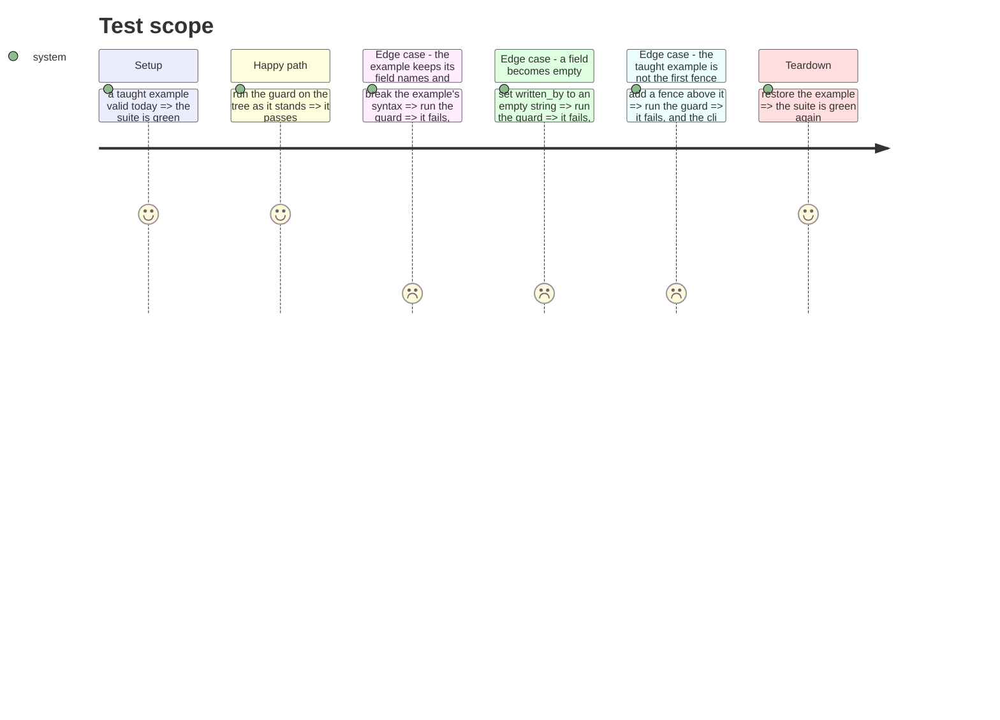

# Instruction: the taught example is parsed where it is watched
## Architecture projection
> Tree of the final files. ✅ create · ✏️ modify · ❌ delete

```txt
.
└── scripts/__tests__/
    └── a-backlog-link-the-reader-can-read.test.js      ✏️ parse the taught example, not its substrings
```
## User Journey

## Test Scope

## Tasks to do
### `1)` watch the guard stay green through the defect
> A guard nothing fails for is indistinguishable from a comment.

1. Break the taught example's JSON syntax, keeping the three field names.
2. Run the guard. Record that it passes, which is the defect.
3. Restore the file.

### `2)` parse the taught example
> The assertion becomes the one the reader actually makes.

1. Parse each taught example instead of searching it for substrings.
2. Require the three fields present and non-empty strings.
3. Fail with the file and the field named, so the message locates the break.
4. Keep the `.md` and `.json` forms both readable: one skill fences the example, the other ships it as an asset.

### `3)` agree with the sibling on which fence is the example
> Two guards reading different fences leave one green and the other red.

1. Read the first json fence, as the `cli/` test does.
2. Fail naming the file, the field it must carry, and how many fences were read.
3. Report the parse error when that fence is not JSON.

### `4)` watch it go red for its own reason
> The mutation that proves the guard ships with it.

1. Break the syntax again. The guard fails, and the message names that file.
2. Empty one field. The guard fails, and the message names that field.
3. Strip the fence markers, leaving the JSON as prose. The guard fails.
4. Restore, and run the whole suite plus `pnpm exec lefthook run pre-commit`.

## Test acceptance criteria
| Task | Acceptance criteria |
| --- | --- |
| 1 | the guard passes over a broken example before the change, recorded |
| 2 | the guard parses both the fenced and the asset form, and names file and field on failure |
| 3 | a fence added above the taught one fails here and in the `cli/` sibling, with the same verdict |
| 4 | the fences stripped and an emptied field each turn this guard red, and the suite is green once restored |
