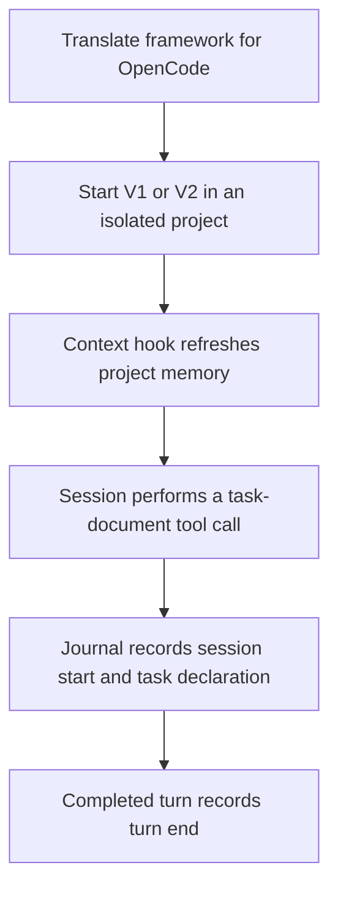
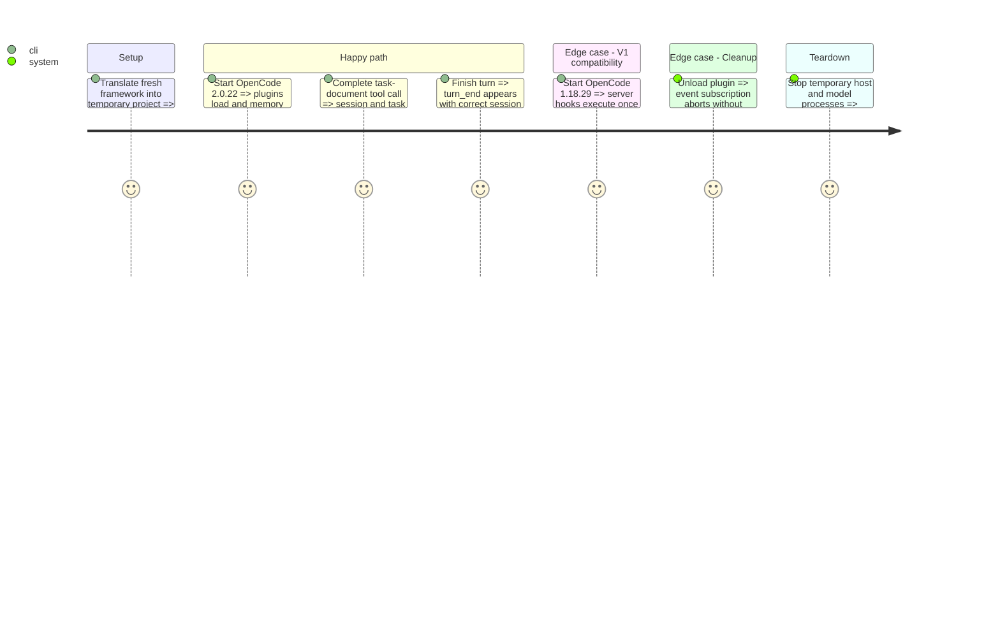

# Instruction: Preserve AIDD hook behavior across OpenCode versions

## Architecture projection
```txt
cli/assets/configs/opencode/opencode-events.js.txt  create: canonical V2 host adapter
cli/src/runtime/assets/asset-loader.ts  modify: embed shared host adapter
cli/tsup.config.ts  modify: bundle text asset
cli/src/contexts/tools/domain/profiles/opencode/build.ts  modify: emit shared adapter outside plugin discovery
cli/src/contexts/tools/domain/contracts.ts  modify: tool-owned plugin runtime files
cli/src/contexts/tools/domain/profiles/opencode/profile.ts  modify: shared runtime file declaration
cli/src/contexts/framework/application/install/install-runtime-config-use-case.ts  modify: install and backfill missing runtime files
cli/src/contexts/framework/application/restore/generate-tool-distribution-use-case.ts  modify: retain runtime files in restoration output
cli/src/contexts/framework/application/plugin/plugin-distribution-loader.ts  move/generalize: shared source retrieval entrypoint for project and user plugins
cli/src/contexts/framework/application/plugin/plugin-add-use-case.ts  modify: ensure tool runtime before plugin delivery
cli/src/contexts/framework/application/plugin/plugin-update-use-case.ts  modify: ensure tool runtime before plugin replacement
cli/src/runtime/wiring/framework.ts  modify: wire shared source retrieval and runtime delivery
cli/tests/contexts/framework/application/plugin/plugin-runtime-files.integration.test.ts  create: existing installation and update coverage
cli/src/contexts/tools/domain/profiles/opencode/opencode-hooks-bridge.ts  modify: generated plugin definition using shared host adapter
plugins/aidd-telemetry/hooks/opencode-plugin.js  modify: telemetry definition using shared host adapter
cli/tests/contexts/tools/domain/profiles/opencode/opencode-hooks-bridge.unit.test.ts  modify: generated entrypoint and behavioral tests
cli/tests/e2e/opencode-hooks-bridge-generated.e2e.test.ts  modify: default server/setup consumption in real translate output
cli/tests/golden/snapshots/framework-build/golden.json  modify: OpenCode bridge hash and shared adapter artifact
scripts/__tests__/opencode-plugin.test.js  modify: actual journal effects through both entrypoints and cleanup
scripts/__tests__/aidd-telemetry-opencode-payloads.test.js  modify if required: loader export contract and event mappings
scripts/__tests__/aidd-telemetry-cost-skill.test.js  modify: distinguish V1 omission from observed V2 session announcements
docs/ARCHITECTURE.md  modify: replace outdated single-factory contract
plugins/aidd-telemetry/README.md  modify: supported OpenCode versions and measured behavior
aidd_docs/tasks/2026_10/2026_10_07_opencode-plugin-loading/verification.md  create: research and observed real runtime evidence
```
The existing user-plugin source loader moves to the shared application layer; its callers and constructor fixtures follow the generalized entrypoint. Add runtime regression coverage only where needed to reproduce a measured V2 difference.

## User Journey


## Test Scope


## Wireframe
Not applicable: no UI change.

## Tasks to do
### 1) Compatible exports and event handling
1. Write regression tests and observe the expected failure.
2. Add default id/server/setup definitions to both modules, preserving named factory seams if the V1 loader permits them without duplicate execution.
3. Register V2 event handling through one shared host adapter with cancellable cleanup. Translate data/location session events, correlate granular tool events into completed tool calls, and handle execution completion as turn-end. Emit the helper outside the plugin discovery directory and test its installed layout.
4. Update existing coverage and documentation; run coding and architecture assertions.

### 2) Real local compatibility proof
1. Translate the actual framework with the built CLI.
2. Run released V1 and V2 binaries in isolated temporary environments.
3. Assert actual memory refresh, task declaration and turn-end records; retain concise versioned evidence and the reproduction command.
4. Run independent review and outcome challenge before opening the draft PR against next.

## Test acceptance criteria
| Task | Acceptance criteria |
| --- | --- |
| 1 | Both emitted modules have default id/setup/server; import does not spawn hooks. |
| 1 | V1 invokes its handler once; V2 setup returns promptly, forwards events and returns cleanup that aborts its subscription. |
| 1 | Malformed/unrelated events do not crash the host; completed tool, session-start and idle semantics remain correct. |
| 1 | Relevant tests and repository coding/architecture gates pass. |
| 2 | Real OpenCode V2 2.0.22 loads both translated modules with no plugin load failure and produces observable memory and journal effects. |
| 2 | Real OpenCode V1 1.18.29 retains those effects with no duplicate session-start. |
| 2 | Evidence names exact commands, versions, results and limitations; no paid model or personal configuration modification. |
