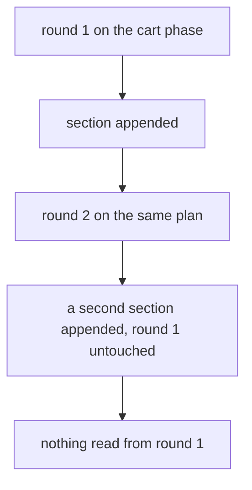
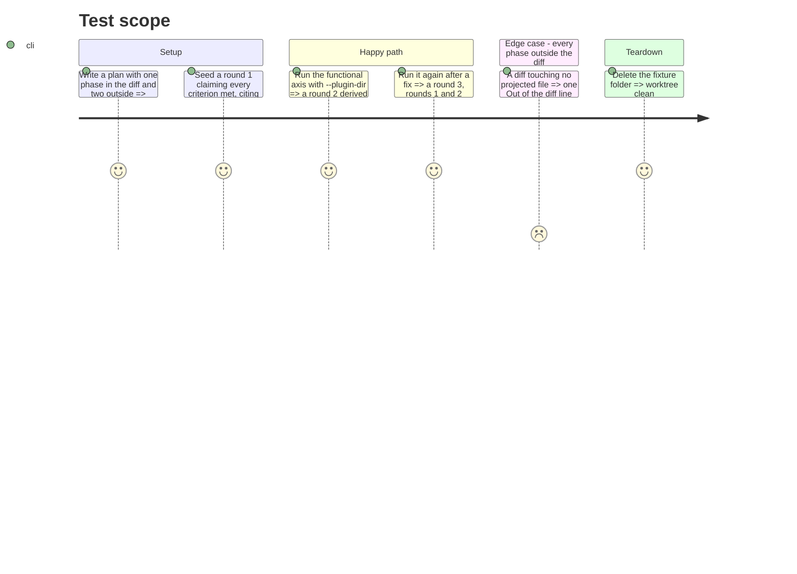

# Instruction: the round section and the phase scope
## Architecture projection
```txt
.
├── plugins/aidd-dev/skills/05-review
│   ├── SKILL.md                          ✏️ the flow, the five actions, the one transversal rule
│   ├── actions/01-prepare.md             ✏️ resolve the diff once, open the round
│   ├── actions/03-review-functional.md   ✏️ the phase projection decides scope
│   ├── actions/05-finalize.md            ✏️ judge the round, check its shape
│   ├── references/report-contract.md     ✏️ the file, the diff, how a round joins it
│   ├── assets/review-template.md         ✏️ the round section and its Out of the diff line
│   └── assets/review-validator.yml       ✏️ a round's header, fields and lists
└── scripts/__tests__
    └── a-review-appends-a-round-and-scores-the-whole-plan.test.js   ✅ the invariants
```
## User Journey

## Test Scope

## Tasks to do
### `1)` The guard goes red first
> Invariants nothing else holds.

1. Assert the re-run rule appends, refuses an earlier round, and says where the number comes from.
2. Assert the validator's field set and the template render the same round, in order.
3. Assert a phase's projected files have one address.
4. Run the suite and watch each fail, nothing else.

### `2)` A round becomes a section
> History gets a home that cannot be mistaken for the current state.

1. In `SKILL.md`, append a round numbered one past the last, derived from the plan and the diff alone.
2. Add the round section to the template: its fields, then `Criteria` and `Findings`.
3. Put a round's fields and lists in the validator; drop the closed set of four sections.
4. Drop from the header what a round's fields already carry.

### `3)` The projection decides scope
> A phase outside the diff is present and visibly unverified.

1. A phase whose projected files the diff leaves untouched gets one `Out of the diff:` line, no box.
2. The line carries the plan's own phase name and its criteria count, written in plan order.
3. Name `## Architecture projection` as the one address where those files are read.

## Test acceptance criteria
| Task | Acceptance criteria |
| --- | --- |
| 1 | Each round and scope assertion reddens alone under the mutation of the rule it names. |
| 2 | Runtime, no diff can show it: with a round 1 claiming every criterion met on files the diff never touched, a second run appends a round scored from the diff alone and leaves round 1 untouched. |
| 3 | A phase outside the diff gets one `Out of the diff:` line, named as the plan names it, in plan order, holding no box. |
