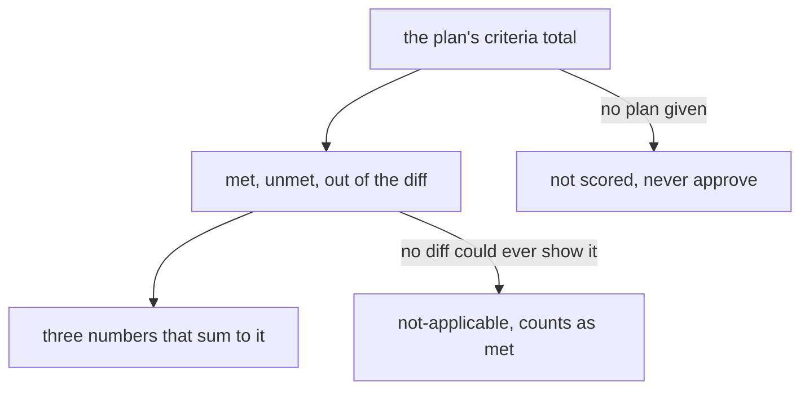
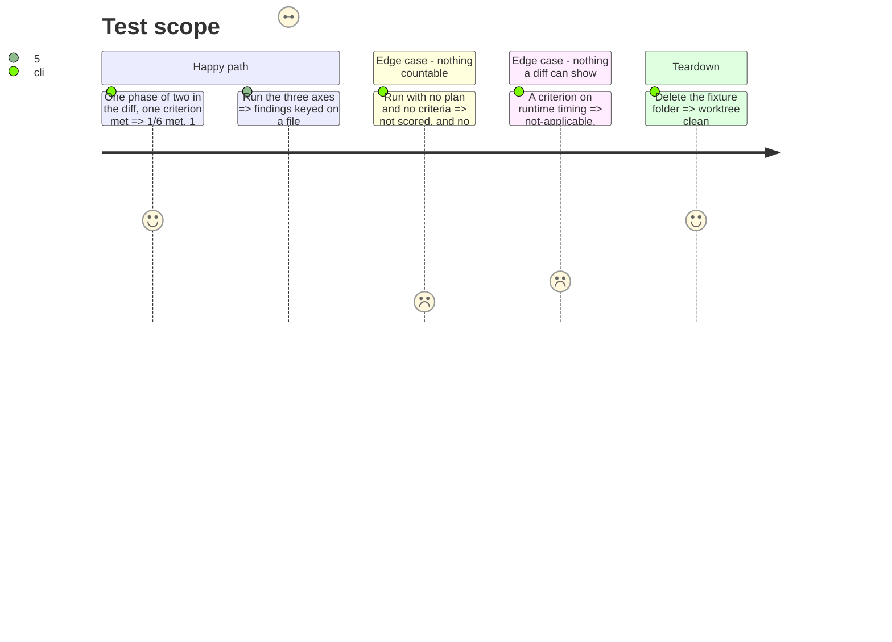

# Instruction: the score and the statuses
## Architecture projection
```txt
.
├── plugins/aidd-dev/skills/05-review
│   ├── actions/02-review-code.md         ✏️ a finding is a line, keyed on a file:line
│   ├── actions/03-review-functional.md   ✏️ the score, not-applicable, evidence over a label
│   ├── actions/04-review-relevancy.md    ✏️ a misfit is a line, keyed on a file:line
│   ├── assets/review-template.md         ✏️ the Score field and the finding's fix
│   └── references/review-rubric.md       ✏️ fixed removed, the verdict rules scoped
└── scripts/__tests__
    └── a-review-appends-a-round-and-scores-the-whole-plan.test.js   ✅ the score and status assertions
```
## User Journey

## Test Scope

## Tasks to do
### `1)` The guard goes red first
> One assertion per rule, each with the mutation that proves it.

1. Assert the score counts over the plan's whole total and that its three numbers sum to it.
2. Assert an unmet criterion has one home, and that no file of the skill sends it to `Findings`.
3. Assert an unscored round never approves, that a criterion no diff could show is `not-applicable`, and that a finding carries its fix.

### `2)` The score replaces the percent
> One denominator, and three numbers a reader can add up.

1. `Score` counts met, unmet and out of the diff over the plan's criteria total.
2. The template renders the form; the action states the rule and names no placeholder.
3. `Score` reads "not scored" when the functional axis did not run.

### `3)` The statuses say what they mean
> A tag the review applies, and a verdict that cannot approve nothing.

1. `fixed` appears in no verdict.
2. `not-applicable` marks a criterion no diff could ever show, counts as met, and says so on its line.
3. A round without functional takes its verdict from its findings alone.
4. A finding is a `Findings` line keyed on a backticked `file:line`, carrying its fix, severity and kind.

## Test acceptance criteria
| Task | Acceptance criteria |
| --- | --- |
| 1 | Each score and status assertion reddens alone under the mutation of the rule it names. |
| 2 | A plan of 6 criteria whose diff touches one phase of 2, with 1 met, reads `1/6 met, 1 unmet, 4 out of the diff`; with no plan it reads `not scored`. |
| 3 | A criterion on runtime timing is checked `not-applicable` and counted as met; a round with no criterion in scope does not read `approve`; a three-axis run writes findings keyed on a `file:line`, each with its fix. |
