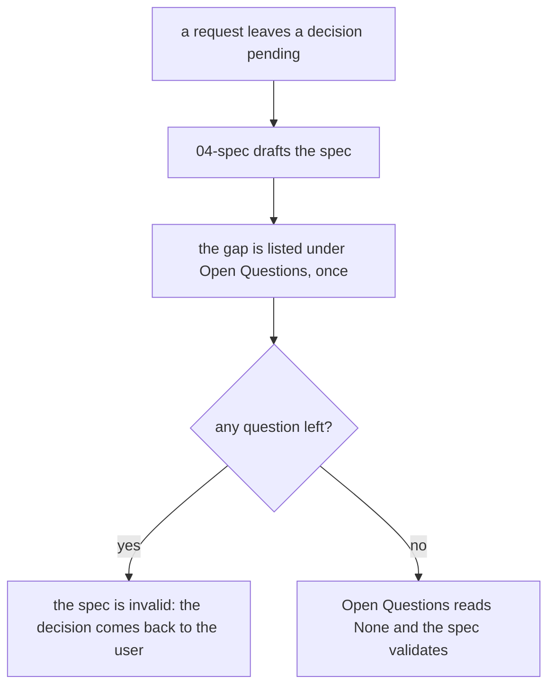
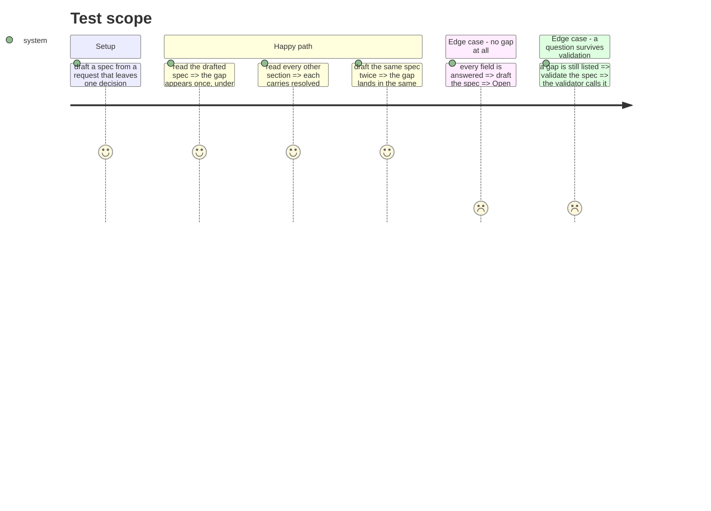

# Instruction: the marker has a home
## Architecture projection
> Tree of the final files. ✅ create · ✏️ modify · ❌ delete

```txt
.
└── plugins/aidd-pm/skills/04-spec/
    ├── references/tbd-marker.md      ✏️ the marker, its home, one entry per gap
    ├── assets/spec-template.md       ✏️ an `## Open Questions` section
    ├── assets/spec-validator.yml     ✏️ a residual question is invalid
    └── actions/
        ├── 01-build.md               ✏️ gaps are listed, never inlined; one test row
        └── 02-refine.md              ✏️ the same for a field still unanswered; one test row
```
## User Journey

## Test Scope

## Tasks to do
### `1)` state the marker's home
> `tbd-marker.md` carries the form, the home, and the one-entry rule.

1. Keep the form `TBD: <precise question>`.
2. Say the home is the template's open questions section, without naming the heading.
3. Define the unit: a gap is an unresolved decision a required section depends on.
4. Say each gap is one entry there, and that no other section carries a marker.

### `2)` give the template the section
> A spec has a place to put a pending decision.

1. Add `## Open Questions` to `spec-template.md`, after `Done-when`.
2. Guide it: one entry per unresolved decision, the marker's form, `None` when there is nothing left.
3. Say it drives to zero before the spec validates.

### `3)` make a residual question invalid
> The validator refuses a spec that still asks something.

1. Add `open_questions_unresolved: invalid` to `hard_thresholds`.
2. Leave every weight and `pass_threshold` untouched.
3. Add the `open_questions` criterion as `required: true`, `weight: 0`, describing the list's shape: required makes an absent or malformed section invalid, and a zero weight keeps the weighted total at 100.

### `4)` route both actions to the home
> Neither action places a marker by judgement any more.

1. `01-build.md` step 3: list every gap per `tbd-marker.md`.
2. `02-refine.md` step 4: the same, and remove an entry only once its decision is fully answered.
3. Add one test row to each: a gap is listed once, in the open questions section only.

### `5)` prove it
> The change holds under the repository's own gates.

1. Read every edited file back.
2. Run `pnpm exec lefthook run pre-commit`.
3. Commit through the commit skill.

## Test acceptance criteria
| Task | Acceptance criteria |
| --- | --- |
| 1 | `tbd-marker.md` names the template's open questions section as the home, and allows one entry per gap |
| 2 | `spec-template.md` carries the section with its guidance, and `None` is the empty form |
| 3 | `spec-validator.yml` calls a spec with an unresolved question invalid, and no weight or threshold moved |
| 4 | each action's gap step points at the home, and each `## Test` table has the row for it |
| 5 | pre-commit is green and the work is committed |
