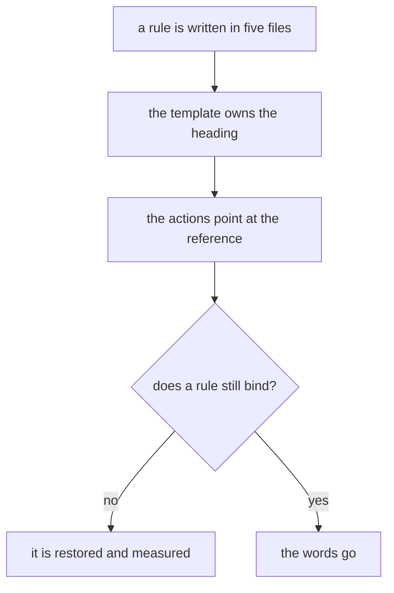
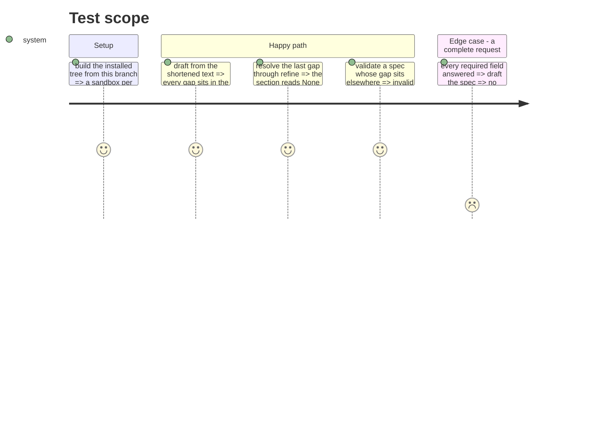

# Instruction: the rules are cut to what changes the draft
## Architecture projection
> Tree of the final files. ✅ create · ✏️ modify · ❌ delete

```txt
.
└── plugins/aidd-pm/skills/04-spec/
    ├── references/tbd-marker.md      ✏️ the unit and the home, nothing else
    ├── assets/spec-template.md       ✏️ the section owns its own heading
    ├── assets/spec-validator.yml     ✏️ placement refuses, an open gap does not
    └── actions/
        ├── 01-build.md               ✏️ the steps lose their restated prose
        └── 02-refine.md              ✏️ the gap step says each thing once
```
## User Journey

## Test Scope

## Tasks to do
### `1)` take the heading out of four files
> The template owns its own section name.

1. Name the section in `spec-template.md` and nowhere else.
2. Point the reference, both actions and the validator at it by description.

### `2)` cut the prose that changes no draft
> On the user asking for the existing text to be cut too, past this issue.

1. Drop the restated sub-bullet, the parenthetical the template already carries, and the example verbs.
2. Reduce the backlog declaration to its rules.

### `3)` restore every rule the cut dropped
> A cut that loses a behaviour is a defect, not a saving.

1. `None` when no entry remains, in refine's step 4 and its test row.
2. The definition of a gap in the validator, which an evaluator reads alone.
3. Refine links the template, so the heading resolves.
4. What `written_by` holds, and the trigger and one-support rule of the backlog declaration.

### `4)` take the refusal off an open gap
> Measured: a complete request still lists entries, so the refusal refused complete work.

1. Replace `open_questions_unresolved` with `open_questions_outside_their_section`.
2. Say in the criterion that a listed gap does not invalidate the spec.
3. Move zero-before-locking to the template's guidance, where nothing enforces it until #625.

## Test acceptance criteria
| Task | Acceptance criteria |
| --- | --- |
| 1 | only `spec-template.md` names the heading, and the installed tree still places every gap there |
| 2 | no rule is lost: each one still names a behaviour a reader can apply |
| 3 | the four restored clauses each pass three runs out of three |
| 4 | a spec with one open gap is valid, and one with a gap elsewhere is invalid |
