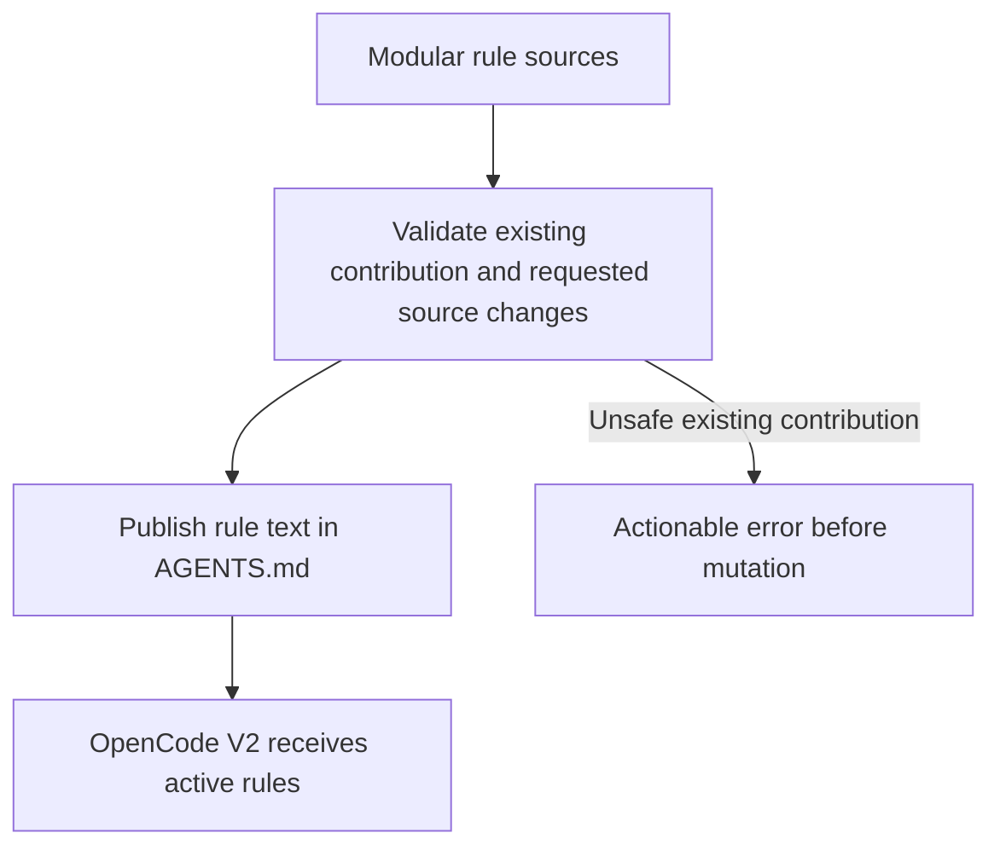
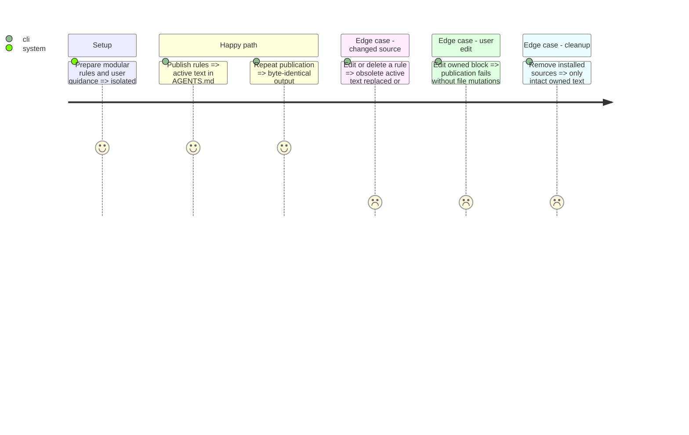

# Instruction: Safe OpenCode V2 rule publication
## Architecture projection
```txt
cli/src/contexts/tools/domain/profiles/opencode/  create rule-block host formatter; modify profile contract
cli/src/contexts/tools/domain/capabilities/       modify rule capability only if a generic host declaration is needed
cli/src/contexts/framework/application/          create shared publication operation; modify rule write/restore/remove entry points
cli/src/presentation/commands/framework.ts       modify existing rules command to expose direct publication
cli/src/runtime/wiring/framework.ts             modify composition wiring
cli/tests/                                     create mirrored formatter/publication tests; extend lifecycle and command coverage
cli/ARCHITECTURE.md                             clarify rule publication versus project-memory production
cli/package.json                               update measured bundle ceiling under existing growth policy
cli/scripts/check-bundle-size.mjs               record measured size and feature cost in the existing registry
```
Create only the smallest helper and dependency entry point needed; preserve context directions and the four-use-case orchestration rule. No deletion is planned.

## User Journey


## Test Scope


## Tasks to do
1. Write failing behavior tests before production changes. Cover preserved user bytes and memory block, LF/CRLF, deterministic order, rule scope prose, duplicate/incomplete markers, edited-block refusal, code-fence examples and idempotence.
2. Implement the host formatter and one framework operation. Validate all sources and existing ownership before writes. Do not add AGENTS.md to the manifest's owned-file list.
3. Expose direct publication through the existing rule command without a manifest requirement. Generator callers must be able to preflight prospective rules before writing them; provide a safe input route through the same operation if necessary.
4. Integrate preflight/publication into the relevant existing install/update/sync/removal/clean paths that can change OpenCode rule sources. Empty rule sets must not create an unrelated AGENTS.md. Preserve any unrelated tools and user-scope behavior.
5. Cover refusal before source mutation, source and last-source deletion, and lifecycle cleanup. Document actual limitations rather than hiding unsupported flows.
6. Measure the final bundle and document its growth using the existing budget policy, with at most about 2% headroom. Keep every other gate and dependency cap unchanged.

## Test acceptance criteria
| Task | Acceptance criteria |
| --- | --- |
| 1–2 | Invalid contributions fail; safe publication preserves bytes outside the owned block and is deterministic and idempotent. |
| 3–4 | Direct generation and CLI lifecycle paths use the same publication contract; stale content is removed; AGENTS.md is never owned as a whole. |
| 5 | Focused regressions and architecture checks pass; planted unsafe input proves that the guards reject it. |
| 6 | The built bundle passes its documented ceiling, with at most about 2% measured headroom and no other guard relaxed. |
