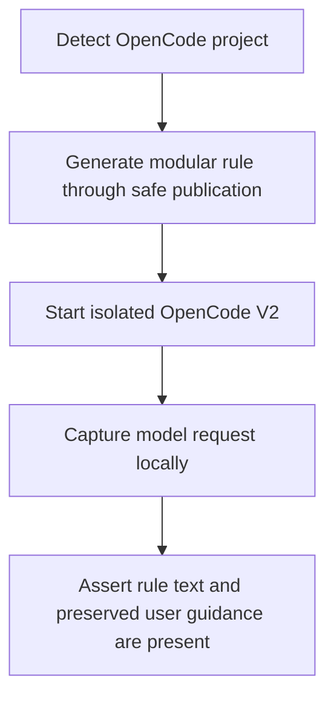
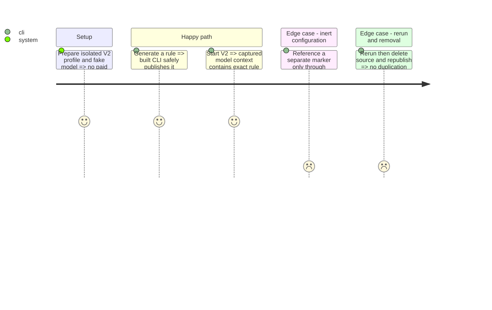

# Instruction: Generator contract and OpenCode V2 runtime evidence
## Architecture projection
```txt
plugins/aidd-context/skills/05-rule-generate/    modify detection, generation, safety and validation contract
plugins/aidd-context/skills/11-explore/references/ai-mapping.md  modify contradictory OpenCode rule claim
cli/README.md                                  document direct publication and V2 limitations
cli/assets/configs/opencode/opencode.json       remove an inert managed instruction glob if now obsolete; preserve other settings
scripts/__tests__/                             extend generator contract guard if behavior assertions are needed
cli/tests/e2e/                                 add built-CLI publication journeys using isolated projects
aidd_docs/tasks/2026_10/2026_10_08_opencode-rule-discovery/  add verification report and retained capture evidence references
```
No deletion is planned. Reuse existing documentation instead of adding competing rule contracts.

## User Journey


## Test Scope


## Tasks to do
1. Reconcile the existing generator and exploration instructions around the verified V2 contract. Detect .opencode/, opencode.json and opencode.jsonc. Write modular sources and publish active text through phase 1's shared safe operation; never claim links or config entries activate V2 rules.
2. Make the direct-generation operation preflight safety before changing either its source or AGENTS.md. Explain a missing CLI or unsafe block precisely, with no partial-write fallback.
3. Build the CLI and reproduce generation, rerun, update and stale-rule deletion in throwaway projects. Run the real V2 2.0.22 binary against a local model capture server with isolated profile directories; preserve the user's installed binary and credentials.
4. Assert exact rule text and preserved user guidance in model input, with a config.instructions-only marker as a negative witness. Record commands, version, platform, observed output and any untested platforms honestly.
5. Run required completion checks and return the candidate for an independent checker. No self-review, commit or push.

## Test acceptance criteria
| Task | Acceptance criteria |
| --- | --- |
| 1–2 | Generator and exploration agree; safe direct generation works from each detection signal and refuses unsafe state before mutation. |
| 3–4 | Built CLI and real V2 journey prove active content consumption; output files alone are not accepted as runtime proof. |
| 5 | Required checks pass; remaining limitations are explicit; independent review receives the source, contract, plan and evidence. |
