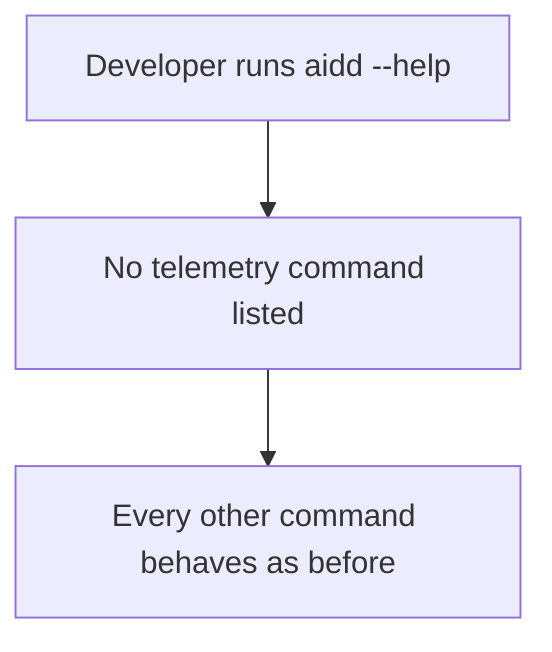
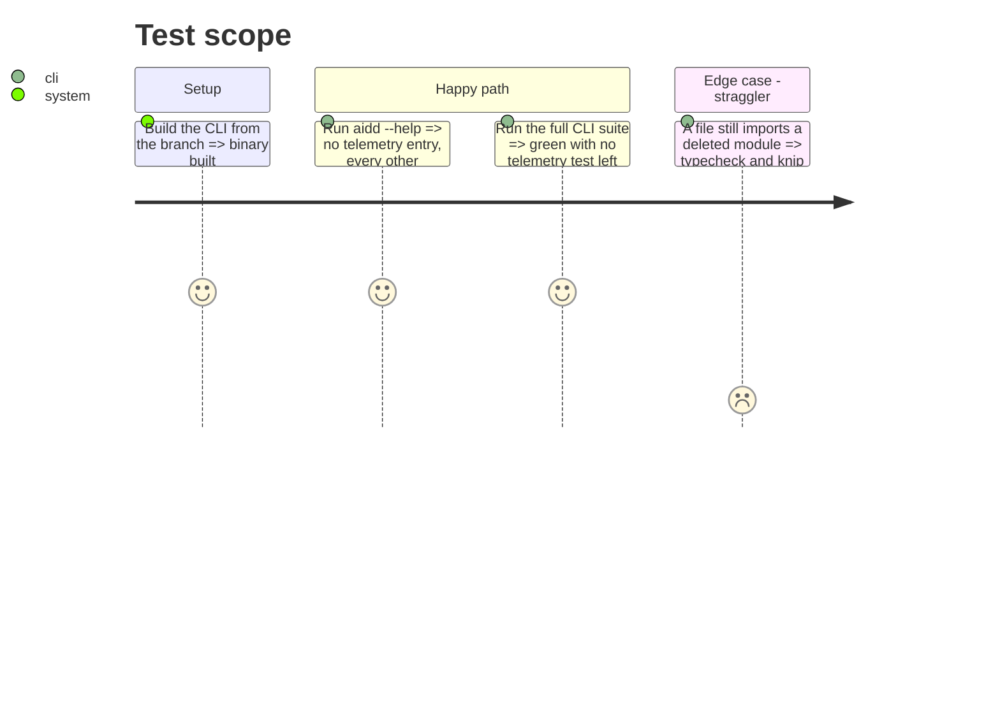

<!-- Fill or omit these sections; never add, rename, or reorder one. -->

# Instruction: Remove the previous telemetry from the CLI

## Architecture projection

> Tree of the final files. ✅ create · ✏️ modify · ❌ delete

```txt
cli/
├── src/
│   ├── cli.ts                                   ✏️ no telemetry registration (re-added in phase 4)
│   ├── contexts/telemetry/                      ❌ whole directory
│   ├── contexts/tools/domain/contracts.ts       ✏️ drop telemetryLocalRead, telemetryJournalHost, telemetryTaskAttributable
│   ├── contexts/tools/domain/registry.ts        ✏️ drop journalHostToAiToolId
│   ├── contexts/tools/domain/profiles/*/profile.ts            ✏️ drop the three telemetry fields
│   ├── contexts/tools/domain/profiles/claude/claude-transcript-location.ts  ❌
│   ├── contexts/tools/domain/profiles/codex/codex-transcript-location.ts    ❌
│   ├── kernel/measurement.ts                    ❌
│   ├── kernel/errors.ts                         ✏️ drop telemetry-only errors (keep any still thrown elsewhere)
│   ├── kernel/paths.ts                          ✏️ drop RUNS_ENTRY/resolvedRunsDir unless framework still needs them
│   ├── kernel/reading/home-dir.ts               ✏️ drop resolveAiddConfigDir (only caller deleted)
│   ├── runtime/git/git-adapter.ts               ✏️ drop the commit-trailer delegate methods
│   ├── runtime/wiring/telemetry.ts              ❌
│   ├── runtime/wiring/framework.ts              ✏️ no TelemetryDeps
│   ├── runtime/wiring/installed-plugins-from-manifest.ts       ❌ if telemetry was its only caller
│   ├── presentation/commands/telemetry.ts       ❌
│   └── presentation/display/{telemetry-*,cost-report-*}.ts     ❌
├── tests/                                       ❌ every test of the above; ✏️ architecture allow-lists
├── biome.json                                   ✏️ drop telemetry layer overrides
├── mutation-scopes.json, package.json           ✏️ drop the telemetry mutation scope and script
├── scripts/check-bundle-size.mjs                ✏️ untouched here: the budget is set once, in phase 9
├── scripts/smoke-tools.sh                       ✏️ drop telemetry smoke steps
└── tests/golden/snapshots/help/surface.json     ✏️ regenerated, no telemetry
```

## User Journey



## Test Scope



## Tasks to do

### `1)` Delete the context and its wiring

> Nothing under `contexts/telemetry` survives, and nothing imports it.

1. Delete `cli/src/contexts/telemetry/`, `runtime/wiring/telemetry.ts`, `presentation/commands/telemetry.ts`, and the telemetry and cost-report display modules.
2. Remove the registration from `cli.ts` and `TelemetryDeps` from `runtime/wiring/framework.ts`.
3. Remove telemetry-only code living elsewhere: `kernel/measurement.ts`, the three profile fields and their contract, the transcript locations, `journalHostToAiToolId`, `resolveAiddConfigDir`, telemetry-only errors, the git adapter's trailer delegate methods.
4. Keep `kernel/paths.ts` `AIDD_DIR`/`AIDD_CONFIG_FILENAME`; keep `RUNS_ENTRY` only if `framework` still reads it, otherwise delete it and its gitignore entry producer.

### `2)` Delete the tests and update the guards

> The suites and architecture guards describe the CLI that remains.

1. Delete every telemetry test, fixture and in-memory port double listed by `grep -ril telemetry cli/tests`.
2. Remove `telemetry` from `ALLOWED`, `PUBLIC_MODULES`, folder-size, orchestrator-deps, tool-addition-cost, catches-that-swallow and self-reentry baselines; drop the biome telemetry overrides.
3. Remove the telemetry mutation scope and script; regenerate the help golden with `UPDATE_HELP_GOLDEN=1`.
4. Drop telemetry steps from `scripts/smoke-tools.sh`. Leave the bundle budget alone.
5. Before deleting, copy into phase 8's notes every location the previous version wrote: the sink dir resolution (`AIDD_TELEMETRY_DIR`, `AIDD_USER_CONFIG_DIR`, `%APPDATA%\aidd\telemetry`, `~/.config/aidd/telemetry`), `identity.json` (`%APPDATA%\aidd` or `~/.config/aidd`), the trailer delegate name and hook line, `aidd_docs/runs` and `AIDD_RUNS_DIR`.

## Test acceptance criteria

| Task | Acceptance criteria |
| ---- | ------------------- |
| 1 | `grep -ril telemetry cli/src` finds nothing but comments explaining the `.aidd/config.json` file `clean` keeps |
| 1 | `aidd --help` lists no `telemetry` command; `setup`, `plugin`, `clean`, `framework build` behave as before |
| 2 | typecheck, lint, arch, knip, jscpd, the three tiers and the build with its budget are green |
| 2 | No architecture baseline names a context or file that no longer exists |
